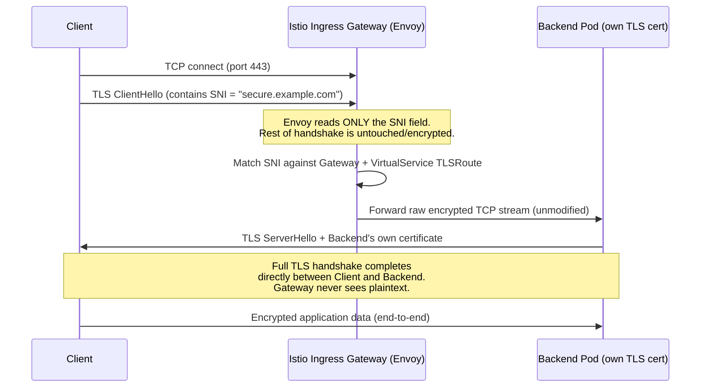
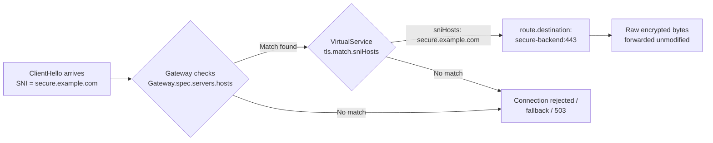
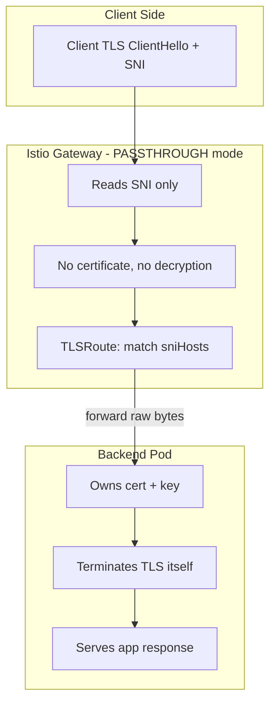

# Istio TLS Passthrough & SNI Routing — Complete Tutorial

A single-stop, step-by-step guide for freshers and experts to understand and configure **`PASSTHROUGH` TLS mode** on an Istio Gateway, how **SNI** is used to route encrypted traffic, and how to verify everything end-to-end.

---

## Table of Contents

1. [What Problem Are We Solving?](#1-what-problem-are-we-solving)
2. [SNI vs Host Header — Explained Simply](#2-sni-vs-host-header--explained-simply)
3. [The Three TLS Modes at a Glance](#3-the-three-tls-modes-at-a-glance)
4. [Architecture: How PASSTHROUGH Actually Works](#4-architecture-how-passthrough-actually-works)
5. [Prerequisites](#5-prerequisites)
6. [Step-by-Step Setup](#6-step-by-step-setup)
7. [Understanding the VirtualService `TLSRoute`](#7-understanding-the-virtualservice-tlsroute)
8. [End-to-End Verification](#8-end-to-end-verification)
9. [Troubleshooting Cheat Sheet](#9-troubleshooting-cheat-sheet)
10. [Summary](#10-summary)

---

## 1. What Problem Are We Solving?

Normally, when you terminate TLS at an Istio Gateway (`SIMPLE` or `MUTUAL` mode), Envoy **decrypts** the traffic, reads the HTTP `Host` header, routes it, and (optionally) re-encrypts it before sending it to the backend.

But sometimes you **don't want the Gateway to see the decrypted traffic at all** — for example:

- The backend application must present **its own certificate** (compliance, mTLS between client and app, legal/regulatory requirement).
- You don't want the Gateway/mesh operator to have access to private keys of every backend team.
- You're doing **multi-tenant routing** where each tenant's app terminates its own TLS.

This is where **`PASSTHROUGH` mode** comes in — the Gateway forwards the **still-encrypted** TLS bytes straight to the backend, and the backend does the decryption.

The catch: if the Gateway never decrypts the traffic, **how does it know which backend to send it to?** That's exactly what **SNI** solves.

---

## 2. SNI vs Host Header — Explained Simply

Think of visiting an apartment building with many flats but only **one shared main gate (one IP address)**.

### Normal HTTP `Host` header (like a name tag you show *after* entering)
- The connection is already established.
- The gate lets you in first (TCP + TLS handshake completes, traffic is decrypted).
- Only *after* that, you say "I'm here for App-A" via the `Host:` header inside the HTTP request.
- Problem: to read this "name tag," someone must **already have opened your sealed envelope** (decrypted the TLS traffic).

### SNI — Server Name Indication (like shouting the flat number *before* the gate even opens)
- SNI is a small, **unencrypted** field sent as part of the very first message of the TLS handshake — the `ClientHello`.
- Before any encryption keys are exchanged, the client basically says: *"Hey, I want to talk to `appA.example.com`."*
- The Gateway can read this **without decrypting anything else**, because SNI itself is sent in plaintext (that's a deliberate, standard part of TLS — it's how one IP can serve many HTTPS domains, similar to virtual hosting).
- Because the Gateway can see the destination hostname without opening the encrypted envelope, it can make a routing decision **and then just forward the sealed envelope, untouched, to the right backend.**

| | **Host Header** | **SNI** |
|---|---|---|
| Sent at | Inside the HTTP request | Inside the TLS `ClientHello` (handshake) |
| Visibility | Only visible **after** TLS decryption | Visible **before** decryption (plaintext) |
| Used for | HTTP-level routing (L7) | TLS-level routing (L4/L5) without opening the payload |
| Needed for PASSTHROUGH? | ❌ Can't be read without decrypting | ✅ This is exactly how passthrough routing works |

**In one line:** *SNI lets Istio route encrypted traffic to the correct service by reading the destination hostname off the outside of a sealed envelope, without ever opening it.*

---

## 3. The Three TLS Modes at a Glance

| Mode | Where TLS is terminated | What Gateway sees | Certificate lives on | Typical use case |
|---|---|---|---|---|
| **SIMPLE** | At the Istio Gateway | Full decrypted HTTP traffic | Gateway (via K8s Secret) | Standard HTTPS termination for public websites |
| **MUTUAL** | At the Istio Gateway | Full decrypted HTTP traffic + client cert is verified | Gateway + Client both present certs | Zero-trust setups needing client identity verification at the edge |
| **PASSTHROUGH** | At the **backend Pod**, not the Gateway | Nothing — only the SNI hostname (encrypted payload untouched) | Backend application/Pod | Backend must own TLS termination; end-to-end encryption compliance |

**Key mental model:**
- `SIMPLE`/`MUTUAL` → Gateway is the **doorman who checks your ID and lets you in**.
- `PASSTHROUGH` → Gateway is a **mail courier who reads only the address on the envelope and delivers it sealed** — the recipient (backend) opens it.

---

## 4. Architecture: How PASSTHROUGH Actually Works



**What this means in plain words:**

1. The client starts a TLS handshake and includes the SNI hostname in the very first packet.
2. Istio's Gateway (Envoy) peeks at just that SNI field — it does **not** hold a private key, so it **cannot** decrypt anything even if it wanted to.
3. Envoy matches the SNI value against your `Gateway` + `VirtualService` (`TLSRoute`) config and picks a backend.
4. Envoy then acts like a **TCP proxy** — it just forwards raw bytes back and forth. It never terminates TLS.
5. The **actual TLS handshake (certificate, encryption keys)** happens directly between the **client and the backend Pod**. The backend must have its own certificate + private key configured (e.g., in its own NGINX/app config).

---

## 5. Prerequisites

- A Kubernetes cluster with **Istio installed** (`istioctl install` done, `istio-injection=enabled` on your namespace).
- `kubectl` and `openssl` available locally.
- Basic familiarity with Istio `Gateway` and `VirtualService` CRDs.

---

## 6. Step-by-Step Setup

### Step 1 — Create a namespace and enable sidecar injection

```bash
kubectl create namespace sni-demo
kubectl label namespace sni-demo istio-injection=enabled
```

### Step 2 — Generate a self-signed certificate **for the backend app itself**

This is the important part: in PASSTHROUGH mode, the **certificate is stored and served by the backend**, NOT as a Gateway Secret.

```bash
openssl req -x509 -newkey rsa:2048 -nodes \
  -keyout backend.key -out backend.crt -days 365 \
  -subj "/CN=secure.example.com" \
  -addext "subjectAltName=DNS:secure.example.com"
```

Create a Kubernetes secret that the **backend Pod** (not Istio Gateway) will mount:

```bash
kubectl -n sni-demo create secret tls backend-tls-secret \
  --cert=backend.crt --key=backend.key
```

### Step 3 — Deploy a backend app that terminates its own TLS

Example: an NGINX Pod configured to serve HTTPS using the mounted certificate.

```yaml
apiVersion: v1
kind: ConfigMap
metadata:
  name: nginx-tls-conf
  namespace: sni-demo
data:
  default.conf: |
    server {
      listen 443 ssl;
      server_name secure.example.com;
      ssl_certificate     /etc/nginx/tls/tls.crt;
      ssl_certificate_key /etc/nginx/tls/tls.key;
      location / {
        return 200 'Hello from backend — TLS terminated HERE, not at the Gateway!\n';
      }
    }
---
apiVersion: apps/v1
kind: Deployment
metadata:
  name: secure-backend
  namespace: sni-demo
spec:
  replicas: 1
  selector:
    matchLabels: { app: secure-backend }
  template:
    metadata:
      labels: { app: secure-backend }
    spec:
      containers:
      - name: nginx
        image: nginx:latest
        ports:
        - containerPort: 443
        volumeMounts:
        - name: tls-certs
          mountPath: /etc/nginx/tls
          readOnly: true
        - name: nginx-conf
          mountPath: /etc/nginx/conf.d
      volumes:
      - name: tls-certs
        secret:
          secretName: backend-tls-secret
      - name: nginx-conf
        configMap:
          name: nginx-tls-conf
---
apiVersion: v1
kind: Service
metadata:
  name: secure-backend
  namespace: sni-demo
spec:
  selector:
    app: secure-backend
  ports:
  - port: 443
    targetPort: 443
    name: tls
```

Apply it:
```bash
kubectl apply -f backend.yaml
```

### Step 4 — Create the Istio `Gateway` in `PASSTHROUGH` mode

```yaml
apiVersion: networking.istio.io/v1
kind: Gateway
metadata:
  name: passthrough-gateway
  namespace: sni-demo
spec:
  selector:
    istio: ingressgateway     # uses the default Istio ingress gateway
  servers:
  - port:
      number: 443
      name: tls
      protocol: TLS
    tls:
      mode: PASSTHROUGH        # <-- This is the key setting
    hosts:
    - "secure.example.com"
```

> Notice: **there is no `credentialName` here** (unlike SIMPLE/MUTUAL mode) — because the Gateway is not holding any certificate at all. It doesn't need one; it's not decrypting anything.

### Step 5 — Create the `VirtualService` with a `TLSRoute`

```yaml
apiVersion: networking.istio.io/v1
kind: VirtualService
metadata:
  name: secure-backend-route
  namespace: sni-demo
spec:
  hosts:
  - "secure.example.com"
  gateways:
  - passthrough-gateway
  tls:
  - match:
    - port: 443
      sniHosts:
      - "secure.example.com"     # matched directly against the SNI field
    route:
    - destination:
        host: secure-backend
        port:
          number: 443
```

Apply both:
```bash
kubectl apply -f gateway.yaml
kubectl apply -f virtualservice.yaml
```

---

## 7. Understanding the VirtualService `TLSRoute`



Key points about `TLSRoute`:

- The `tls.match.sniHosts` field is the **only thing** used for routing decisions — there's no path, header, or method matching possible here (unlike `http.match`), because Envoy literally cannot see any of that; it's still encrypted.
- `sniHosts` supports **wildcards** (e.g., `"*.example.com"`) so one Gateway can route many backend TLS services by hostname pattern.
- You can define **multiple `tls.match` blocks** in a single `VirtualService` to route different SNI hostnames to different backend services — all through the same Gateway port 443, without ever decrypting.
- This is different from `http.route` in an `HTTPRoute`/`VirtualService`, which requires decrypted traffic and works on the `Host` header + path/headers.

---

## 8. End-to-End Verification

The goal: prove that the **certificate the client receives is actually the backend's certificate**, not something the Gateway generated — confirming TLS truly terminates at the backend.

### Step 1 — Get the Ingress Gateway's external IP

```bash
export INGRESS_HOST=$(kubectl -n istio-system get svc istio-ingressgateway \
  -o jsonpath='{.status.loadBalancer.ingress[0].ip}')
export INGRESS_PORT=443
```

### Step 2 — Use `openssl s_client` to inspect the certificate returned

This sends a real TLS handshake with SNI set correctly, and prints out **whose certificate came back**:

```bash
openssl s_client -connect $INGRESS_HOST:$INGRESS_PORT \
  -servername secure.example.com | openssl x509 -noout -subject -issuer
```

**Expected output** should show:
```
subject=CN=secure.example.com
issuer=CN=secure.example.com
```

This matches exactly the self-signed cert you generated in **Step 2 of Section 6** and mounted directly on the **backend Pod** — proof that the Gateway did not intercept or replace it.

### Step 3 — Confirm application-level response with `curl`

```bash
curl -v --resolve secure.example.com:443:$INGRESS_HOST \
  https://secure.example.com --insecure
```

You should see:
```
Hello from backend — TLS terminated HERE, not at the Gateway!
```

### Step 4 — Negative test — wrong SNI should NOT route

```bash
curl -v --resolve notexpected.example.com:443:$INGRESS_HOST \
  https://notexpected.example.com --insecure
```

This should fail or be rejected — proving that routing genuinely depends on the SNI value, and nothing else.

### Step 5 (optional) — Confirm the Gateway is blind to payload

Check Istio ingress gateway access logs — for `PASSTHROUGH` traffic on the TLS filter chain, you will **not** see HTTP-level fields like request path or headers logged, only TCP/TLS connection metadata. This is expected and confirms no decryption happened at the Gateway.

```bash
kubectl -n istio-system logs deploy/istio-ingressgateway | grep secure.example.com
```

---

## 9. Troubleshooting Cheat Sheet

| Symptom | Likely Cause | Fix |
|---|---|---|
| `curl` hangs or connection reset | `sniHosts` in VirtualService doesn't match the `hosts` in Gateway exactly | Make sure Gateway `hosts` and VirtualService `sniHosts` use the **same** hostname string |
| TLS handshake fails entirely | Client didn't send SNI (some very old clients/tools omit it) | Always use `--servername` (openssl) or `--resolve` + real hostname (curl); never test with raw IP only |
| Certificate shown is wrong/self-signed by Envoy | Gateway is actually in `SIMPLE` mode, not `PASSTHROUGH` | Double check `tls.mode: PASSTHROUGH` and that no `credentialName` is set |
| 503 from Gateway | No matching `VirtualService` `sniHosts`, or backend Service port mismatch | Verify `tls.match.sniHosts` and destination `port.number` match the backend Service |
| Works via `kubectl port-forward` but not externally | Ingress gateway `LoadBalancer`/`NodePort` not exposing port 443 correctly | Check `istio-ingressgateway` Service ports and cloud LB config |

---

## 10. Summary



**Key takeaways:**

1. `PASSTHROUGH` mode means the Istio Gateway forwards encrypted TLS bytes **without decrypting** them.
2. **SNI** is the plaintext hostname field sent early in the TLS handshake — it's what makes routing possible without decryption.
3. `TLSRoute` inside a `VirtualService` matches purely on `sniHosts` — there's no header/path matching, because nothing else is visible.
4. The **backend Pod owns the certificate and does the actual TLS termination** — the Gateway never holds or needs a `credentialName`/Secret for passthrough hosts.
5. `PASSTHROUGH` is fundamentally different from `SIMPLE`/`MUTUAL`, where the **Gateway itself** terminates TLS and needs its own certificate configuration.
6. You verify success by checking that the **certificate returned to the client is the backend's own cert** (via `openssl s_client -servername`), not one issued/served by the Gateway.
