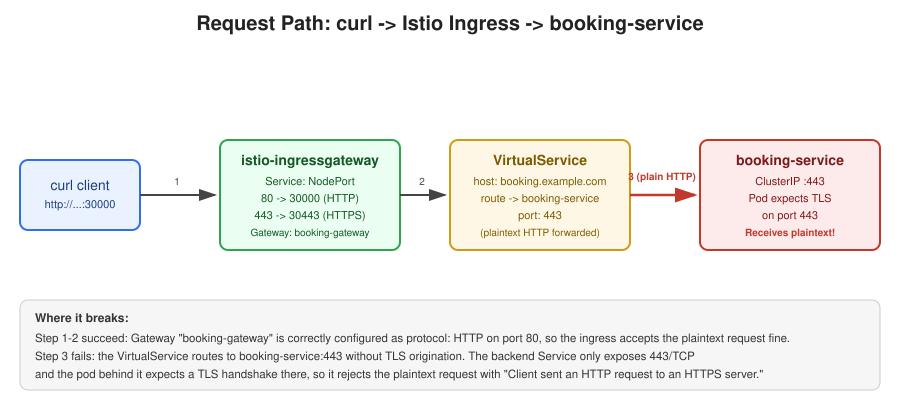
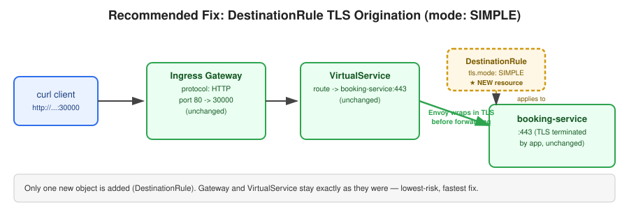
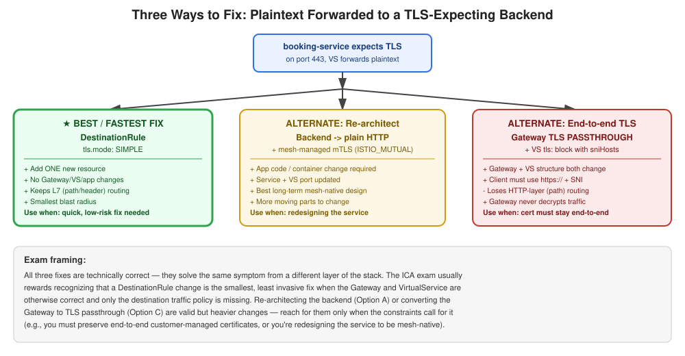

# "Client Sent an HTTP Request to an HTTPS Server": A Real Istio Troubleshooting Walkthrough (ICA Exam Prep)

*A hands-on debugging story that touches four core Istio Certified Associate (ICA) exam topics in one go: `Gateway`, `VirtualService`, `DestinationRule`, and NodePort service routing — plus three valid ways to fix it, ranked by speed and blast radius.*

---

## Why this scenario matters for the ICA exam

The ICA exam loves testing the relationship between four resources:

- **`Gateway`** — what the mesh edge (ingress) accepts
- **`VirtualService`** — where accepted traffic is routed
- **`DestinationRule`** — how traffic is treated on the way to its destination (load balancing, mTLS, TLS origination)
- **`Service` / NodePort** — the Kubernetes plumbing that exposes the mesh externally

Most real (and exam) Istio bugs live in the **seams between these four objects**, not inside any single one. This walkthrough is a real debugging session that shows exactly that — and, once the root cause is found, three legitimate ways to fix it, so you can recognize all of them on the exam and pick the right one under time pressure.

---

## The setup

```bash
root@controlplane:~$ k get gw -o wide
NAME              AGE
booking-gateway   18m

root@controlplane:~$ k get svc -o wide
NAME              TYPE        CLUSTER-IP     EXTERNAL-IP   PORT(S)    AGE   SELECTOR
booking-service   ClusterIP   10.106.80.235  <none>        443/TCP    23m   app=booking-service
kubernetes        ClusterIP   10.96.0.1      <none>        443/TCP    17d   <none>

root@controlplane:~$ k get svc -n istio-system -o wide
NAME                   TYPE       CLUSTER-IP      EXTERNAL-IP   PORT(S)                                            AGE   SELECTOR
istio-ingressgateway   NodePort   10.98.230.208   <none>        15021:30870/TCP,80:30000/TCP,443:30443/TCP,...     24m   app=istio-ingressgateway,istio=ingressgateway
istiod                 ClusterIP  10.107.29.53    <none>        15010/TCP,15012/TCP,443/TCP,15014/TCP             24m   app=istiod,istio=pilot
```

Two facts worth memorizing the habit of checking:

- The ingress gateway Service maps **port 80 → nodePort 30000** and **port 443 → nodePort 30443**.
- `booking-service` only exposes **443/TCP** at the Kubernetes Service level.

### The symptom

```bash
root@controlplane:~$ curl http://booking.example.com:30000/bookings
Client sent an HTTP request to an HTTPS server.
```

A plaintext call to the "HTTP" NodePort fails with a TLS-mismatch error. Time to trace the request path.

---

## Root cause analysis

**Step 1 — Check the Gateway listener:**

```bash
k get gw booking-gateway -o yaml
```

```yaml
spec:
  servers:
  - hosts: [booking.example.com]
    port:
      name: http
      number: 80
      protocol: HTTP
```

Clean. `protocol: HTTP` matches the plaintext request on the `80 → 30000` mapping. **The Gateway is not the problem.**

**Step 2 — Check the VirtualService:**

```bash
k get vs -o yaml
```

```yaml
spec:
  gateways: [booking-gateway]
  hosts: [booking.example.com]
  http:
  - route:
    - destination:
        host: booking-service
        port:
          number: 443
```

Found it. The `VirtualService` forwards HTTP traffic to `booking-service` on **port 443 as plaintext** — `VirtualService.http` routes never encrypt traffic on their own. Since `booking-service` only exposes 443 and its pod is terminating TLS there, Envoy is handing it a raw HTTP request. The pod (correctly) rejects it with the exact error we saw.



```
curl (plain HTTP)
   -> istio-ingressgateway :30000   [Gateway: HTTP]        OK
   -> VirtualService "booking"      [routes to :443]
   -> booking-service :443          [pod expects TLS]      FAILS
```

Now that the root cause is confirmed, here are three ways to fix it — starting with the one to reach for first.

---

## ✅ Best / fastest fix: `DestinationRule` with TLS origination

Since the `Gateway` and `VirtualService` are otherwise correctly configured, and the *only* missing piece is telling Envoy to encrypt traffic before it reaches a TLS-only backend, add a single new resource:

```yaml
apiVersion: networking.istio.io/v1
kind: DestinationRule
metadata:
  name: booking-service
  namespace: default
spec:
  host: booking-service
  trafficPolicy:
    tls:
      mode: SIMPLE
```

`tls.mode: SIMPLE` tells the gateway's Envoy proxy to **originate TLS** to `booking-service:443` — wrapping the outbound request in TLS before it leaves the gateway, matching exactly what the pod expects.



**Why this is the best first move:**

- **Zero changes** to the existing `Gateway` or `VirtualService` — both were already correct.
- **No application/container changes** — the backend keeps doing exactly what it was doing.
- **Keeps HTTP-layer (L7) routing** — path/header matching, retries, timeouts, etc. all keep working, since the gateway still parses the request as HTTP before originating TLS downstream.
- **Smallest blast radius** — one new object, easy to roll back, easy to test in isolation.

Verify:

```bash
curl http://booking.example.com:30000/bookings -v
```

You should now get a normal application response instead of the TLS mismatch error.

---

## Alternate approach 1: Re-architect the backend to speak plain HTTP + mesh mTLS

If you're not just patching the bug but **redesigning the service** to be properly mesh-native, the idiomatic long-term pattern is: let the **application speak plain HTTP**, and let **Istio's sidecar-to-sidecar mTLS** (`ISTIO_MUTUAL`) handle encryption on the wire instead of the app terminating its own TLS.

Changes required:

1. Container listens on a plain HTTP port (e.g., `8080`) instead of terminating TLS itself.
2. Kubernetes `Service` `port`/`targetPort` updated to match.
3. `VirtualService` destination port updated to the new plaintext port.

```yaml
spec:
  http:
  - route:
    - destination:
        host: booking-service
        port:
          number: 8080   # plaintext internally — Istio mTLS encrypts the wire
```

**Trade-off:** requires touching the application/container, not just Istio config. Best when you're already refactoring the service, not when you just need the outage fixed.

---

## Alternate approach 2: Convert the Gateway to TLS `PASSTHROUGH`

If the backend's own certificate must remain end-to-end (compliance, customer-managed certs, no decryption at the mesh edge allowed), configure the gateway to pass the encrypted connection straight through without terminating it.

**Gateway:**

```yaml
apiVersion: networking.istio.io/v1
kind: Gateway
metadata:
  name: booking-gateway
  namespace: default
spec:
  selector:
    istio: ingressgateway
  servers:
  - port:
      number: 443
      name: tls
      protocol: TLS
    tls:
      mode: PASSTHROUGH
    hosts:
    - booking.example.com
```

**VirtualService** — note this becomes a `tls:` block matched by SNI, not an `http:` block, since Envoy never decrypts the traffic to read HTTP headers or paths:

```yaml
apiVersion: networking.istio.io/v1
kind: VirtualService
metadata:
  name: booking
  namespace: default
spec:
  hosts: [booking.example.com]
  gateways: [booking-gateway]
  tls:
  - match:
    - port: 443
      sniHosts: [booking.example.com]
    route:
    - destination:
        host: booking-service
        port:
          number: 443
```

Client now connects over HTTPS on the 443 NodePort:

```bash
curl https://booking.example.com:30443/bookings \
  --resolve booking.example.com:30443:<ingress-node-ip> -k
```

**Trade-off:** both `Gateway` and `VirtualService` change structure, the client must switch to `https://` with correct SNI, and — importantly — **you lose HTTP-layer routing at the gateway** (no path-based routing, header matching, or HTTP-aware retries), since Envoy is just forwarding encrypted bytes it can't inspect.

---

## Comparing all three



| | ✅ DestinationRule (SIMPLE) | Re-architect backend | Gateway PASSTHROUGH |
|---|---|---|---|
| Resources touched | +1 (`DestinationRule`) | App + Service + VS | Gateway + VS (rewritten) |
| App/container changes | None | Yes | None |
| Keeps L7 (path/header) routing | Yes | Yes | **No** |
| Client-facing change | None | None | Must use `https://` + SNI |
| Best fit | Fast, low-risk fix when Gateway/VS are already correct | Long-term mesh-native redesign | End-to-end cert must never be decrypted at the edge |

---

## Which one should you reach for on the exam?

**Go with the `DestinationRule` + `tls.mode: SIMPLE` fix first**, and here's the exam logic for why:

- The scenario as given shows a `Gateway` and `VirtualService` that are **already valid** — the only gap is a missing traffic policy on the destination. The exam typically wants you to identify the *smallest correct change*, not redesign the topology.
- Re-architecting the backend (Alternate 1) requires changing the application, which is out of scope for a networking/traffic-management question — Istio config questions expect Istio config answers.
- Converting to `PASSTHROUGH` (Alternate 2) is a bigger structural change (new protocol, new route type, client behavior change) and **sacrifices HTTP-layer routing**, which is rarely something you want to trade away unless the question explicitly says the certificate must remain end-to-end.

**Rule of thumb for the exam:** when a request fails because of an HTTP/TLS protocol mismatch *between the mesh and a backend*, and the Gateway/VirtualService look otherwise correct, check whether a `DestinationRule.trafficPolicy.tls` is missing before you touch anything else. It's almost always the intended, minimal-diff answer.

---

## Key takeaways for ICA exam prep

| Concept | What to remember |
|---|---|
| `Gateway.spec.servers[].port.protocol` | Defines what the **edge listener** expects. Mismatch vs. client request → "Client sent an HTTP request to an HTTPS server." |
| `VirtualService.http[].route[].destination` | Only controls **routing**, never encryption. It will happily forward plaintext to a TLS-expecting port. |
| `DestinationRule.trafficPolicy.tls.mode` | Controls **TLS origination** to the destination: `DISABLE`, `SIMPLE`, `MUTUAL`, `ISTIO_MUTUAL`. `SIMPLE` is the fast fix for this exact symptom. |
| `Gateway` TLS `PASSTHROUGH` | Edge never decrypts; routing at the gateway becomes SNI-based only, losing L7 routing. |
| NodePort mapping (`80:30000/TCP`) | Just a Kubernetes port forward — tells you nothing about the protocol Envoy expects. Always check the `Gateway` CRD for that. |
| Debugging order | Client → `Gateway` → `VirtualService` → `DestinationRule` → `Service` → `Pod`. Walk the whole chain. |

---

## Closing thought

*"Client sent an HTTP request to an HTTPS server"* can come from either end of the request path — a misconfigured `Gateway` listener, or a `VirtualService` forwarding plaintext to a TLS-only backend with no TLS origination configured. All three fixes above are technically correct; what separates a good answer from a great one — on the exam and in production — is picking the one with the smallest, safest footprint for the constraint you're actually given. Default to the `DestinationRule` fix unless the scenario explicitly calls for end-to-end encryption or a backend redesign.
