# Istio Egress Gateway — From Beginner to Expert

> **Target version:** Istio **1.30.x** (sidecar mode)
> **Environment assumed:** Kubernetes + Istio 1.30.x **`demo` profile already installed** (no installation steps in this guide)
> **API version used everywhere:** `networking.istio.io/v1` (the GA version; `v1alpha3`/`v1beta1` are older names for the same resources)
> **Running example:** an application calls `http://finance.yahoo.com/...`; the **egress gateway** upgrades it to HTTPS (TLS origination)
> **Estimated time:** Levels 1–3 ≈ 1 hour · full guide with security labs ≈ 3–4 hours

---

## How this guide is organised

| Level | Part | After this part you can… |
|---|---|---|
| 🟢 Setup | [Part 0](#part-0--lab-setup-no-installation) | Prepare an isolated lab and make Istio *block* unknown outbound traffic |
| 🟢 Beginner | [Part 1](#part-1--beginner-the-concepts) | Explain egress, egress gateway, TLS origination vs termination vs passthrough |
| 🟡 Intermediate | [Part 2](#part-2--intermediate-the-guided-lab) | Build the full HTTP → gateway → HTTPS flow and **prove** it works |
| 🟠 Advanced | [Part 3](#part-3--advanced-under-the-hood) | Read Envoy config, logs and `istioctl` output hop by hop |
| 🟠 Advanced | [Part 4](#part-4--advanced-patterns-and-variants) | Choose between sidecar origination, gateway origination, passthrough, mTLS origination |
| 🔴 Expert | [Part 5](#part-5--expert-security-and-operations) | Force traffic through the gateway, restrict *who* may use it, scale it, observe it |
| 🔴 Expert | [Part 6](#part-6--troubleshooting-playbook) | Diagnose any egress failure systematically |
| 📝 Review | [Parts 7–9](#part-7--cheat-sheet) | Cheat sheet, practice questions (exam style), cleanup |

**How to work through it:** type the commands yourself, read the *"What just happened?"* boxes, and always run the *verify* step. Every lab step ends with an expected result.

### Table of contents

- [Part 0 — Lab setup (no installation)](#part-0--lab-setup-no-installation)
- [Part 1 — Beginner: the concepts](#part-1--beginner-the-concepts)
- [Part 2 — Intermediate: the guided lab](#part-2--intermediate-the-guided-lab)
- [Part 3 — Advanced: under the hood](#part-3--advanced-under-the-hood)
- [Part 4 — Advanced: patterns and variants](#part-4--advanced-patterns-and-variants)
- [Part 5 — Expert: security and operations](#part-5--expert-security-and-operations)
- [Part 6 — Troubleshooting playbook](#part-6--troubleshooting-playbook)
- [Part 7 — Cheat sheet](#part-7--cheat-sheet)
- [Part 8 — Practice questions](#part-8--practice-questions)
- [Part 9 — Cleanup](#part-9--cleanup)
- [Appendix A — All lab manifests in one place](#appendix-a--all-lab-manifests-in-one-place)
- [Appendix B — Notes for instructors: how the two source guides were merged](#appendix-b--notes-for-instructors-how-the-two-source-guides-were-merged)

---

# Part 0 — Lab setup (no installation)

## 0.1 Check what you already have

You should already have Istio 1.30.x with the `demo` profile. The demo profile includes an **egress gateway** — that is the component this whole guide is about.

```bash
istioctl version
kubectl get pods -n istio-system
kubectl get svc istio-egressgateway -n istio-system
```

You should see (names/ages will differ):

```text
NAME                                   READY   STATUS    RESTARTS   AGE
istio-egressgateway-xxxxxxxxxx-xxxxx   1/1     Running   0          2d
istio-ingressgateway-xxxxxxxxxx-xxxxx  1/1     Running   0          2d
istiod-xxxxxxxxxx-xxxxx                1/1     Running   0          2d

NAME                  TYPE        CLUSTER-IP    EXTERNAL-IP   PORT(S)          AGE
istio-egressgateway   ClusterIP   10.96.x.x     <none>        80/TCP,443/TCP   2d
```

✅ **Checkpoint:** an `istio-egressgateway` pod is `Running` and the Service exists.

The demo profile also turns on Envoy **access logs** (to stdout). We will rely on them to prove where traffic goes:

```bash
kubectl get configmap istio -n istio-system -o jsonpath='{.data.mesh}' | grep -i accessLog
```

Expected: a line such as `accessLogFile: /dev/stdout`.

> 💡 If that prints nothing, access logs are off. You can still finish the lab, but the "proof" steps that read logs won't show output. Enable them with a `Telemetry` resource or your installation config before continuing.

## 0.2 Create an isolated lab namespace with sidecar injection

```bash
kubectl create namespace egress-lab
kubectl label namespace egress-lab istio-injection=enabled
```

## 0.3 Deploy the test client (`curl` pod)

This is our "application". It uses a `curl` image and just sleeps so we can `exec` into it.

```bash
kubectl apply -f - <<'EOF'
apiVersion: v1
kind: ServiceAccount
metadata:
  name: curl
  namespace: egress-lab
---
apiVersion: apps/v1
kind: Deployment
metadata:
  name: curl
  namespace: egress-lab
spec:
  replicas: 1
  selector:
    matchLabels:
      app: curl
  template:
    metadata:
      labels:
        app: curl
    spec:
      serviceAccountName: curl
      terminationGracePeriodSeconds: 0
      containers:
      - name: curl
        image: curlimages/curl:8.11.1
        command: ["/bin/sleep", "infinity"]
        imagePullPolicy: IfNotPresent
EOF

kubectl rollout status deploy/curl -n egress-lab
kubectl get pods -n egress-lab
```

Expected: the pod shows **`2/2`** containers — your app **+** the injected `istio-proxy` sidecar.

```text
NAME                    READY   STATUS    RESTARTS   AGE
curl-xxxxxxxxxx-xxxxx   2/2     Running   0          30s
```

> ⚠️ `1/1` means the sidecar was **not** injected. Re-check the namespace label from 0.2, then `kubectl rollout restart deploy/curl -n egress-lab`.

## 0.4 Two shell helpers (saves typing for the whole guide)

```bash
export SOURCE_POD=$(kubectl get pod -n egress-lab -l app=curl -o jsonpath='{.items[0].metadata.name}')

# ecurl = "egress curl": run curl inside the app pod, print only the response headers
ecurl() {
  kubectl exec -n egress-lab "$SOURCE_POD" -c curl -- curl -sS -o /dev/null -D - "$@"
}
```

Quick test of the helper (this reaches a Kubernetes-internal address, so it works before any egress configuration):

```bash
ecurl --max-time 5 http://istiod.istio-system.svc.cluster.local:15014/version || true
```

Any HTTP response (even an error code) proves the helper works.

## 0.5 Make Istio *block* unknown outbound traffic (`REGISTRY_ONLY`)

By default — including the demo profile — Istio uses **`outboundTrafficPolicy: ALLOW_ANY`**. A sidecar lets traffic to *unknown* hosts go straight out. That's convenient, but it means you can neither see nor control it.

| Mode | Behaviour for a host Istio doesn't know | Result you'll see |
|---|---|---|
| `ALLOW_ANY` *(default)* | Passed through directly | Request succeeds |
| `REGISTRY_ONLY` | Blocked unless a `ServiceEntry` (or Kubernetes Service) defines it | HTTP: **`502 Bad Gateway`** · TCP/TLS: connection reset |

To make the lesson visible we switch **only our lab namespace** to `REGISTRY_ONLY` using a `Sidecar` resource (no mesh-wide change, easy to undo):

```bash
kubectl apply -f - <<'EOF'
apiVersion: networking.istio.io/v1
kind: Sidecar
metadata:
  name: default
  namespace: egress-lab
spec:
  outboundTrafficPolicy:
    mode: REGISTRY_ONLY
  egress:
  - hosts:
    - "./*"             # everything in this namespace
    - "istio-system/*"  # the egress gateway service lives here
EOF
```

> 💡 **In production** you would normally set this mesh-wide (`meshConfig.outboundTrafficPolicy.mode: REGISTRY_ONLY` in your Istio installation config). The `Sidecar` resource is just a safe, scoped way to do it in a lab.

### Baseline test — Istio should now block Yahoo

```bash
ecurl --max-time 10 http://finance.yahoo.com/markets/crypto/all/
```

Expected:

```text
HTTP/1.1 502 Bad Gateway
...
server: envoy
```

Peek at the sidecar log to see *why*:

```bash
kubectl logs -n egress-lab "$SOURCE_POD" -c istio-proxy --tail=3
```

Look for **`BlackHoleCluster`** in the last line — Envoy's "graveyard" for traffic to unregistered destinations.

✅ **Checkpoint:** you get `502` and `BlackHoleCluster`. This is our "before" picture.

---

# Part 1 — Beginner: the concepts

## 1.1 What is "egress"?

**Ingress** = traffic coming *into* your cluster. **Egress** = traffic going *out of* your cluster/mesh to something external: a SaaS API, a payment provider, a partner, a package registry, the public internet.

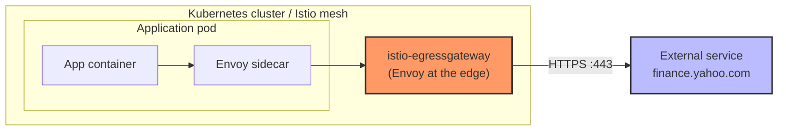

## 1.2 Three ways out of the mesh

| # | Pattern | Who makes the connection to the internet? | Where is outbound policy applied? |
|---|---|---|---|
| 1 | **Direct from sidecar** (ServiceEntry only) | Each pod's sidecar | Spread over every pod |
| 2 | **Sidecar TLS origination** | Each pod's sidecar (it encrypts) | Spread over every pod |
| 3 | **Egress gateway** (+ TLS origination) | **One dedicated gateway** | **One central place** |

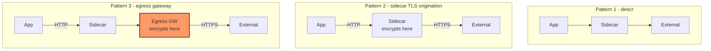

**Analogy — the corporate proxy.** Employees don't each connect their laptop straight to the internet. They send requests to a company proxy; the proxy is the *only* machine allowed outside. An egress gateway is that proxy for your pods.

## 1.3 Why use an egress gateway?

Imagine 100 microservices that call an external HTTPS API. Without a gateway, TLS settings, allow-lists and logging live in 100 places. With one:

- **One choke point** — every outbound call passes through a single, well-known component.
- **Central TLS policy** — pods speak plain HTTP inside the mesh; only the gateway speaks HTTPS to the world (easier cert rotation, easier audit).
- **Security policy** — apply `AuthorizationPolicy` to decide *which workloads* may reach *which external hosts*.
- **Observability** — one place to log and measure all outbound calls.
- **Predictable source IP** — pin gateway pods to dedicated nodes so partners can allow-list a small set of IP addresses (see [5.4](#54-scaling-high-availability-and-a-fixed-egress-ip)).
- **Network lock-down** — with Kubernetes `NetworkPolicy`, *only* the gateway needs internet access; application pods need none (see [5.1](#51-stop-bypass-with-a-kubernetes-networkpolicy)).

## 1.4 TLS origination vs termination vs passthrough

These three words trip up many students. Memorize the picture:

```text
TLS TERMINATION     Client ──HTTPS──▶ [Gateway removes TLS] ──HTTP──▶ Backend
                    (typical of an INGRESS gateway)

TLS ORIGINATION     Client ──HTTP───▶ [Gateway adds TLS]    ──HTTPS─▶ Backend
                    (what we build: the EGRESS gateway "originates" TLS)

TLS PASSTHROUGH     Client ──HTTPS──▶ [Gateway forwards untouched, routes by SNI] ──HTTPS──▶ Backend
                    (gateway never decrypts anything)
```

> **Rule of thumb:** *originate* = the proxy **starts** a new TLS connection. The application itself never does TLS.

## 1.5 The egress gateway is just Envoy

- It is a normal Envoy proxy running as a pod (`istio-egressgateway` in `istio-system`), labelled **`istio: egressgateway`**.
- It does **nothing** by default. It only starts doing something when you give it configuration: a `Gateway` (what to listen for), a `VirtualService` (where to send it) and `DestinationRule`s (how to connect).
- Its Kubernetes `Service` exposes ports 80 and 443 (the pod itself listens on unprivileged 8080/8443 — you'll see those numbers in `istioctl` output later).

## 1.6 The cast of resources

Five Istio objects work together (yes, **two** `DestinationRule`s):

| Order | Resource | One-line job | Question it answers |
|---|---|---|---|
| 1 | `ServiceEntry` | Registers the external host | *"Does Istio know this service exists?"* |
| 2 | `Gateway` | Configures the egress gateway pod's listener | *"What does the gateway accept?"* |
| 3 | `DestinationRule` **#1** | Sidecar → gateway connection settings | *"How do sidecars talk to the gateway?"* |
| 4 | `DestinationRule` **#2** | Gateway → external host connection settings (**TLS origination**) | *"How does the gateway talk to Yahoo?"* |
| 5 | `VirtualService` | Routing in two stages | *"Where should this request go next?"* |

**Memory trick — S-G-D-D-V** (or the story **REGISTER → LISTEN → CONNECT → ORIGINATE → ROUTE**):

```text
S  ServiceEntry     REGISTER   the external host
G  Gateway          LISTEN     on the egress gateway
D  DestinationRule  CONNECT    sidecar → gateway
D  DestinationRule  ORIGINATE  gateway → external (TLS)
V  VirtualService   ROUTE      mesh → gateway → external
```

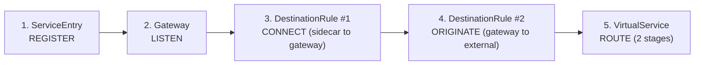

> 💡 **Apply order isn't enforced by Istio.** Config is eventually consistent, so applying the `VirtualService` before the `Gateway` won't error. The order above is the order that makes the design easiest to *reason about* (each object depends on the ones before it). Run `istioctl analyze` if you suspect a dangling reference.

## 1.7 The single most important idea

> **Never think of the request as one connection. Think of two.**

```text
Connection 1 (inside the mesh):   App ─▶ Sidecar ═══════════▶ Egress Gateway
Connection 2 (outside the mesh):                  Egress Gateway ═══════════▶ External service
```

Each connection has its **own** listener, port, TLS settings and routing rule. Almost every egress bug is a mix-up between the two.


---

# Part 2 — Intermediate: the guided lab

**Goal:** the application sends **plain HTTP**; Yahoo receives **HTTPS**; the traffic provably passes through the egress gateway.

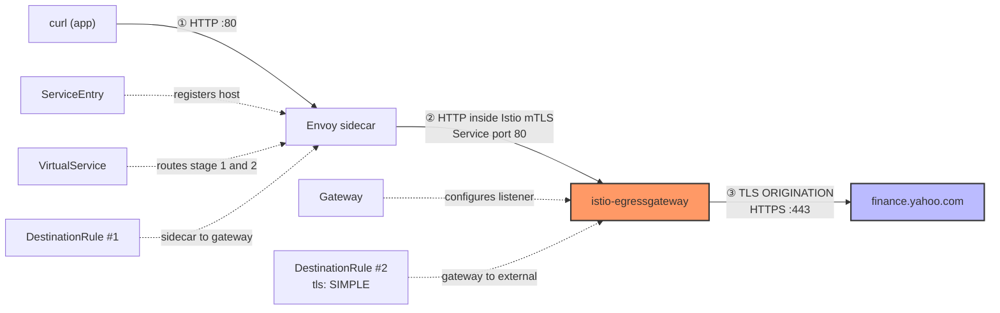

We build it one resource at a time and test after each stage, so you see exactly what each object contributes.

## Step 1 — `ServiceEntry`: REGISTER the external host

```bash
kubectl apply -f - <<'EOF'
apiVersion: networking.istio.io/v1
kind: ServiceEntry
metadata:
  name: finance-yahoo
  namespace: egress-lab
spec:
  hosts:
  - finance.yahoo.com
  location: MESH_EXTERNAL
  ports:
  - number: 80
    name: http
    protocol: HTTP
  - number: 443
    name: https
    protocol: HTTPS
  resolution: DNS
EOF
```

| Field | Meaning |
|---|---|
| `hosts` | The external DNS name(s) Istio should recognise |
| `location: MESH_EXTERNAL` | This service is outside the mesh (no sidecar, no Istio mTLS to it) |
| `ports` | Which ports may be used and their protocol. The **`name`** and **`protocol`** decide how Envoy parses the traffic |
| `resolution: DNS` | Envoy resolves the hostname via DNS to find real IPs (other options: `NONE`, `STATIC`, `DNS_ROUND_ROBIN`) |

**Verify**

```bash
kubectl get serviceentry -n egress-lab
ecurl --max-time 10 http://finance.yahoo.com/markets/crypto/all/
```

Expected — the `502` from Part 0 turned into a real answer from Yahoo (a redirect to HTTPS):

```text
NAME            HOSTS                   LOCATION        RESOLUTION   AGE
finance-yahoo   ["finance.yahoo.com"]   MESH_EXTERNAL   DNS          5s

HTTP/1.1 301 Moved Permanently
location: https://finance.yahoo.com/markets/crypto/all/
```

> Yahoo's exact headers/status can change over time (it may redirect elsewhere or rate-limit `curl`). What matters: **not `502` any more**.

### ⚠️ Checkpoint that catches many people (and exam questions)

The `301` proves Istio now *allows* the call. It does **not** prove the egress gateway is used. Check:

```bash
kubectl logs -l istio=egressgateway -c istio-proxy -n istio-system --tail=10 | grep -c yahoo
```

Expected: `0` — the gateway saw nothing. Today the traffic goes **straight from the sidecar to the internet**:

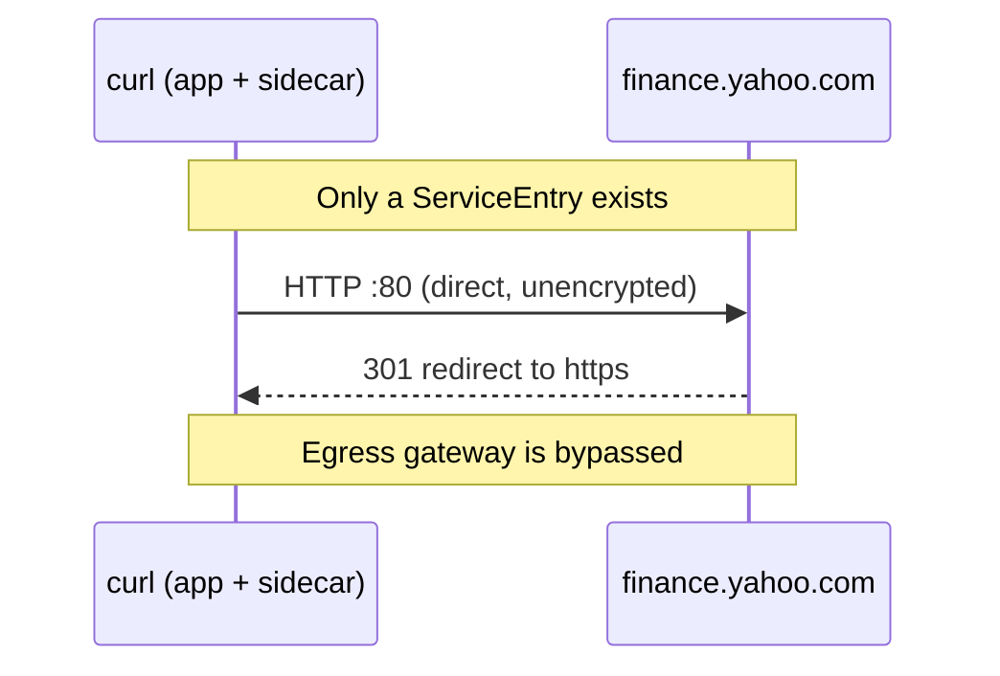

> **A `ServiceEntry` alone never forces traffic through an egress gateway.** It only tells Istio the host exists.

## Step 2 — `Gateway`: LISTEN on the egress gateway

```bash
kubectl apply -f - <<'EOF'
apiVersion: networking.istio.io/v1
kind: Gateway
metadata:
  name: yahoo-egressgateway
  namespace: egress-lab
spec:
  selector:
    istio: egressgateway          # attaches to the istio-egressgateway pod
  servers:
  - port:
      number: 80
      name: https-port-for-tls-origination
      protocol: HTTPS
    hosts:
    - finance.yahoo.com
    tls:
      mode: ISTIO_MUTUAL          # accept Istio-mTLS from sidecars
EOF
```

### 🤔 "Wait — port 80 but protocol HTTPS?"

This is the most confusing line in the whole lab, so slow down. Three different things are being described:

| What | Value | Why |
|---|---|---|
| Listener **port number** | `80` | Just a label to match the VirtualService and the Service port. The app asked for `http://` (port 80), so we keep 80 inside the mesh. |
| Listener **protocol** | `HTTPS` (TLS) | The **sidecar wraps its HTTP request in Istio mutual TLS** before sending it to the gateway, so the gateway listener must expect TLS. |
| **What the app sent** | plain HTTP | Unchanged. The app never knows about any TLS. |

So on the wire between sidecar and gateway you have *HTTP carried inside Istio mTLS*. That gives you an encrypted, **authenticated** hop — the gateway learns *which workload* is calling (needed for the `AuthorizationPolicy` lab in Part 5).

> 📌 `selector: istio: egressgateway` must match the gateway pod's label. If it doesn't, the `Gateway` silently attaches to nothing. Verify with `kubectl get pods -n istio-system --show-labels | grep egress`.

## Step 3 — `DestinationRule` #1: CONNECT sidecar → gateway

This rule is about the **first connection** (inside the mesh). It tells sidecars *how* to talk to the `istio-egressgateway` Service.

```bash
kubectl apply -f - <<'EOF'
apiVersion: networking.istio.io/v1
kind: DestinationRule
metadata:
  name: egressgateway-for-yahoo
  namespace: egress-lab
spec:
  host: istio-egressgateway.istio-system.svc.cluster.local
  subsets:
  - name: yahoo
    trafficPolicy:
      loadBalancer:
        simple: ROUND_ROBIN
      portLevelSettings:
      - port:
          number: 80
        tls:
          mode: ISTIO_MUTUAL      # use the mesh's mTLS certificates
          sni: finance.yahoo.com  # tells the gateway which host this is for
EOF
```

| Piece | Why it's there |
|---|---|
| `host: istio-egressgateway...svc.cluster.local` | This rule applies to the **egress gateway Service**, *not* to Yahoo |
| `subsets: - name: yahoo` | A named "view" of the gateway. The `VirtualService` will target `subset: yahoo`. One subset **per external host** keeps their settings separate (important when you add more hosts — see [4.5](#45-several-external-hosts-through-one-gateway)) |
| `tls.mode: ISTIO_MUTUAL` | Sidecar presents its mesh certificate and verifies the gateway's. Must **match** the `Gateway` server's `tls.mode` from Step 2 |
| `sni: finance.yahoo.com` | The gateway's listener selects a server block by SNI; this makes the sidecar send the right one |

## Step 4 — `DestinationRule` #2: ORIGINATE TLS gateway → Yahoo

This rule is about the **second connection** (outside the mesh). It is the one that actually performs **TLS origination**.

```bash
kubectl apply -f - <<'EOF'
apiVersion: networking.istio.io/v1
kind: DestinationRule
metadata:
  name: originate-tls-for-yahoo-com
  namespace: egress-lab
spec:
  host: finance.yahoo.com
  trafficPolicy:
    portLevelSettings:
    - port:
        number: 443
      tls:
        mode: SIMPLE              # one-way TLS: gateway acts like a browser
EOF
```

`mode: SIMPLE` means: *"when connecting to `finance.yahoo.com` on port **443**, start a normal TLS handshake."* The gateway presents **no** client certificate (that would be `MUTUAL`, see [4.4](#44-mutual-tls-origination-the-partner-needs-a-client-certificate)).

| | DestinationRule **#1** | DestinationRule **#2** |
|---|---|---|
| `host` | `istio-egressgateway.istio-system.svc.cluster.local` | `finance.yahoo.com` |
| Connection | sidecar → gateway (inside mesh) | gateway → Yahoo (outside) |
| Port that matters | **80** | **443** |
| `tls.mode` | `ISTIO_MUTUAL` | `SIMPLE` |
| Purpose | Secure, authenticate internal hop | **Real TLS origination** |

> 🔐 **Server certificate validation.** Do not assume `SIMPLE` alone verifies Yahoo's certificate. Whether the gateway validates the server certificate depends on your mesh's certificate-verification setting and on whether you supply a CA (`caCertificates`, or a `credentialName` Secret containing `ca.crt`). For production egress to sensitive partners, configure the CA **explicitly** and check the Istio 1.30 documentation for the default behaviour. (See [5.6](#56-production-checklist).)

## Step 5 — `VirtualService`: ROUTE in two stages

```bash
kubectl apply -f - <<'EOF'
apiVersion: networking.istio.io/v1
kind: VirtualService
metadata:
  name: direct-yahoo-through-egress-gateway
  namespace: egress-lab
spec:
  hosts:
  - finance.yahoo.com
  gateways:
  - yahoo-egressgateway     # the Gateway from Step 2 (stage 2 applies here)
  - mesh                    # every sidecar in the mesh (stage 1 applies here)
  http:
  # ---- Stage 1: sidecar -> egress gateway ------------------------------
  - match:
    - gateways:
      - mesh
      port: 80
    route:
    - destination:
        host: istio-egressgateway.istio-system.svc.cluster.local
        subset: yahoo
        port:
          number: 80
  # ---- Stage 2: egress gateway -> Yahoo --------------------------------
  - match:
    - gateways:
      - yahoo-egressgateway
      port: 80
    route:
    - destination:
        host: finance.yahoo.com
        port:
          number: 443       # 443 is what activates DestinationRule #2 (TLS)
EOF
```

### Read it like two sentences

| Stage | `match.gateways` | Plain-English meaning |
|---|---|---|
| **1** | `mesh` | *"If a sidecar in the mesh wants `finance.yahoo.com:80`, send it to the egress gateway (subset `yahoo`, port 80)."* |
| **2** | `yahoo-egressgateway` | *"Once the request has arrived at that egress gateway, send it on to the real `finance.yahoo.com` on **port 443**."* |

* **`mesh`** is a reserved keyword meaning "all sidecars in the mesh". It is **not** the name of a Gateway object.
* The **port change 80 → 443** in stage 2 is deliberate. The destination port 443 is what makes Envoy look up DestinationRule #2 (which has `SIMPLE` TLS for port 443).
* **Both** entries in `spec.gateways` are required. Remove `mesh` and stage 1 disappears; remove the named gateway and stage 2 disappears.

## Step 6 — Verify (four independent proofs)

A single `200` isn't proof. Collect evidence from four places.

### Proof 1 — The response changed from `301` to `200`

```bash
ecurl --max-time 15 http://finance.yahoo.com/markets/crypto/all/
```

Expected:

```text
HTTP/1.1 200 OK
...
```

**Why is this a proof?** Before, the plain-HTTP request reached Yahoo and Yahoo said "please use HTTPS" (`301`). Now the gateway already speaks HTTPS to Yahoo, so Yahoo answers directly. **A `301 → https` after finishing all five steps means TLS origination is *not* happening.**

> If Yahoo answers `403`/`429` (it sometimes rejects scripted clients), that is Yahoo's behaviour, not an Istio fault. Continue with proofs 2–4, which don't depend on Yahoo's status code. To use a friendlier host, see the tip at the end of this step.

### Proof 2 — The gateway logged the request

```bash
kubectl logs -l istio=egressgateway -c istio-proxy -n istio-system --tail=20 | grep finance.yahoo.com
```

Expect a line similar to (shortened):

```text
[2026-09-29T10:15:31.204Z] "GET /markets/crypto/all/ HTTP/1.1" 200 - via_upstream ... "finance.yahoo.com" "203.0.113.10:443" outbound|443||finance.yahoo.com ...
```

The key fragment is **`outbound|443||finance.yahoo.com`** — the gateway's upstream cluster on **port 443**. Earlier the gateway log had zero Yahoo lines.

### Proof 3 — The sidecar sent the request to the gateway

```bash
kubectl logs -n egress-lab "$SOURCE_POD" -c istio-proxy --tail=3
```

Look for the upstream cluster:

```text
outbound|80|yahoo|istio-egressgateway.istio-system.svc.cluster.local
```

Read it as `outbound | port | subset | service` → port 80, subset **yahoo**, the egress gateway service.

### Proof 4 — Envoy configuration shows TLS origination

```bash
istioctl proxy-config clusters deploy/istio-egressgateway -n istio-system \
  --fqdn finance.yahoo.com --port 443 -o json | grep -i -A3 transportSocket
```

You should see a `transportSocket` block using Envoy's **TLS** transport (`envoy.transport_sockets.tls`) — the gateway's upstream connection to Yahoo is TLS-wrapped.

And a lint check on the whole namespace:

```bash
istioctl analyze -n egress-lab
```

Expected: `✔ No validation issues found when analyzing namespace: egress-lab.`

### ✅ Lab complete — what the wire looks like now

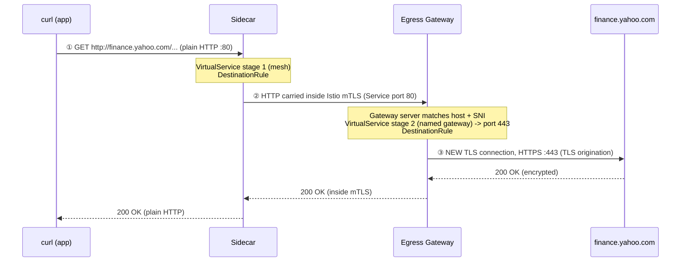

| Hop | From → To | Port | On the wire | Governed by |
|---|---|---|---|---|
| ① | app → its sidecar | 80 | plain HTTP | sidecar traffic interception |
| ② | sidecar → egress gateway | 80 (Service) → 8080 (pod) | HTTP inside Istio mTLS | VS stage 1 + DR #1 + `Gateway` server |
| ③ | egress gateway → Yahoo | 443 | HTTPS (TLS originated) | VS stage 2 + DR #2 |

> 💡 **Tip — using a different external host.** If Yahoo is unreliable from your network, replace `finance.yahoo.com` everywhere with `edition.cnn.com` (the host used in the official Istio docs) and use the path `/politics`. Keep object names or rename them consistently. A quick way: save the manifests from [Appendix A](#appendix-a--all-lab-manifests-in-one-place) to a file and run `sed 's/finance.yahoo.com/edition.cnn.com/g'`.

## Step 7 — Experiment: break it on purpose (highly recommended)

Understanding comes from seeing failures. For each experiment, **undo it** afterwards.

**Experiment A — Remove stage 1 (`mesh`).**

```bash
kubectl get virtualservice direct-yahoo-through-egress-gateway -n egress-lab -o yaml > /tmp/vs-backup.yaml
kubectl patch virtualservice direct-yahoo-through-egress-gateway -n egress-lab --type=json \
  -p='[{"op":"remove","path":"/spec/http/0"},{"op":"replace","path":"/spec/gateways","value":["yahoo-egressgateway"]}]'
ecurl --max-time 10 http://finance.yahoo.com/markets/crypto/all/
kubectl logs -l istio=egressgateway -c istio-proxy -n istio-system --tail=5 | grep -c yahoo
```

Result: the call likely **still "works"** (`301` again), but the gateway gets nothing new. The request silently **bypasses** the gateway — the most dangerous kind of failure because nothing looks broken. Restore:

```bash
kubectl apply -f - <<'EOF'
apiVersion: networking.istio.io/v1
kind: VirtualService
metadata:
  name: direct-yahoo-through-egress-gateway
  namespace: egress-lab
spec:
  hosts:
  - finance.yahoo.com
  gateways:
  - yahoo-egressgateway
  - mesh
  http:
  - match:
    - gateways:
      - mesh
      port: 80
    route:
    - destination:
        host: istio-egressgateway.istio-system.svc.cluster.local
        subset: yahoo
        port:
          number: 80
  - match:
    - gateways:
      - yahoo-egressgateway
      port: 80
    route:
    - destination:
        host: finance.yahoo.com
        port:
          number: 443
EOF
```

**Experiment B — Wrong TLS port in DestinationRule #2.** Change `number: 443` to `number: 80` in `originate-tls-for-yahoo-com` (`kubectl edit destinationrule originate-tls-for-yahoo-com -n egress-lab`). The gateway now connects to port 443 **without** TLS settings, so you'll see a redirect or an error instead of `200`. Change it back to `443`.

**Experiment C — Delete the `Gateway`.**

```bash
kubectl delete gateway yahoo-egressgateway -n egress-lab
ecurl --max-time 10 http://finance.yahoo.com/markets/crypto/all/
```

The gateway no longer has a matching listener, so the request fails with a **`503`** (connection failure) or similar. Re-create the `Gateway` from Step 2.

After each experiment re-run **Proof 1** to confirm you are back to `200`.


---

# Part 3 — Advanced: under the hood

## 3.1 How Istio turns your YAML into behaviour

You never configure Envoy directly. **`istiod`** watches your Istio resources, translates them into Envoy configuration, and pushes it to every proxy (the sidecars **and** the egress gateway) over xDS.

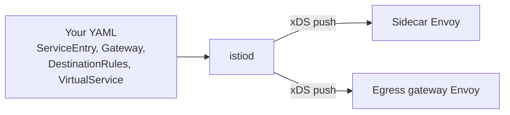

Check that both proxies are in sync with istiod:

```bash
istioctl proxy-status
```

Look for your `curl-...egress-lab` pod and `istio-egressgateway-...istio-system` with **`SYNCED`** in the CDS/LDS/EDS/RDS columns. `STALE` or `NOT SENT` means a configuration problem (or a very recent change).

## 3.2 What happens inside the egress gateway

When a request arrives at the gateway Envoy, it walks this pipeline. Each stage is driven by one of your resources:

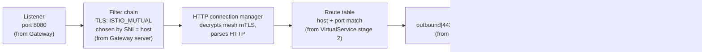

## 3.3 Inspect each stage with `istioctl`

Make these commands muscle memory — they are the fastest way to answer *"did my configuration reach the proxy?"*.

**On the sidecar (does it know to use the gateway?)**

```bash
# Route: which VirtualService matched finance.yahoo.com:80?
istioctl proxy-config routes "$SOURCE_POD" -n egress-lab --name 80 | grep -E "NAME|yahoo"

# Cluster: the gateway subset should exist
istioctl proxy-config clusters "$SOURCE_POD" -n egress-lab \
  --fqdn istio-egressgateway.istio-system.svc.cluster.local
```

Expected: a route row for `finance.yahoo.com` pointing at VirtualService `direct-yahoo-through-egress-gateway.egress-lab`, and cluster rows for the egress gateway with `SUBSET` = `yahoo` on port `80`.

**On the egress gateway (did it accept and forward?)**

```bash
# Listener
istioctl proxy-config listeners deploy/istio-egressgateway -n istio-system

# Routes
istioctl proxy-config routes deploy/istio-egressgateway -n istio-system

# Cluster to Yahoo, and its live endpoints
istioctl proxy-config clusters  deploy/istio-egressgateway -n istio-system --fqdn finance.yahoo.com
istioctl proxy-config endpoints deploy/istio-egressgateway -n istio-system \
  --cluster "outbound|443||finance.yahoo.com"
```

What to look for:

| Command | Healthy output |
|---|---|
| `listeners` | A listener on port **8080** (the pod-side of Service port 80) |
| `routes` | A route config (e.g. `http.8080`) with domain `finance.yahoo.com` → your VirtualService |
| `clusters --fqdn finance.yahoo.com` | Cluster `outbound|443||finance.yahoo.com` |
| `endpoints --cluster ...` | Real Yahoo IP addresses on `:443`, status `HEALTHY` |

> 💡 The gateway pod runs unprivileged, so Service port 80/443 map to container ports **8080/8443**. That is why 8080 shows up in `istioctl` even though your YAML says 80.

## 3.4 Reading an access-log line

Envoy's default Istio log line is dense. These are the fields you'll use most (in the gateway log and in the sidecar log):

| Field | Example | Tells you |
|---|---|---|
| Request line | `"GET /markets/crypto/all/ HTTP/1.1"` | What the client asked for |
| Response code | `200` | Result. `0` or `503` often means connection trouble |
| **Response flags** | `-`, `UF`, `UH`, `NR`, `UC`, `URX` | *Why* Envoy failed (table below) |
| Transport failure reason | `"-"` or TLS error text | TLS handshake problems |
| Authority | `"finance.yahoo.com"` | Host header the client sent |
| Upstream host | `"203.0.113.10:443"` | The real address Envoy connected to |
| **Upstream cluster** | `outbound|443||finance.yahoo.com` | **Where Envoy decided to send it** |
| Requested server name | `finance.yahoo.com` | SNI on the incoming connection |

Common **response flags** (memorize these four):

| Flag | Meaning | Typical egress cause |
|---|---|---|
| `NR` | No route configured | Host/port doesn't match any VirtualService/route |
| `UH` | No healthy upstream | Subset selects nothing / gateway pods not ready |
| `UF` | Upstream connection failure | TLS mismatch on hop ②, or gateway can't reach the internet |
| `UC` | Upstream connection terminated | Server closed the connection (often a protocol/TLS mismatch) |

## 3.5 Debugging method — "follow the hops"

Ask these questions **in order**; stop at the first "no".

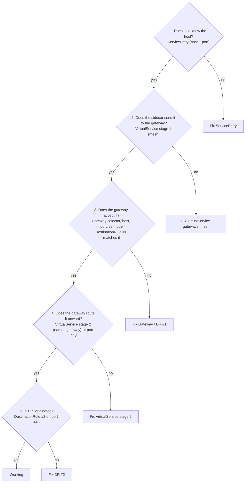

---

# Part 4 — Advanced: patterns and variants

Now that the core pattern is solid, here are the variations you'll meet in real clusters and in the exam.

## 4.1 Sidecar TLS origination (no gateway)

The sidecar itself encrypts. **Read-only example — do not apply while the Part 2 lab is active** (it would conflict with the same host).

```yaml
apiVersion: networking.istio.io/v1
kind: ServiceEntry
metadata:
  name: finance-yahoo-sidecar-origination
spec:
  hosts:
  - finance.yahoo.com
  ports:
  - number: 80
    name: http-port
    protocol: HTTP
    targetPort: 443          # sidecar redirects port 80 -> 443
  - number: 443
    name: https-port
    protocol: HTTPS
  resolution: DNS
---
apiVersion: networking.istio.io/v1
kind: DestinationRule
metadata:
  name: yahoo-sidecar-tls
spec:
  host: finance.yahoo.com
  trafficPolicy:
    portLevelSettings:
    - port:
        number: 80
      tls:
        mode: SIMPLE         # TLS originated by each pod's sidecar
```

**Trade-off:** simplest to set up, but the TLS policy is applied in every workload's sidecar, and there is no dedicated egress hop to audit or lock down.

## 4.2 Older variant: plain HTTP on the internal hop

Earlier Istio guides (and one of the source guides) keep the sidecar→gateway hop as **unencrypted HTTP**. Only two objects change:

```yaml
# Gateway: plain HTTP listener, no tls block
servers:
- port: {number: 80, name: http, protocol: HTTP}
  hosts: [finance.yahoo.com]
---
# DestinationRule #1: no tls settings at all
spec:
  host: istio-egressgateway.istio-system.svc.cluster.local
  subsets:
  - name: yahoo
    trafficPolicy:
      loadBalancer: {simple: ROUND_ROBIN}
```

Everything else (ServiceEntry, DestinationRule #2, VirtualService) is identical.

> ⚠️ **The two ends must agree.** `Gateway` `protocol: HTTP` (plain) **with** DestinationRule #1 `ISTIO_MUTUAL` — or the reverse — means one side speaks TLS and the other doesn't. Requests fail, usually with `503` and response flags `UF`/`UC`. Choose one design and apply it to *both* objects.

| Internal hop | `Gateway` server | DestinationRule #1 | Gateway can see caller identity? |
|---|---|---|---|
| **Istio mTLS** *(this guide)* | `protocol: HTTPS` + `tls.mode: ISTIO_MUTUAL` | `tls.mode: ISTIO_MUTUAL` + `sni` | ✅ Yes → enables `AuthorizationPolicy` by workload |
| Plain HTTP | `protocol: HTTP` | no `tls` | ❌ No |

## 4.3 TLS passthrough (the app already speaks HTTPS)

Sometimes the application **must** do its own TLS (certificate pinning, client libraries you can't change). Then the gateway can't originate — it can only **forward** the encrypted stream, choosing the destination from the **SNI** in the TLS handshake. You still get a central egress point and logs, but no visibility into the HTTP content.

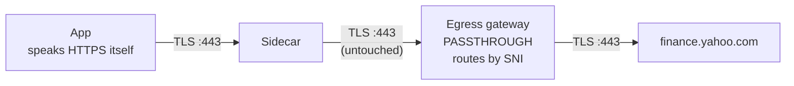

```yaml
apiVersion: networking.istio.io/v1
kind: Gateway
metadata:
  name: yahoo-egressgateway-passthrough
  namespace: egress-lab
spec:
  selector:
    istio: egressgateway
  servers:
  - port:
      number: 443
      name: tls
      protocol: TLS
    hosts:
    - finance.yahoo.com
    tls:
      mode: PASSTHROUGH
---
apiVersion: networking.istio.io/v1
kind: VirtualService
metadata:
  name: yahoo-passthrough-through-egress-gateway
  namespace: egress-lab
spec:
  hosts:
  - finance.yahoo.com
  gateways:
  - mesh
  - yahoo-egressgateway-passthrough
  tls:                                   # <-- "tls:" routes, not "http:"
  - match:
    - gateways: [mesh]
      port: 443
      sniHosts: [finance.yahoo.com]
    route:
    - destination:
        host: istio-egressgateway.istio-system.svc.cluster.local
        subset: yahoo
        port: {number: 443}
  - match:
    - gateways: [yahoo-egressgateway-passthrough]
      port: 443
      sniHosts: [finance.yahoo.com]
    route:
    - destination:
        host: finance.yahoo.com
        port: {number: 443}
```

Test with the app doing the TLS itself: `ecurl --max-time 15 https://finance.yahoo.com/markets/crypto/all/`.

**Key differences from origination:**

| | Origination (Part 2) | Passthrough (4.3) |
|---|---|---|
| Who encrypts | Gateway | The app |
| Gateway sees HTTP paths/headers? | ✅ Yes | ❌ No (only SNI) |
| VirtualService section | `http:` | `tls:` with `sniHosts` |
| Gateway server | `HTTPS` + `ISTIO_MUTUAL` | `TLS` + `PASSTHROUGH` |

## 4.4 Mutual TLS origination (the partner needs a client certificate)

Some partners demand **mutual TLS**: your side must present a client certificate. Centralizing this at the egress gateway means the private key lives in **one** place instead of in every pod.

**Step A — store the credentials as a Secret in the egress gateway's namespace** (`istio-system`). Use the key names `tls.key`, `tls.crt` and `ca.crt`:

```bash
kubectl create secret generic partner-client-credential -n istio-system \
  --from-file=tls.key=client.key \
  --from-file=tls.crt=client.crt \
  --from-file=ca.crt=partner-ca.crt
```

**Step B — a DestinationRule with `MUTUAL` mode** (replaces `DestinationRule #2` for that host):

```yaml
apiVersion: networking.istio.io/v1
kind: DestinationRule
metadata:
  name: originate-mtls-for-partner
  namespace: egress-lab
spec:
  host: internal-partner.example.com
  trafficPolicy:
    portLevelSettings:
    - port:
        number: 443
      tls:
        mode: MUTUAL
        credentialName: partner-client-credential   # Secret with client cert, key, CA
        sni: internal-partner.example.com
```

| `tls.mode` | Meaning | Extra fields |
|---|---|---|
| `DISABLE` | No TLS | — |
| `SIMPLE` | One-way TLS (verify server) | optional CA |
| `MUTUAL` | Two-way TLS (present client cert too) | client cert + key + CA (`credentialName`) |
| `ISTIO_MUTUAL` | Two-way TLS using **Istio's own** mesh certificates | none (used inside the mesh) |

> 📌 The older fields `clientCertificate`, `privateKey`, `caCertificates` take **file paths** inside the proxy container, so the certificates must be mounted there. On a gateway, `credentialName` (a Kubernetes Secret delivered through SDS) is the practical approach: no volume mounts and certificate rotation without pod restarts. Confirm Secret-namespace rules for your Istio version in the official docs before using this in production.

## 4.5 Several external hosts through one gateway

One gateway pod can serve many external hosts. What is per-host and what is shared?

| Resource | One shared object or one per host? | Why |
|---|---|---|
| Egress gateway **pod** | Shared | It is the single choke point |
| `ServiceEntry` | Either — `hosts:` accepts a list | Group hosts that share ports/protocol/resolution |
| `Gateway` | Shared — list many `hosts:` in a server (or several servers) | Defines what the gateway accepts |
| `DestinationRule` #1 | Shared object, **one subset per host** | Each subset carries that host's `sni` |
| `DestinationRule` #2 | **One per host** (`host:` takes one destination) | Each host can need a different TLS mode (`SIMPLE` vs `MUTUAL`) |
| `VirtualService` | One per host is the clean default (a list in `hosts:` is allowed) | Independent lifecycle per partner |

> 🧩 *Challenge lab in [Part 8](#challenge-labs): add `edition.cnn.com` next to Yahoo.*

## 4.6 Other things worth knowing

| Topic | Summary |
|---|---|
| **Non-HTTP traffic (TCP/databases)** | Use a `ServiceEntry` with a `TCP` port and a `tcp:` route in the VirtualService. The gateway forwards bytes; there is no HTTP-level routing or logging |
| **Wildcard hosts** (`*.example.com`) | Possible, but the gateway can only route by SNI, and a wildcard needs an SNI-forwarding arrangement. Follow the official "Egress using wildcard hosts" task rather than improvising |
| **External HTTPS proxy** | When policy requires going through a corporate proxy, Istio can route to it — see the official "Using an external HTTPS proxy" task |
| **Kubernetes Gateway API** | Istio also supports defining egress gateways with the Kubernetes Gateway API (`gateway.networking.k8s.io`). This guide uses the Istio APIs because they make each hop explicit and are what the demo-profile gateway uses. Gateway API needs its CRDs installed and creates its *own* gateway deployment |
| **Ambient mode** | Handles egress differently from sidecar mode. Everything in this guide is **sidecar mode** |

## 4.7 Which pattern should I use?

| Situation | Best fit |
|---|---|
| Quick allow-listing, no strict control needed | `ServiceEntry` only (Pattern 1) |
| Just need HTTP→HTTPS upgrade, few workloads | Sidecar TLS origination (4.1) |
| Central audit, policy, network lock-down, fixed egress IP | **Egress gateway + TLS origination** (Part 2) |
| App must do its own TLS (pinning, gRPC over TLS with its own certs) | Egress gateway **passthrough** (4.3) |
| Partner requires client certificates | Egress gateway **mTLS origination** (4.4) |
| Need to know *which workload* called which host | Istio-mTLS internal hop + `AuthorizationPolicy` (5.2) |


---

# Part 5 — Expert: security and operations

An egress gateway only adds security if traffic **can't go around it** and only **approved workloads** can use it. This part closes both gaps.

## 5.1 Stop bypass with a Kubernetes `NetworkPolicy`

**The problem.** Everything so far relies on the *sidecar* choosing to use the gateway. A pod without a sidecar (or someone who bypasses the proxy) ignores your `VirtualService` and `REGISTRY_ONLY` completely. Sidecar configuration is **routing**, not a **security boundary**. The boundary must be enforced by the network.

> ⚠️ **Requires a CNI that enforces `NetworkPolicy`** (for example Calico or Cilium). On a cluster whose CNI ignores NetworkPolicy, the "blocked" test below will *not* block anything.

### Lab 5.1.1 — Prove the bypass exists

Create a "rogue" pod with **no sidecar**:

```bash
kubectl apply -f - <<'EOF'
apiVersion: v1
kind: Pod
metadata:
  name: rogue
  namespace: egress-lab
  labels:
    app: rogue
    sidecar.istio.io/inject: "false"     # opt out of injection
spec:
  terminationGracePeriodSeconds: 0
  containers:
  - name: curl
    image: curlimages/curl:8.11.1
    command: ["/bin/sleep", "infinity"]
EOF
kubectl wait --for=condition=Ready pod/rogue -n egress-lab --timeout=60s
kubectl get pod rogue -n egress-lab      # READY should be 1/1 (no sidecar)
```

Call the internet directly:

```bash
kubectl exec -n egress-lab rogue -- curl -sS -o /dev/null -w '%{http_code}\n' --max-time 10 https://finance.yahoo.com/
```

Any HTTP status code (`200`, `301`, `429`, …) means the pod **reached the internet directly**, ignoring Istio and the gateway.

### Lab 5.1.2 — Close the door

Allow the namespace's pods to talk only to: other pods in the namespace, `istio-system` (istiod **and** the egress gateway), and DNS.

```bash
kubectl apply -f - <<'EOF'
apiVersion: networking.k8s.io/v1
kind: NetworkPolicy
metadata:
  name: egress-only-via-mesh
  namespace: egress-lab
spec:
  podSelector: {}            # every pod in the namespace
  policyTypes:
  - Egress
  egress:
  - to:                      # pods in this namespace
    - podSelector: {}
  - to:                      # istiod and the egress gateway
    - namespaceSelector:
        matchLabels:
          kubernetes.io/metadata.name: istio-system
  - to:                      # cluster DNS
    - namespaceSelector:
        matchLabels:
          kubernetes.io/metadata.name: kube-system
    ports:
    - protocol: UDP
      port: 53
    - protocol: TCP
      port: 53
EOF
```

### Lab 5.1.3 — Verify both sides

```bash
# 1) The rogue pod is now stuck: expect 000 after the timeout (curl exit code 28)
kubectl exec -n egress-lab rogue -- curl -sS -o /dev/null -w '%{http_code}\n' --max-time 8 https://finance.yahoo.com/

# 2) The legitimate path via sidecar + egress gateway still works
ecurl --max-time 15 http://finance.yahoo.com/markets/crypto/all/
```

Expected: `000` (timeout) for the rogue pod, `HTTP/1.1 200 OK` for the mesh path.

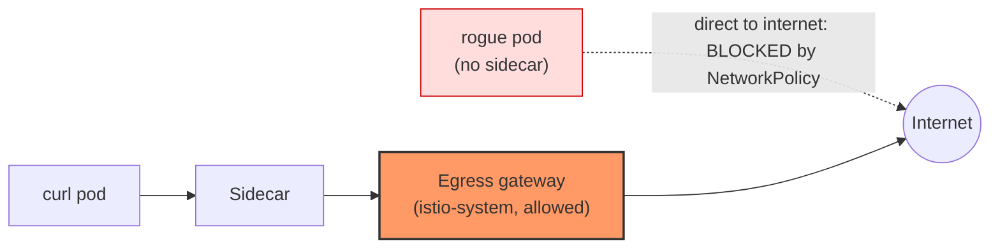

> 💡 **Fail-closed bonus.** Repeat *Experiment A* from Step 7 now. Before the NetworkPolicy, removing the `mesh` route made traffic silently bypass the gateway. Now it **fails visibly** (timeout) instead — a misconfiguration can no longer leak traffic.

**Notes**
- If your cluster uses NodeLocal DNSCache or a differently labelled DNS service, adjust the DNS rule.
- Only namespaces you restrict are protected. Apply an equivalent policy (ideally a default-deny baseline) to every namespace whose egress you must control.

## 5.2 Decide *who* may use the gateway: `AuthorizationPolicy`

Because hop ② uses Istio mTLS, the gateway knows the caller's **workload identity** (its ServiceAccount). You can therefore write rules such as *"only the `curl` ServiceAccount may call `finance.yahoo.com`"*.

> This only works with the **mTLS design** (Gateway `ISTIO_MUTUAL` + DR #1 `ISTIO_MUTUAL`). With a plain-HTTP internal hop (4.2) the gateway can't identify the caller.

### Lab 5.2.1 — Add a second, unauthorised client

```bash
kubectl apply -f - <<'EOF'
apiVersion: v1
kind: ServiceAccount
metadata:
  name: blocked
  namespace: egress-lab
---
apiVersion: apps/v1
kind: Deployment
metadata:
  name: curl-blocked
  namespace: egress-lab
spec:
  replicas: 1
  selector:
    matchLabels:
      app: curl-blocked
  template:
    metadata:
      labels:
        app: curl-blocked
    spec:
      serviceAccountName: blocked
      terminationGracePeriodSeconds: 0
      containers:
      - name: curl
        image: curlimages/curl:8.11.1
        command: ["/bin/sleep", "infinity"]
EOF
kubectl rollout status deploy/curl-blocked -n egress-lab
```

Both clients can currently use Yahoo through the gateway:

```bash
kubectl exec -n egress-lab deploy/curl-blocked -c curl -- \
  curl -sS -o /dev/null -w '%{http_code}\n' --max-time 15 http://finance.yahoo.com/markets/crypto/all/
```

Expected: an HTTP status from Yahoo (e.g. `200`).

### Lab 5.2.2 — Allow only the `curl` ServiceAccount

The policy lives in `istio-system` and targets the egress gateway pods:

```bash
kubectl apply -f - <<'EOF'
apiVersion: security.istio.io/v1
kind: AuthorizationPolicy
metadata:
  name: egress-allow-curl-only
  namespace: istio-system
spec:
  selector:
    matchLabels:
      istio: egressgateway
  action: ALLOW
  rules:
  - from:
    - source:
        principals:
        - "cluster.local/ns/egress-lab/sa/curl"    # <trust-domain>/ns/<namespace>/sa/<serviceaccount>
    to:
    - operation:
        hosts:
        - "finance.yahoo.com"
        - "finance.yahoo.com:*"
EOF
```

### Lab 5.2.3 — Verify

```bash
# Authorised client -> works
ecurl --max-time 15 http://finance.yahoo.com/markets/crypto/all/

# Unauthorised client -> denied at the gateway
kubectl exec -n egress-lab deploy/curl-blocked -c curl -- \
  curl -sS --max-time 15 http://finance.yahoo.com/markets/crypto/all/
```

Expected: first command `HTTP/1.1 200 OK`; second prints:

```text
RBAC: access denied
```

(HTTP status `403`.) The gateway logs the denied request too:

```bash
kubectl logs -l istio=egressgateway -c istio-proxy -n istio-system --tail=5
```

**Why this design is powerful:**

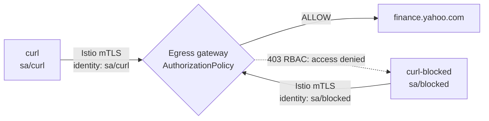

> ⚠️ An `ALLOW` policy on the gateway means **anything not explicitly allowed is denied** for that gateway — including future hosts and workloads. That's the point (default-deny egress), but add rules as you onboard new destinations.
> If the trust domain of your mesh isn't `cluster.local`, replace it in the principal. Check with `kubectl get configmap istio -n istio-system -o jsonpath='{.data.mesh}' | grep -i trustDomain`.

## 5.3 Apply resilience policy at the choke point

Because every outbound call passes through one place, it's the natural spot for timeouts, retries and connection limits. Optional add-ons to the Part 2 objects:

**Timeout and retries on the gateway→Yahoo stage** (edit stage 2 of the VirtualService):

```yaml
  - match:
    - gateways:
      - yahoo-egressgateway
      port: 80
    route:
    - destination:
        host: finance.yahoo.com
        port:
          number: 443
    timeout: 10s
    retries:
      attempts: 2
      perTryTimeout: 4s
      retryOn: connect-failure,refused-stream,503
```

**Connection limits toward Yahoo** (add to DestinationRule #2 under `trafficPolicy`):

```yaml
  trafficPolicy:
    connectionPool:
      tcp:
        maxConnections: 100
        connectTimeout: 5s
      http:
        http1MaxPendingRequests: 50
        maxRequestsPerConnection: 100
    portLevelSettings:
    - port:
        number: 443
      tls:
        mode: SIMPLE
```

> ⚠️ Only retry **idempotent** requests, and keep retry budgets small — retries multiply load on the external service (and on your gateway).

## 5.4 Scaling, high availability and a fixed egress IP

By funnelling everything through the gateway you make it **critical infrastructure**. Treat it like a production load balancer.

| Concern | What to do |
|---|---|
| **Single point of failure** | Run ≥ 2 replicas, spread across nodes/zones (pod anti-affinity or topology spread), add a `PodDisruptionBudget` |
| **Load** | Enable an HPA; watch CPU, active connections and `5xx` on the gateway |
| **Fixed source IP for partners** | Schedule gateway pods onto dedicated nodes (`nodeSelector` + taints/tolerations) whose outbound traffic leaves through a known NAT/public IP; give *those* IPs to partners |
| **Blast radius** | Consider separate gateways for separate trust zones (e.g., payments vs. general internet) |
| **Persistence of settings** | Set replicas/resources in your **installation configuration** — changes made with `kubectl` can be overwritten at the next Istio upgrade |

Quick experiment (lab only) — the demo profile runs one replica:

```bash
kubectl scale deployment istio-egressgateway -n istio-system --replicas=2
kubectl get pods -n istio-system -l istio=egressgateway
```

Generate some traffic, then confirm both replicas serve it (the `ROUND_ROBIN` in DR #1 spreads requests):

```bash
for i in $(seq 1 10); do ecurl --max-time 15 http://finance.yahoo.com/markets/crypto/all/ | head -1; done
kubectl logs -l istio=egressgateway -c istio-proxy -n istio-system --prefix --tail=20 | grep finance.yahoo.com
```

Scale back when done: `kubectl scale deployment istio-egressgateway -n istio-system --replicas=1`.

## 5.5 Observability

**Access logs** (used throughout this guide) — first place to look.

**Metrics.** Both the sidecar and the gateway report standard Istio metrics. If you have Prometheus scraping the mesh:

```promql
# Requests to Yahoo, per calling workload and status code (reported by the callers' sidecars)
sum by (source_workload, response_code) (
  rate(istio_requests_total{reporter="source", destination_service="finance.yahoo.com"}[5m])
)

# Same traffic as seen by the gateway itself
sum by (response_code) (
  rate(istio_requests_total{source_workload="istio-egressgateway", destination_service="finance.yahoo.com"}[5m])
)
```

If the two series diverge, some callers are **not** going through the gateway.

**Raw Envoy stats** (no Prometheus needed):

```bash
kubectl exec -n istio-system deploy/istio-egressgateway -c istio-proxy -- \
  pilot-agent request GET stats | grep 'outbound|443||finance.yahoo.com' | grep -E 'upstream_rq_total|upstream_cx_total|ssl.handshake'
```

A growing `ssl.handshake` counter for that cluster is one more proof that TLS is being originated by the gateway.

## 5.6 Production checklist

- [ ] Mesh-wide `outboundTrafficPolicy: REGISTRY_ONLY` (not just one namespace)
- [ ] `NetworkPolicy` (default-deny egress) so only the gateway can leave the cluster
- [ ] Gateway `ISTIO_MUTUAL` on the internal hop, so callers have an identity
- [ ] `AuthorizationPolicy` on the gateway: explicit workload → host allow-list
- [ ] Server certificate validation configured **explicitly** (CA supplied) for external hosts; confirm the Istio 1.30 default for your mesh
- [ ] Client certificates for partner mTLS stored as Secrets in the gateway namespace, with a rotation plan
- [ ] ≥ 2 gateway replicas, anti-affinity, PDB, HPA, sized for peak
- [ ] Dedicated nodes/NAT for a stable egress IP if partners allow-list you
- [ ] Access logs retained; metrics dashboards and alerts for gateway `5xx` and latency
- [ ] `istioctl analyze` in CI; egress configuration in version control
- [ ] Documented "break-glass" procedure (how to allow a new host quickly *and* safely)


---

# Part 6 — Troubleshooting playbook

## 6.1 Symptom → likely cause (quick table)

| # | Symptom (from the `curl` pod) | Most likely cause | First command to run |
|---|---|---|---|
| 1 | `502 Bad Gateway`, sidecar log shows `BlackHoleCluster` | No `ServiceEntry` for that host/port (with `REGISTRY_ONLY`), or the `Sidecar` resource hides it | `kubectl get serviceentry -A` |
| 2 | `301` → `https://…` **after** the full setup | Request isn't going through TLS origination (bypass, or stage 2 not using port 443) | `istioctl proxy-config routes $SOURCE_POD -n egress-lab --name 80` |
| 3 | Request works, but **gateway log is empty** | Traffic bypasses the gateway (missing `mesh` stage) | `kubectl get vs direct-yahoo-through-egress-gateway -n egress-lab -o yaml` |
| 4 | `404`, `server: envoy`, empty body | Request reached the gateway but no route matched (host/port/gateway-name mismatch) | `istioctl proxy-config routes deploy/istio-egressgateway -n istio-system` |
| 5 | `503` with `upstream connect error … connection failure/reset` | Hop ② mismatch: `Gateway` plain HTTP vs DR #1 `ISTIO_MUTUAL` (or reverse); or no `Gateway` listener | Compare the `Gateway` server `tls`/`protocol` with DR #1 |
| 6 | `503`, gateway log `UF` with a TLS error / Yahoo says "plain HTTP request sent to HTTPS port" | Hop ③: DR #2 missing/wrong port, or CA/handshake problem | `kubectl get dr originate-tls-for-yahoo-com -n egress-lab -o yaml` |
| 7 | `403`, body `RBAC: access denied` | `AuthorizationPolicy` on the gateway doesn't allow this identity/host | `kubectl get authorizationpolicy -n istio-system -o yaml` |
| 8 | Hangs, `curl` exit code 28 (timeout) | `NetworkPolicy`, cloud firewall, or DNS blocks the gateway/pod | `kubectl exec … -- curl -v --max-time 5 …` and check policies |
| 9 | `no healthy upstream` / flag `UH` | Subset/label mismatch or gateway pods not Ready | `kubectl get pods -n istio-system -l istio=egressgateway` |
| 10 | Config applied but the gateway "does nothing" | `Gateway` `selector` doesn't match the pod label, or namespace scoping | `kubectl get pods -n istio-system --show-labels \| grep egress` |
| 11 | Yahoo returns `403`/`429` | Yahoo's bot protection — an **external** behaviour, not Istio | Prove the path with gateway logs (`outbound\|443\|\|finance.yahoo.com`) |

## 6.2 Deep dives on the most common failures

### Symptom 2 — "I still get a `301` even though everything is applied"

The `301` means Yahoo received an **unencrypted** request. Either the request never went through the gateway, or the gateway sent plain HTTP.

1. Does the gateway log show the request? If not → it bypassed (jump to symptom 3).
2. If it does, check the **stage 2 port**: it must be **443**. If stage 2 routes to port 80, Yahoo receives plain HTTP again.
3. Check DR #2 uses **`port.number: 443`** with `tls.mode: SIMPLE`.

### Symptom 3 — "It works, but nothing appears in the gateway"

This is the classic silent failure. Verify **both** entries exist in the VirtualService:

```bash
kubectl get virtualservice direct-yahoo-through-egress-gateway -n egress-lab \
  -o jsonpath='{.spec.gateways}{"\n"}'
```

Expected: `["yahoo-egressgateway","mesh"]`. Then confirm the sidecar picked it up — the route for `finance.yahoo.com` must reference the VirtualService (`istioctl proxy-config routes … --name 80`). Finally, `istioctl analyze -n egress-lab`.

### Symptom 5 — "503 right after I changed the Gateway/DestinationRule"

Compare the two ends of hop ②:

```bash
kubectl get gateway yahoo-egressgateway -n egress-lab -o jsonpath='{.spec.servers[0].port.protocol}{" / "}{.spec.servers[0].tls.mode}{"\n"}'
kubectl get dr egressgateway-for-yahoo -n egress-lab -o jsonpath='{.spec.subsets[0].trafficPolicy.portLevelSettings[0].tls.mode}{"\n"}'
```

They must be a matched pair:

| Gateway server | DR #1 |
|---|---|
| `HTTPS / ISTIO_MUTUAL` | `ISTIO_MUTUAL` (+ `sni`) |
| `HTTP / (none)` | no `tls` |

### Symptom 6 — TLS problems on the last hop

Look at the gateway's log entry: the *transport failure reason* field and response flags say why. Also confirm the gateway can resolve and reach the host:

```bash
kubectl exec -n istio-system deploy/istio-egressgateway -c istio-proxy -- \
  pilot-agent request GET clusters | grep 'outbound|443||finance.yahoo.com' | head
```

You should see addresses for Yahoo. No addresses → DNS resolution or `resolution:` in the `ServiceEntry` is wrong.

### Symptom 10 — "My `Gateway` is ignored"

```bash
kubectl get pods -n istio-system --show-labels | grep egressgateway   # expect istio=egressgateway
kubectl get gateway -A                                                  # is it where you think?
```

If the label differs (custom gateway install), change `selector` to match it.

## 6.3 Toolbox

```bash
# Config sanity
istioctl analyze -n egress-lab
istioctl proxy-status

# What does each proxy believe?
istioctl proxy-config routes    $SOURCE_POD -n egress-lab --name 80
istioctl proxy-config clusters  $SOURCE_POD -n egress-lab --fqdn istio-egressgateway.istio-system.svc.cluster.local
istioctl proxy-config listeners deploy/istio-egressgateway -n istio-system
istioctl proxy-config routes    deploy/istio-egressgateway -n istio-system
istioctl proxy-config clusters  deploy/istio-egressgateway -n istio-system --fqdn finance.yahoo.com
istioctl proxy-config endpoints deploy/istio-egressgateway -n istio-system --cluster "outbound|443||finance.yahoo.com"

# Logs
kubectl logs -n egress-lab "$SOURCE_POD" -c istio-proxy --tail=20
kubectl logs -l istio=egressgateway -c istio-proxy -n istio-system --tail=20

# Temporarily raise gateway log verbosity for connection/TLS problems
istioctl proxy-config log deploy/istio-egressgateway -n istio-system --level connection:debug,upstream:debug
# ...and set it back
istioctl proxy-config log deploy/istio-egressgateway -n istio-system --level connection:warning,upstream:warning
```

---

# Part 7 — Cheat sheet

## The pattern in one page

```text
PROBLEM   App sends HTTP; external service needs HTTPS; we want ONE controlled exit.

FLOW      App ─HTTP:80─▶ Sidecar ─HTTP in Istio mTLS:80─▶ Egress GW ─HTTPS:443─▶ External

RESOURCE   ROLE                                  KEY SETTINGS
--------   ------------------------------------  -----------------------------------------------
ServiceEntry    REGISTER  host + ports           hosts, ports (80 HTTP, 443 HTTPS), resolution: DNS
Gateway         LISTEN    on egress gateway       selector: istio: egressgateway
                                                  server 80, protocol HTTPS, tls: ISTIO_MUTUAL
DestinationRule CONNECT   sidecar → gateway       host: istio-egressgateway...svc.cluster.local
   #1                                             subset per host; tls: ISTIO_MUTUAL + sni
DestinationRule ORIGINATE gateway → external      host: finance.yahoo.com
   #2                                             port 443, tls: SIMPLE
VirtualService  ROUTE     2 stages                gateways: [named-gw, mesh]
                                                  stage 1: match mesh:80      → egress GW:80 (subset)
                                                  stage 2: match named-gw:80  → external:443
```

## Ten rules to remember

1. `ServiceEntry` **alone** does not send traffic through the gateway.
2. Think in **two connections**: sidecar → gateway, then gateway → external.
3. `mesh` = all sidecars. The **named** gateway = "already arrived at the gateway".
4. VirtualService `gateways:` must list **both** `mesh` and the named gateway.
5. Gateway listener port (80) ≠ external port (443) — by design.
6. **Port 443 in stage 2** is what triggers DR #2's TLS origination.
7. `SIMPLE` = one-way TLS · `MUTUAL` = client cert · `ISTIO_MUTUAL` = Istio's own certs · `PASSTHROUGH` = don't touch TLS.
8. Both ends of the internal hop must agree (Gateway `HTTPS+ISTIO_MUTUAL` ⇔ DR #1 `ISTIO_MUTUAL`).
9. A successful response is **not** proof of gateway use — check gateway logs / `istioctl`.
10. Sidecar routing is not a security boundary — add `NetworkPolicy` + `AuthorizationPolicy`.

## Tiny reference tables

| Keyword | Where | Meaning |
|---|---|---|
| `REGISTRY_ONLY` | `outboundTrafficPolicy.mode` | Block unknown external hosts |
| `ALLOW_ANY` | same | Allow unknown external hosts (default) |
| `MESH_EXTERNAL` | `ServiceEntry.location` | Service is outside the mesh |
| `resolution: DNS` | `ServiceEntry` | Envoy resolves the hostname |
| `sniHosts` | `VirtualService.tls.match` | Route TLS by SNI (passthrough) |
| `credentialName` | `DestinationRule…tls` | Secret holding client cert/key/CA (mTLS origination) |

## Command reminders

```bash
kubectl logs -l istio=egressgateway -c istio-proxy -n istio-system --tail=20   # who used the gateway?
istioctl proxy-config routes    deploy/istio-egressgateway -n istio-system      # does the gateway have the route?
istioctl proxy-config endpoints deploy/istio-egressgateway -n istio-system --cluster "outbound|443||<host>"
istioctl analyze -n <ns>                                                        # lint
```


---

# Part 8 — Practice questions

Try to answer before opening the solution.

## 8.1 Self-check (concepts)

1. What HTTP status do you get for an unregistered external host when the mesh is in `REGISTRY_ONLY` mode, and what do you get in the default `ALLOW_ANY` mode?
2. Which `VirtualService` match block handles traffic that has **already arrived** at the egress gateway?
3. Why does the application send plain HTTP instead of HTTPS in this design?
4. Does `tls.mode: SIMPLE` mean one-way or mutual TLS?
5. Why are there **two** `DestinationRule`s, and what `host` does each target?
6. What does `gateways: [mesh]` mean?
7. Why do the `Gateway` (port 80) and the external destination (port 443) use different ports?
8. Does a `ServiceEntry` force traffic through an egress gateway?
9. Which label does the `Gateway` `selector` use to find the egress gateway pod?
10. Explain TLS termination vs origination vs passthrough in one sentence each.

<details>
<summary><strong>Show answers</strong></summary>

1. `502 Bad Gateway` in `REGISTRY_ONLY` (sidecar routes it to `BlackHoleCluster`). In `ALLOW_ANY` the request simply succeeds — no error — which is why the lab switches the namespace to `REGISTRY_ONLY`.
2. The block with `match.gateways: [<name of the Gateway object>]` (here `yahoo-egressgateway`).
3. TLS is centralized: only the egress gateway talks HTTPS to the outside; pods need no TLS configuration.
4. One-way TLS (the client verifies the server; it presents no client certificate). Mutual TLS is `MUTUAL`.
5. DR #1 targets `istio-egressgateway.istio-system.svc.cluster.local` and configures the **sidecar → gateway** hop (`ISTIO_MUTUAL`, `sni`, subset). DR #2 targets `finance.yahoo.com` and configures the **gateway → external** hop (`SIMPLE` on port 443 = TLS origination).
6. A reserved keyword meaning "traffic originating from sidecars inside the mesh". It is not a Gateway object.
7. The app asked for `http://` (80), and the internal hop keeps that port. The external service speaks HTTPS on 443. Routing stage 2 changes the port 80 → 443, and that port change activates the TLS-origination rule.
8. No. It only registers the host. You need the `VirtualService` (and `Gateway`) to route through the gateway.
9. `istio: egressgateway`.
10. *Termination:* a proxy decrypts incoming TLS and forwards plain traffic. *Origination:* a proxy takes plain traffic and starts a new TLS connection. *Passthrough:* a proxy forwards the encrypted stream untouched, routing by SNI.

</details>

## 8.2 Scenario questions (exam style)

### Scenario 1 — Traffic reaches the gateway but HTTPS fails

The architecture is `App → Sidecar → gateway (80) → api.partner.com (443)`. The `ServiceEntry`, `Gateway` and `VirtualService` are correct. The request reaches the gateway but the external call fails. The DestinationRule is:

```yaml
apiVersion: networking.istio.io/v1
kind: DestinationRule
metadata:
  name: partner-tls
spec:
  host: api.partner.com
  trafficPolicy:
    portLevelSettings:
    - port:
        number: 80
      tls:
        mode: SIMPLE
```

**What is the most likely problem?**
A. The Gateway must listen on 443. B. The DestinationRule must configure TLS on port **443**. C. The ServiceEntry should contain only port 443. D. The VirtualService must use `gateways: [mesh]` for both routes.

<details>
<summary><strong>Show answer</strong></summary>

**B.** The gateway connects to `api.partner.com` on **443**, so the TLS policy must apply to port 443. The gateway *listener* port (80) and the *external* port (443) are different hops — do not mix them up.

```yaml
portLevelSettings:
- port:
    number: 443
  tls:
    mode: SIMPLE
```
</details>

### Scenario 2 — The gateway is reached, but the request fails there

Policy requires `payment-service` to call `api.bank.example.com` through the egress gateway. The gateway is installed and a `ServiceEntry` exists. Only this VirtualService is deployed, and requests from the pod now **fail** (a `503`, or a `404` from Envoy):

```yaml
apiVersion: networking.istio.io/v1
kind: VirtualService
metadata:
  name: bank-egress
spec:
  hosts:
  - api.bank.example.com
  gateways:
  - mesh
  http:
  - match:
    - port: 80
    route:
    - destination:
        host: istio-egressgateway.istio-system.svc.cluster.local
        port:
          number: 80
```

**What is missing?**
A. A ServiceEntry cannot be used with an egress gateway. B. The gateway side: a `Gateway` server for the host **and** a stage-2 route (named-gateway match → `api.bank.example.com:443`). C. The gateway must use TCP. D. TLS must be originated in the application.

<details>
<summary><strong>Show answer</strong></summary>

**B.** Only stage 1 (mesh → gateway) exists. Once the request arrives at the gateway there is nothing to accept it (no `Gateway` server → connection failure, typically `503`) or nothing to route it onward (listener but no stage-2 route → `404`). The VirtualService needs both `mesh` and the named Gateway in `spec.gateways`, and a matching route for each:

```yaml
gateways:
- mesh
- bank-egress
http:
- match:
  - gateways: [mesh]
    port: 80
  route:
  - destination:
      host: istio-egressgateway.istio-system.svc.cluster.local
      subset: bank
      port: {number: 80}
- match:
  - gateways: [bank-egress]
    port: 80
  route:
  - destination:
      host: api.bank.example.com
      port: {number: 443}
```

**Exam takeaway:** *A request that succeeds doesn't prove it went through the gateway — and a gateway route that is missing on one side breaks it at that hop.*
</details>

### Scenario 3 — A teammate "simplified" the VirtualService

```yaml
spec:
  hosts:
  - finance.yahoo.com
  gateways:
  - yahoo-egressgateway
  http:
  - match:
    - gateways:
      - yahoo-egressgateway
      port: 80
    route:
    - destination:
        host: finance.yahoo.com
        port:
          number: 443
```

Requests from application pods now behave strangely. (1) What was removed and why does it matter? (2) What do you observe from inside a pod? (3) Fix it.

<details>
<summary><strong>Show answer</strong></summary>

1. `mesh` was removed from `spec.gateways`, and with it the **stage-1** route. The VirtualService now only handles traffic that has *already arrived* at the gateway; nothing tells sidecars to send traffic there.
2. Because the `ServiceEntry` still exists, the sidecar sends the request **directly** to Yahoo. It usually still "works" (e.g. `301`), which is what makes this bug dangerous: it silently defeats the egress gateway. The gateway log shows nothing.
3. Restore `mesh` and the stage-1 route:

```yaml
  gateways:
  - yahoo-egressgateway
  - mesh
  http:
  - match:
    - gateways: [mesh]
      port: 80
    route:
    - destination:
        host: istio-egressgateway.istio-system.svc.cluster.local
        subset: yahoo
        port: {number: 80}
  - match:
    - gateways: [yahoo-egressgateway]
      port: 80
    route:
    - destination:
        host: finance.yahoo.com
        port: {number: 443}
```
</details>

### Scenario 4 — Two hosts, different TLS requirements

One gateway must serve `finance.yahoo.com` (public, one-way TLS) and `internal-partner.example.com` (requires a **client certificate**).

1. Can DR #2 (`originate-tls-for-yahoo-com`) be reused for the partner by adding a second host?
2. Which `tls.mode` does the partner rule need, and what fields?
3. Does the `Gateway` change?
4. Does the partner need its own `VirtualService`?

<details>
<summary><strong>Show answer</strong></summary>

1. **No.** `DestinationRule.host` targets one destination, and the partner needs a different `trafficPolicy` (mutual vs simple TLS). Create a separate DR.
2. `tls.mode: MUTUAL` with a client certificate, private key and CA — preferably supplied through `credentialName` (a Secret in the gateway's namespace with `tls.crt`, `tls.key`, `ca.crt`), optionally `sni`. (File-path fields `clientCertificate`, `privateKey`, `caCertificates` also exist but require the files to be mounted in the proxy.)
3. **Yes** — the gateway must accept the new host: add it to the existing server's `hosts` (same port/protocol), or add a second `server` entry.
4. Technically optional: a VirtualService can list several `hosts` with separate route pairs. In practice use **one VirtualService per external host** so each partner has an independent lifecycle. You must split them if the hosts need conflicting settings.

Also add a **second subset** to DR #1 (with `sni: internal-partner.example.com`).

**Takeaway:** `ServiceEntry.hosts` and `VirtualService.hosts` can hold many names; `DestinationRule.host` cannot — different TLS needs mean separate DestinationRules.
</details>

### Scenario 5 — Everything is applied but Yahoo still redirects to HTTPS

The gateway log shows requests, and the upstream cluster is `outbound|443||finance.yahoo.com`, but Yahoo still answers `301 → https`. What do you check?

<details>
<summary><strong>Show answer</strong></summary>

The gateway *is* used, yet what leaves it is plain HTTP on port 443 — so **DestinationRule #2 isn't applying**. Check: `host` is exactly `finance.yahoo.com`; `portLevelSettings.port.number` is **443** (not 80); `tls.mode: SIMPLE` is set; the DR is visible to the gateway (`exportTo`/namespace); and `istioctl proxy-config clusters deploy/istio-egressgateway -n istio-system --fqdn finance.yahoo.com --port 443 -o json` contains a `transportSocket` block.
</details>

### Scenario 6 — 503 right after "hardening" the internal hop

An engineer changed DR #1 to `ISTIO_MUTUAL` but forgot to update the Gateway, which still has `protocol: HTTP` on port 80 and no `tls` block. What happens and how do you fix it?

<details>
<summary><strong>Show answer</strong></summary>

The sidecar now starts a TLS connection to a listener that expects plain HTTP, so the hop fails — typically `503` with flags `UF`/`UC`. Fix by making the pair match: Gateway server `protocol: HTTPS` + `tls.mode: ISTIO_MUTUAL` (and DR #1 `ISTIO_MUTUAL` with `sni`), **or** revert both to plain HTTP.
</details>

### Scenario 7 — A pod outside the mesh still reaches the internet

You configured everything in Part 2, yet a pod without a sidecar reaches Yahoo directly. Which control fixes this, and why isn't the `VirtualService` enough?

<details>
<summary><strong>Show answer</strong></summary>

A Kubernetes **`NetworkPolicy`** (default-deny egress, allowing only DNS and the egress gateway/istiod). A `VirtualService` and `REGISTRY_ONLY` are enforced *by the sidecar*; a pod without a sidecar never consults them. Only the network layer can enforce that all outbound traffic goes through the gateway.
</details>

### Scenario 8 — 403 only for one service

After adding an `AuthorizationPolicy` on the gateway, `curl` still works but `payments` receives `403 RBAC: access denied`. Why, and what would you do?

<details>
<summary><strong>Show answer</strong></summary>

The gateway sees the caller's identity (because hop ② uses Istio mTLS) and the `ALLOW` policy lists only the `curl` ServiceAccount. Anything not listed is denied. Add `cluster.local/ns/<ns>/sa/payments` (and the host it needs) as a rule — if the business approves that access.
</details>

## Challenge labs

**Challenge 1 — Add a second host.** Send `edition.cnn.com` through the same gateway using TLS origination. Verify a `200` from `http://edition.cnn.com/politics` and a matching gateway log line.

<details>
<summary><strong>Show solution</strong></summary>

```bash
kubectl apply -f - <<'EOF'
apiVersion: networking.istio.io/v1
kind: ServiceEntry
metadata:
  name: edition-cnn
  namespace: egress-lab
spec:
  hosts:
  - edition.cnn.com
  location: MESH_EXTERNAL
  ports:
  - {number: 80, name: http, protocol: HTTP}
  - {number: 443, name: https, protocol: HTTPS}
  resolution: DNS
---
apiVersion: networking.istio.io/v1
kind: Gateway
metadata:
  name: yahoo-egressgateway
  namespace: egress-lab
spec:
  selector:
    istio: egressgateway
  servers:
  - port: {number: 80, name: https-port-for-tls-origination, protocol: HTTPS}
    hosts:
    - finance.yahoo.com
    - edition.cnn.com
    tls:
      mode: ISTIO_MUTUAL
---
apiVersion: networking.istio.io/v1
kind: DestinationRule
metadata:
  name: egressgateway-for-yahoo
  namespace: egress-lab
spec:
  host: istio-egressgateway.istio-system.svc.cluster.local
  subsets:
  - name: yahoo
    trafficPolicy:
      loadBalancer: {simple: ROUND_ROBIN}
      portLevelSettings:
      - port: {number: 80}
        tls: {mode: ISTIO_MUTUAL, sni: finance.yahoo.com}
  - name: cnn
    trafficPolicy:
      loadBalancer: {simple: ROUND_ROBIN}
      portLevelSettings:
      - port: {number: 80}
        tls: {mode: ISTIO_MUTUAL, sni: edition.cnn.com}
---
apiVersion: networking.istio.io/v1
kind: DestinationRule
metadata:
  name: originate-tls-for-cnn
  namespace: egress-lab
spec:
  host: edition.cnn.com
  trafficPolicy:
    portLevelSettings:
    - port: {number: 443}
      tls: {mode: SIMPLE}
---
apiVersion: networking.istio.io/v1
kind: VirtualService
metadata:
  name: direct-cnn-through-egress-gateway
  namespace: egress-lab
spec:
  hosts:
  - edition.cnn.com
  gateways:
  - yahoo-egressgateway
  - mesh
  http:
  - match:
    - gateways: [mesh]
      port: 80
    route:
    - destination:
        host: istio-egressgateway.istio-system.svc.cluster.local
        subset: cnn
        port: {number: 80}
  - match:
    - gateways: [yahoo-egressgateway]
      port: 80
    route:
    - destination:
        host: edition.cnn.com
        port: {number: 443}
EOF

ecurl --max-time 15 http://edition.cnn.com/politics
kubectl logs -l istio=egressgateway -c istio-proxy -n istio-system --tail=10 | grep edition.cnn.com
```

If you applied the Part 5.2 `AuthorizationPolicy`, also add `edition.cnn.com` to its allowed hosts, or the call will be denied (`403`).
</details>

**Challenge 2 — Detect a bypass with metrics.** Using the PromQL in [5.5](#55-observability), design an alert that fires when traffic to an external host is seen by callers' sidecars but **not** by the egress gateway.

**Challenge 3 — Passthrough.** Apply the configuration from [4.3](#43-tls-passthrough-the-app-already-speaks-https), call `https://finance.yahoo.com/` from the `curl` pod, and prove from the gateway log that it saw only SNI/TCP-level information (no HTTP request line).

---

# Part 9 — Cleanup

Delete everything created by this guide:

```bash
# Objects in istio-system (not removed by deleting the lab namespace)
kubectl delete authorizationpolicy egress-allow-curl-only -n istio-system --ignore-not-found
kubectl delete secret partner-client-credential -n istio-system --ignore-not-found

# Restore the demo profile's single gateway replica if you scaled it
kubectl scale deployment istio-egressgateway -n istio-system --replicas=1

# Everything else lives in the lab namespace: ServiceEntries, Gateways, DestinationRules,
# VirtualServices, Sidecar, NetworkPolicy, curl / curl-blocked / rogue pods
kubectl delete namespace egress-lab
```

Confirm:

```bash
kubectl get ns egress-lab                      # NotFound
kubectl get authorizationpolicy -n istio-system
```

---

# Appendix A — All lab manifests in one place

Core lab (Part 2) after the Part 0 setup. Save as `egress-lab.yaml` and apply with `kubectl apply -f egress-lab.yaml`.

```yaml
apiVersion: networking.istio.io/v1
kind: ServiceEntry
metadata:
  name: finance-yahoo
  namespace: egress-lab
spec:
  hosts:
  - finance.yahoo.com
  location: MESH_EXTERNAL
  ports:
  - number: 80
    name: http
    protocol: HTTP
  - number: 443
    name: https
    protocol: HTTPS
  resolution: DNS
---
apiVersion: networking.istio.io/v1
kind: Gateway
metadata:
  name: yahoo-egressgateway
  namespace: egress-lab
spec:
  selector:
    istio: egressgateway
  servers:
  - port:
      number: 80
      name: https-port-for-tls-origination
      protocol: HTTPS
    hosts:
    - finance.yahoo.com
    tls:
      mode: ISTIO_MUTUAL
---
apiVersion: networking.istio.io/v1
kind: DestinationRule
metadata:
  name: egressgateway-for-yahoo
  namespace: egress-lab
spec:
  host: istio-egressgateway.istio-system.svc.cluster.local
  subsets:
  - name: yahoo
    trafficPolicy:
      loadBalancer:
        simple: ROUND_ROBIN
      portLevelSettings:
      - port:
          number: 80
        tls:
          mode: ISTIO_MUTUAL
          sni: finance.yahoo.com
---
apiVersion: networking.istio.io/v1
kind: DestinationRule
metadata:
  name: originate-tls-for-yahoo-com
  namespace: egress-lab
spec:
  host: finance.yahoo.com
  trafficPolicy:
    portLevelSettings:
    - port:
        number: 443
      tls:
        mode: SIMPLE
---
apiVersion: networking.istio.io/v1
kind: VirtualService
metadata:
  name: direct-yahoo-through-egress-gateway
  namespace: egress-lab
spec:
  hosts:
  - finance.yahoo.com
  gateways:
  - yahoo-egressgateway
  - mesh
  http:
  - match:
    - gateways:
      - mesh
      port: 80
    route:
    - destination:
        host: istio-egressgateway.istio-system.svc.cluster.local
        subset: yahoo
        port:
          number: 80
  - match:
    - gateways:
      - yahoo-egressgateway
      port: 80
    route:
    - destination:
        host: finance.yahoo.com
        port:
          number: 443
```

Use a different external host: `sed 's/finance.yahoo.com/edition.cnn.com/g' egress-lab.yaml | kubectl apply -f -`

---

# Appendix B — Notes for instructors: how the two source guides were merged

This tutorial merges *"TLS Origination on Egress Gateway — Istio Learning Guide"* (guide 1) and *"Istio TLS Origination on an Egress Gateway"* (guide 2), and adds Parts 0, 3–6 and the security/operations labs. Where the guides differed or a statement needed tightening, this is what was decided:

| Topic | Guide 1 | Guide 2 | Decision in this tutorial |
|---|---|---|---|
| API version | `v1alpha3` in several manifests | `v1` | `networking.istio.io/v1` everywhere (GA; current) |
| Sidecar → gateway hop | DR #1 `ISTIO_MUTUAL`, but `Gateway` server `protocol: HTTP` (the two ends disagree) | Plain HTTP, DR #1 with a subset only | Adopted the pattern used in the current official Istio task: `Gateway` `protocol: HTTPS` + `tls: ISTIO_MUTUAL`, DR #1 with `ISTIO_MUTUAL` + `sni` + a subset. The plain-HTTP design is kept as variant 4.2, with the matched-pair warning |
| DR #1 subset | none | `subset: yahoo` | Subset kept (needed for per-host `sni`; scales to many hosts) |
| Why `502` appears | "Istio defaults to `REGISTRY_ONLY`" | "if restricted" | The `demo` profile defaults to `ALLOW_ANY`; Part 0.5 sets `REGISTRY_ONLY` on the lab namespace so the baseline `502` is reproducible |
| Apply order | "Create the Gateway before the VirtualService or the reference resolves to nothing" | — | Softened: Istio doesn't enforce apply order; the order is a reasoning aid; use `istioctl analyze` |
| `SIMPLE` and certificate checks | "gateway verifies the server certificate" | — | Softened to "don't assume; configure the CA explicitly and check the 1.30 default" (5.6) |
| Partner mTLS | file-path fields (`clientCertificate`, …) | — | `credentialName` Secret as the primary approach; file-path fields noted (4.4) |
| Practice question "request succeeds but bypasses gateway" (guide 2, Q2) | — | VirtualService with only a `mesh` route, described as bypassing the gateway | With that VirtualService the request *does* go to the gateway, where it fails for lack of a gateway-side listener/route, so the symptom was corrected in Scenario 2 (answer unchanged: the gateway side is missing) |
| Yahoo as the example host | ✔ | ✔ | Kept; a one-line `sed` swaps in `edition.cnn.com` because public sites change behaviour and may rate-limit scripted clients |

**Before class:** run the labs once on your own 1.30.x cluster. The expected outputs shown are representative; exact headers, status codes and log formatting vary with the external site and with Istio configuration. Container image `curlimages/curl:8.11.1` is pinned for repeatability — substitute a version available in your registry if needed.

**Suggested schedule (half day):** Part 0–1 (30 min) · Part 2 with Step 7 experiments (60 min) · Part 3 (30 min) · Part 4 (30 min) · Part 5 labs (60 min) · Part 8 quiz and challenge (30 min).

