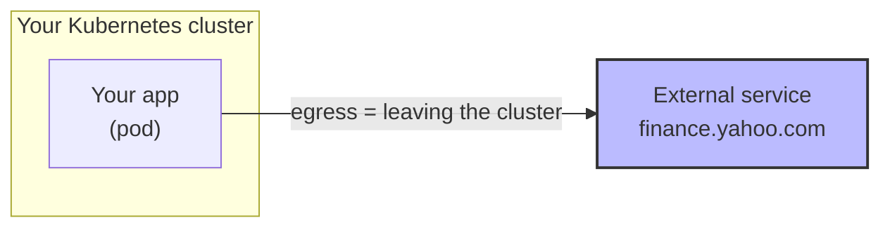
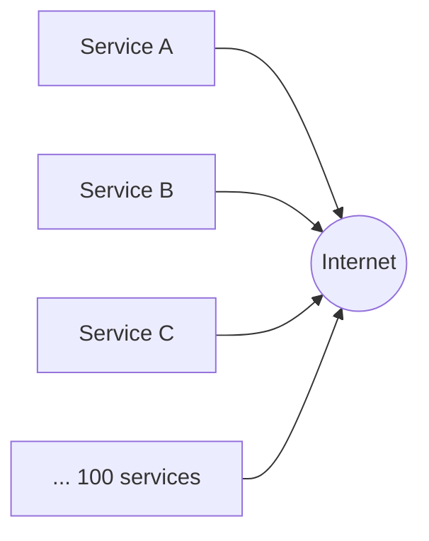
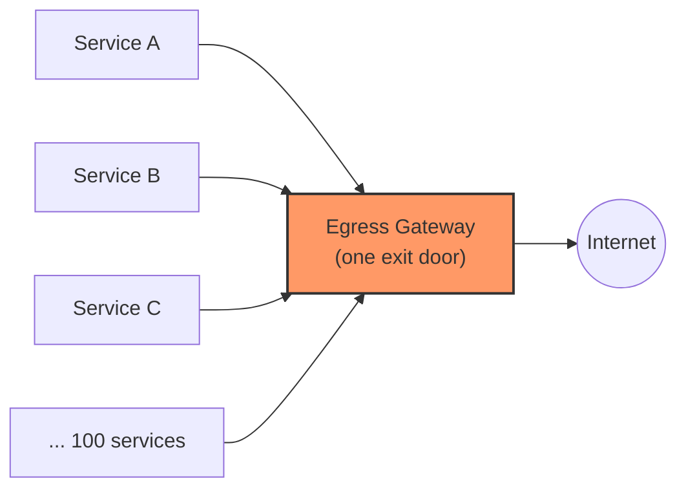
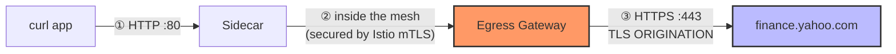
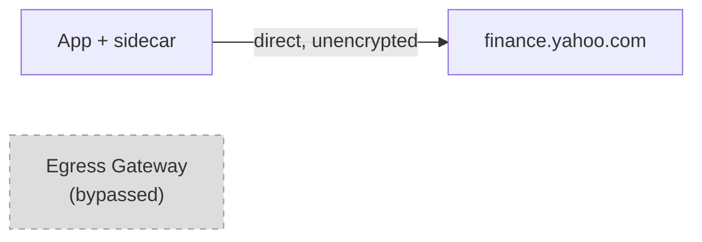
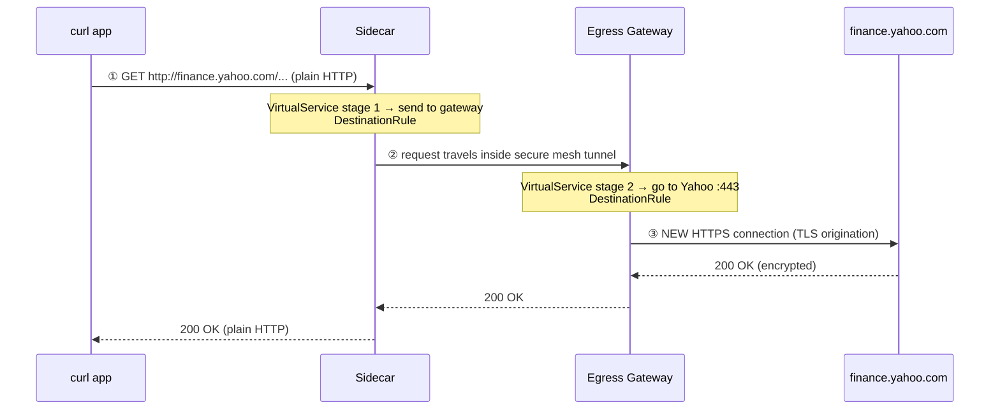
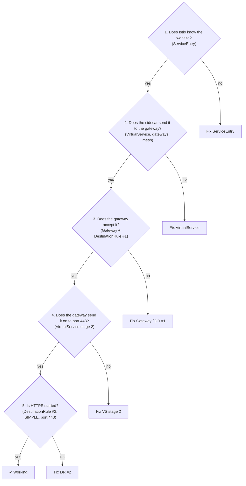
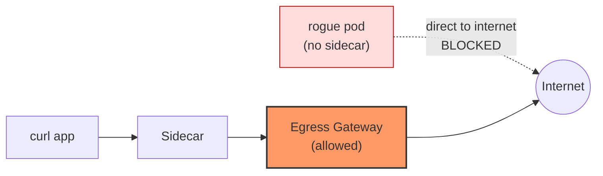
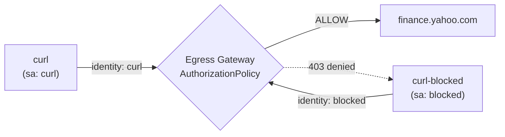

# Istio Egress Gateway — A Beginner-to-Expert Guide

> **For:** freshers who know basic Kubernetes (pods, services, `kubectl`) but nothing about egress gateways
> **Istio version:** 1.30.x (sidecar mode, `demo` profile already installed — no installation steps here)
> **Example used throughout:** an app calls `http://finance.yahoo.com`, and Istio secures the trip to the internet

---

## What you will learn

By the end you will be able to:

1. Explain **what an egress gateway is** and **why companies use one**
2. Build one yourself and **prove** that traffic really flows through it
3. Explain **TLS origination** in one sentence
4. **Debug** it when it breaks
5. **Lock it down** so nobody can bypass it, and control who may use it

## The learning path

| Level | Title | Time | What you do |
|---|---|---|---|
| 1 | Understand the idea | 15 min | Read only, no commands |
| 2 | Prepare the lab | 10 min | Create a test namespace and pod |
| 3 | Build it, step by step | 40 min | Create 5 Istio objects, test after each |
| 4 | Read logs and debug | 20 min | Find out where traffic really went |
| 5 | Make it secure (expert) | 40 min | Block bypass, restrict who can use it |
| ✔ | Practice + cheat sheet | 20 min | Quiz yourself |

> **Tip:** Don't skip Level 1. Almost every mistake students make in the lab comes from not understanding the pictures in Level 1.

---

# Level 1 — Understand the idea

## 1.1 What is "egress"?

- **Ingress** = traffic coming **into** your cluster.
- **Egress** = traffic going **out of** your cluster to something external: a payment API, a weather service, a partner, the internet.



## 1.2 The problem: uncontrolled exits

Imagine a company with **100 microservices**. Many of them call external APIs. By default, every pod can go straight to the internet on its own:



Problems for the company:

- 🔍 **No visibility** — who is calling what outside? Nobody knows.
- 🔐 **No central security rules** — each team handles TLS (HTTPS) its own way.
- 🚫 **No control** — any pod can call any website, even a malicious one.

## 1.3 The solution: one controlled exit door

An **egress gateway** is a dedicated proxy at the edge of your mesh. All outbound traffic is sent to it first, and **only the gateway** talks to the outside world.



**Real-life analogy — the office security desk.** Employees don't walk out of the building through any window they like. Everyone leaves through the main door, where security can see, log and check who goes out. The egress gateway is that main door.

**What you gain:**

| Benefit | Meaning |
|---|---|
| 👁 Visibility | One place to see all outbound calls (logs, metrics) |
| 🔒 Central TLS | Apps send plain HTTP inside the mesh; the gateway does the HTTPS part |
| 🛂 Access control | You decide *which app* may call *which external site* |
| 🌐 Fixed exit point | Partners can allow-list your gateway's IP address |

## 1.4 What is the egress gateway, technically?

- It is a normal **Envoy proxy** running in a pod: `istio-egressgateway` in the `istio-system` namespace (the demo profile already installed it).
- Your apps already have a small Envoy proxy next to them, called the **sidecar**. The gateway is the same technology, but it is standalone and shared by everyone.
- **Important:** the gateway does *nothing* until you configure it. That configuration is what this tutorial teaches.

## 1.5 What is "TLS origination"?

Your app sends plain **HTTP**. The external service needs **HTTPS**. Who does the encryption?

```text
Without gateway:   App ──HTTP──▶ Internet         ✗ not encrypted

With TLS origination:
   App ──HTTP──▶ Egress Gateway ──HTTPS (encrypted)──▶ Internet ✔
                       ▲
                 "originates" (starts) the TLS connection here
```

> **TLS origination = a proxy takes a plain HTTP request and starts a new HTTPS connection on behalf of the app.**
> The application code never needs to know about TLS.

Don't confuse it with its two cousins:

| Term | Picture | Where you see it |
|---|---|---|
| **Termination** | `Client ─HTTPS─▶ Proxy ─HTTP─▶ Backend` (proxy *removes* TLS) | Ingress gateway |
| **Origination** | `Client ─HTTP─▶ Proxy ─HTTPS─▶ Backend` (proxy *adds* TLS) | **Egress gateway (this tutorial)** |
| **Passthrough** | `Client ─HTTPS─▶ Proxy ─HTTPS─▶ Backend` (proxy doesn't touch TLS) | Special cases |

## 1.6 The five Istio objects you will create

An egress gateway is set up with five small objects. Each answers one question:

| # | Object | Nickname | Question it answers |
|---|---|---|---|
| 1 | `ServiceEntry` | **REGISTER** | "Does Istio know this external website exists?" |
| 2 | `Gateway` | **LISTEN** | "What should the egress gateway accept?" |
| 3 | `DestinationRule` **#1** | **CONNECT** | "How does the app's sidecar connect *to the gateway*?" |
| 4 | `DestinationRule` **#2** | **ORIGINATE** | "How does the gateway connect *to Yahoo* (with TLS)?" |
| 5 | `VirtualService` | **ROUTE** | "Where should the request go next?" |

Memory trick: **S-G-D-D-V** → *REGISTER, LISTEN, CONNECT, ORIGINATE, ROUTE*.

## 1.7 The single most important idea

> **Think of the journey as TWO separate connections, not one.**


Each connection has its own settings. Almost every egress mistake is mixing them up:

| | Connection 1 | Connection 2 |
|---|---|---|
| From → To | sidecar → egress gateway | egress gateway → Yahoo |
| Port | 80 | 443 |
| Configured by | `DestinationRule #1` + `Gateway` | `DestinationRule #2` |
| Routed by | `VirtualService` rule "mesh → gateway" | `VirtualService` rule "gateway → Yahoo" |

✅ **Level 1 check:** can you explain, without looking, (a) why we want one exit door, and (b) what "TLS origination" means? If yes, move on.

---

# Level 2 — Prepare the lab

You already have Kubernetes and Istio 1.30.x (demo profile). We only prepare a small test area.

## 2.1 Check that the egress gateway exists

```bash
kubectl get pods -n istio-system
```

You should see a running `istio-egressgateway-...` pod:

```text
istio-egressgateway-xxxxxxxxxx-xxxxx    1/1   Running
istio-ingressgateway-xxxxxxxxxx-xxxxx   1/1   Running
istiod-xxxxxxxxxx-xxxxx                 1/1   Running
```

Also check that Envoy **access logs** are on (we use them as proof later):

```bash
kubectl get configmap istio -n istio-system -o jsonpath='{.data.mesh}' | grep accessLogFile
```

Expected: `accessLogFile: /dev/stdout`. (If empty, ask your instructor to enable it — the demo profile normally has it on.)

## 2.2 Create the lab namespace and a test app

We create a namespace with automatic sidecar injection, and a tiny `curl` pod that plays the role of "your application".

```bash
kubectl create namespace egress-lab
kubectl label namespace egress-lab istio-injection=enabled

kubectl apply -n egress-lab -f - <<'EOF'
apiVersion: v1
kind: ServiceAccount
metadata:
  name: curl
---
apiVersion: apps/v1
kind: Deployment
metadata:
  name: curl
spec:
  replicas: 1
  selector:
    matchLabels:
      app: curl
  template:
    metadata:
      labels:
        app: curl
    spec:
      serviceAccountName: curl
      terminationGracePeriodSeconds: 0
      containers:
      - name: curl
        image: curlimages/curl:8.11.1
        command: ["/bin/sleep", "infinity"]
EOF

kubectl rollout status deploy/curl -n egress-lab
kubectl get pods -n egress-lab
```

Expected — **`2/2`** containers (your app + the Istio sidecar):

```text
NAME                    READY   STATUS    RESTARTS   AGE
curl-xxxxxxxxxx-xxxxx   2/2     Running   0          20s
```

> ⚠️ If you see `1/1`, the sidecar was not injected. Check the namespace label, then run `kubectl rollout restart deploy/curl -n egress-lab`.

## 2.3 A small helper to save typing

```bash
export SOURCE_POD=$(kubectl get pod -n egress-lab -l app=curl -o jsonpath='{.items[0].metadata.name}')

# ecurl = run curl inside the app pod and show only response headers
ecurl() { kubectl exec -n egress-lab "$SOURCE_POD" -c curl -- curl -sS -o /dev/null -D - "$@"; }
```

## 2.4 Make Istio block unknown websites

By default Istio **allows** pods to reach any website (`ALLOW_ANY`). To learn properly we switch our lab namespace to **`REGISTRY_ONLY`**: only websites that are *registered* with Istio are allowed.

```bash
kubectl apply -n egress-lab -f - <<'EOF'
apiVersion: networking.istio.io/v1
kind: Sidecar
metadata:
  name: default
spec:
  outboundTrafficPolicy:
    mode: REGISTRY_ONLY
  egress:
  - hosts:
    - "./*"
    - "istio-system/*"
EOF
```

| Mode | Unknown website | You see |
|---|---|---|
| `ALLOW_ANY` (default) | Allowed | Request works |
| `REGISTRY_ONLY` | Blocked | HTTP **`502 Bad Gateway`** |

### Baseline test — this should FAIL

```bash
ecurl --max-time 10 http://finance.yahoo.com/markets/crypto/all/
```

Expected:

```text
HTTP/1.1 502 Bad Gateway
server: envoy
```

Peek at the sidecar log to see why:

```bash
kubectl logs -n egress-lab "$SOURCE_POD" -c istio-proxy --tail=2
```

You will see **`BlackHoleCluster`** — Envoy's "trash can" for destinations Istio doesn't know.

✅ **Checkpoint:** you get `502` + `BlackHoleCluster`. This is our "before" picture. Now let's fix it properly.

---

# Level 3 — Build it, step by step

**Goal:** the app sends plain HTTP; Yahoo receives HTTPS; the traffic passes through the egress gateway.



We create the five objects one at a time and test as we go. All commands use `-n egress-lab`.

## Step 1 — ServiceEntry (REGISTER)

Tell Istio that `finance.yahoo.com` exists.

```bash
kubectl apply -n egress-lab -f - <<'EOF'
apiVersion: networking.istio.io/v1
kind: ServiceEntry
metadata:
  name: finance-yahoo
spec:
  hosts:
  - finance.yahoo.com
  location: MESH_EXTERNAL
  ports:
  - number: 80
    name: http
    protocol: HTTP
  - number: 443
    name: https
    protocol: HTTPS
  resolution: DNS
EOF
```

| Field | Plain meaning |
|---|---|
| `hosts` | The external website name |
| `location: MESH_EXTERNAL` | It lives outside our mesh |
| `ports` | Which ports we may use (80 = HTTP, 443 = HTTPS) |
| `resolution: DNS` | Look up its IP address through DNS |

**Test:**

```bash
ecurl --max-time 10 http://finance.yahoo.com/markets/crypto/all/
```

The `502` becomes a real answer from Yahoo:

```text
HTTP/1.1 301 Moved Permanently
location: https://finance.yahoo.com/markets/crypto/all/
```

(`301` = "please use HTTPS". Exact headers can vary; what matters is **not 502**.)

### ⚠️ Very important checkpoint

The app works — but did the request use the egress gateway? Check the gateway's log:

```bash
kubectl logs -l istio=egressgateway -c istio-proxy -n istio-system --tail=20 | grep -c yahoo
```

Result: `0`. **The gateway saw nothing.** The sidecar went straight to the internet:



> 🔑 **A `ServiceEntry` only means "this website is allowed". It does NOT send traffic through the gateway.** The next steps do that.

## Step 2 — Gateway (LISTEN)

Configure the egress gateway pod to accept traffic for Yahoo.

```bash
kubectl apply -n egress-lab -f - <<'EOF'
apiVersion: networking.istio.io/v1
kind: Gateway
metadata:
  name: yahoo-egressgateway
spec:
  selector:
    istio: egressgateway
  servers:
  - port:
      number: 80
      name: https-port-for-tls-origination
      protocol: HTTPS
    hosts:
    - finance.yahoo.com
    tls:
      mode: ISTIO_MUTUAL
EOF
```

| Line | Plain meaning |
|---|---|
| `selector: istio: egressgateway` | "Apply this to the pod labelled `istio=egressgateway`" |
| `hosts: finance.yahoo.com` | Accept traffic meant for Yahoo |
| `number: 80` | The port sidecars will use to reach the gateway |
| `tls.mode: ISTIO_MUTUAL` | Accept only connections secured with Istio's built-in certificates |

> 🤔 **"Port 80 but protocol HTTPS? That looks wrong!"**
> It isn't. The **app** sends plain HTTP, but the **sidecar wraps it in Istio's secure mTLS tunnel** before handing it to the gateway. So on this inside-the-mesh hop the gateway expects a secure connection ("HTTPS"), while the port number stays 80. This also lets the gateway know *which app* is calling — we use that in Level 5.

## Step 3 — DestinationRule #1 (CONNECT: sidecar → gateway)

Tell sidecars how to talk **to the gateway**.

```bash
kubectl apply -n egress-lab -f - <<'EOF'
apiVersion: networking.istio.io/v1
kind: DestinationRule
metadata:
  name: egressgateway-for-yahoo
spec:
  host: istio-egressgateway.istio-system.svc.cluster.local
  subsets:
  - name: yahoo
    trafficPolicy:
      loadBalancer:
        simple: ROUND_ROBIN
      portLevelSettings:
      - port:
          number: 80
        tls:
          mode: ISTIO_MUTUAL
          sni: finance.yahoo.com
EOF
```

| Line | Plain meaning |
|---|---|
| `host: istio-egressgateway...` | This rule is about the **gateway service**, not Yahoo |
| `subsets: yahoo` | A name for "the gateway, as used for Yahoo traffic" (the VirtualService will point at it) |
| `tls.mode: ISTIO_MUTUAL` | Use Istio's certificates — must **match** the Gateway's `tls.mode` from Step 2 |
| `sni: finance.yahoo.com` | Tells the gateway which website this connection is for |

## Step 4 — DestinationRule #2 (ORIGINATE: gateway → Yahoo)

This is the object that **creates the HTTPS connection** to Yahoo.

```bash
kubectl apply -n egress-lab -f - <<'EOF'
apiVersion: networking.istio.io/v1
kind: DestinationRule
metadata:
  name: originate-tls-for-yahoo-com
spec:
  host: finance.yahoo.com
  trafficPolicy:
    portLevelSettings:
    - port:
        number: 443
      tls:
        mode: SIMPLE
EOF
```

Read it as: *"When connecting to `finance.yahoo.com` on **port 443**, start a normal TLS (HTTPS) handshake."*
`SIMPLE` = normal one-way TLS, the same as a browser visiting a website.

**Compare your two DestinationRules:**

| | DestinationRule **#1** | DestinationRule **#2** |
|---|---|---|
| `host` | the egress gateway service | `finance.yahoo.com` |
| Which connection | ① sidecar → gateway | ② gateway → Yahoo |
| Port | 80 | **443** |
| TLS mode | `ISTIO_MUTUAL` | `SIMPLE` |
| Job | secure the inside hop | **TLS origination** |

## Step 5 — VirtualService (ROUTE)

The final piece: tell traffic where to go, in two stages. Save it to a file first (we reuse it later):

```bash
cat > virtual-service.yaml <<'EOF'
apiVersion: networking.istio.io/v1
kind: VirtualService
metadata:
  name: direct-yahoo-through-egress-gateway
spec:
  hosts:
  - finance.yahoo.com
  gateways:
  - yahoo-egressgateway
  - mesh
  http:
  # STAGE 1: from any sidecar in the mesh -> to the egress gateway
  - match:
    - gateways:
      - mesh
      port: 80
    route:
    - destination:
        host: istio-egressgateway.istio-system.svc.cluster.local
        subset: yahoo
        port:
          number: 80
  # STAGE 2: once at the egress gateway -> to Yahoo on port 443
  - match:
    - gateways:
      - yahoo-egressgateway
      port: 80
    route:
    - destination:
        host: finance.yahoo.com
        port:
          number: 443
EOF

kubectl apply -n egress-lab -f virtual-service.yaml
```

**How to read the two stages:**

| Stage | `match.gateways` | In plain English |
|---|---|---|
| **1** | `mesh` | "If an app inside the mesh wants Yahoo on port 80 → send it to the **egress gateway**." |
| **2** | `yahoo-egressgateway` | "Once the request has **arrived at the gateway** → send it on to **Yahoo, port 443**." |

Three things to remember:

- **`mesh`** is a special word meaning "all sidecars in the mesh". It is *not* the name of a Gateway object.
- The port changes from **80 → 443** in stage 2. That port 443 is what activates DestinationRule #2 (TLS).
- **Both** entries under `gateways:` are required. Without `mesh`, stage 1 vanishes. Without the named gateway, stage 2 vanishes.

## Step 6 — Verify (three proofs)

A working response alone proves nothing. Collect evidence.

### Proof 1 — the answer changed

```bash
ecurl --max-time 15 http://finance.yahoo.com/markets/crypto/all/
```

```text
HTTP/1.1 200 OK
```

Before, Yahoo said `301` ("use HTTPS"). Now the gateway already speaks HTTPS to Yahoo, so Yahoo just answers. **If you still get `301`, TLS origination is not working.**

> Yahoo sometimes returns `403`/`429` to scripts. That's Yahoo's choice, not an Istio error — rely on Proofs 2 and 3. If Yahoo is unreliable from your network, replace `finance.yahoo.com` with `edition.cnn.com` (the host used in Istio's official documentation) in all steps.

### Proof 2 — the gateway logged it

```bash
kubectl logs -l istio=egressgateway -c istio-proxy -n istio-system --tail=20 | grep finance.yahoo.com
```

You now see a line containing:

```text
outbound|443||finance.yahoo.com
```

That means: *"the gateway sent this request on to Yahoo, port 443."* Earlier the count was 0.

### Proof 3 — the app's sidecar sent it to the gateway

```bash
kubectl logs -n egress-lab "$SOURCE_POD" -c istio-proxy --tail=3
```

Look for:

```text
outbound|80|yahoo|istio-egressgateway.istio-system.svc.cluster.local
```

Read it as `outbound | port | subset | service` — "port 80, subset *yahoo*, to the egress gateway".

### 🎉 What happened, hop by hop



| Hop | From → To | On the wire | Controlled by |
|---|---|---|---|
| ① | app → its sidecar | plain HTTP | (automatic) |
| ② | sidecar → gateway | HTTP inside Istio mTLS | VS stage 1 + DR #1 + Gateway |
| ③ | gateway → Yahoo | **HTTPS** | VS stage 2 + DR #2 |

## Step 7 — Break it on purpose (5 minutes, very educational)

See what a *missing* piece looks like. Delete the VirtualService:

```bash
kubectl delete virtualservice direct-yahoo-through-egress-gateway -n egress-lab
ecurl --max-time 10 http://finance.yahoo.com/markets/crypto/all/
kubectl logs -l istio=egressgateway -c istio-proxy -n istio-system --tail=3 | grep -c yahoo
```

Result: the call **still "works"** (`301` again) but the gateway gets nothing new. Traffic has silently **bypassed** the gateway. This is the most dangerous kind of failure: nothing looks broken!

Restore it:

```bash
kubectl apply -n egress-lab -f virtual-service.yaml
ecurl --max-time 15 http://finance.yahoo.com/markets/crypto/all/    # 200 again
```

> **Lesson:** "the request succeeded" ≠ "it went through the gateway". Always check the gateway log.

✅ **Level 3 complete.** You built a working egress gateway with TLS origination.

---

# Level 4 — Read logs and debug

## 4.1 Two log lines that tell you everything

Both the sidecar and the gateway print one line per request. Focus on **one field**: the *upstream cluster* (`outbound|port|subset|service`). It shows **where Envoy decided to send the request**.

| You see in the log | It means |
|---|---|
| `BlackHoleCluster` | Istio doesn't know that website → missing/wrong `ServiceEntry` |
| `outbound\|80\|yahoo\|istio-egressgateway…` (in the **sidecar** log) | Sidecar correctly sent it to the gateway |
| `outbound\|443\|\|finance.yahoo.com` (in the **gateway** log) | Gateway correctly sent it on to Yahoo over port 443 |
| Nothing in the gateway log | Traffic **bypassed** the gateway |

Also useful — the **response flag** in the log line:

| Flag | Meaning | Typical egress cause |
|---|---|---|
| `NR` | No route | Host/port doesn't match any VirtualService rule |
| `UH` | No healthy upstream | Wrong subset name, or gateway pod not ready |
| `UF` | Upstream connection failed | Mismatch on the inside hop, or TLS trouble on the outside hop |

## 4.2 Four commands to memorize

```bash
# 1. Lint your configuration for mistakes
istioctl analyze -n egress-lab

# 2. Are the sidecar and gateway in sync with the control plane? (look for SYNCED)
istioctl proxy-status

# 3. What does the SIDECAR think about Yahoo traffic?
istioctl proxy-config routes "$SOURCE_POD" -n egress-lab --name 80

# 4. What does the GATEWAY know about Yahoo?
istioctl proxy-config clusters deploy/istio-egressgateway -n istio-system --fqdn finance.yahoo.com
```

## 4.3 Debug by following the hops

Ask these questions **in order** and stop at the first "no":



## 4.4 Common problems and fixes

| Symptom | Most likely cause | What to check |
|---|---|---|
| `502` + `BlackHoleCluster` | No `ServiceEntry` for that host/port | `kubectl get serviceentry -n egress-lab` |
| Works, but **gateway log is empty** | VirtualService missing, or `mesh` missing under `gateways:` | `kubectl get vs -n egress-lab -o yaml` |
| Still `301` to https | Stage 2 doesn't use port **443**, or DestinationRule #2 not applied | Check both |
| `503` right after editing Gateway/DR #1 | The two ends of the inside hop disagree (one uses TLS, the other doesn't) | Gateway `tls.mode` and DR #1 `tls.mode` must both be `ISTIO_MUTUAL` |
| `404` from `server: envoy` | Request reached the gateway but no stage-2 route matched | Named gateway in `match.gateways`, host and port |
| Gateway config seems ignored | `Gateway` `selector` doesn't match the pod label | `kubectl get pods -n istio-system --show-labels \| grep egress` |
| `403 RBAC: access denied` | An `AuthorizationPolicy` (Level 5) blocks the caller | `kubectl get authorizationpolicy -n istio-system` |
| Yahoo returns `403`/`429` | Yahoo's own bot protection — **not** an Istio problem | Confirm via gateway log that the path works |

---

# Level 5 — Make it secure (expert)

Our lab works, but it isn't *secure* yet. Two gaps remain:

1. **Bypass:** a pod can still skip the gateway and reach the internet directly.
2. **Anyone can use it:** every app in the mesh may call every allowed website.

## 5.1 Close the bypass with a NetworkPolicy

**Why it matters.** Everything so far depends on the *sidecar* politely choosing the gateway. A pod **without a sidecar** ignores all of it. Routing rules are not a security wall — the **network** must enforce it.

> ⚠️ Needs a CNI that enforces `NetworkPolicy` (e.g., Calico, Cilium). On other clusters the "blocked" test below won't block.

**a) Prove the bypass exists.** Create a rogue pod with no sidecar and call the internet:

```bash
kubectl run rogue -n egress-lab --image=curlimages/curl:8.11.1 \
  --labels="sidecar.istio.io/inject=false" --command -- sleep infinity
kubectl wait --for=condition=Ready pod/rogue -n egress-lab --timeout=60s

kubectl exec -n egress-lab rogue -- curl -sS -o /dev/null -w '%{http_code}\n' --max-time 10 https://finance.yahoo.com/
```

Any HTTP code (`200`, `301`, `429`…) means it **reached the internet directly**, ignoring Istio.

**b) Close the door.** Allow pods in this namespace to talk only to: this namespace, `istio-system` (istiod + egress gateway), and DNS.

```bash
kubectl apply -n egress-lab -f - <<'EOF'
apiVersion: networking.k8s.io/v1
kind: NetworkPolicy
metadata:
  name: egress-only-via-mesh
spec:
  podSelector: {}
  policyTypes:
  - Egress
  egress:
  - to:
    - podSelector: {}
  - to:
    - namespaceSelector:
        matchLabels:
          kubernetes.io/metadata.name: istio-system
  - to:
    - namespaceSelector:
        matchLabels:
          kubernetes.io/metadata.name: kube-system
    ports:
    - {protocol: UDP, port: 53}
    - {protocol: TCP, port: 53}
EOF
```

**c) Verify both sides:**

```bash
# Rogue pod: now blocked -> prints 000 after the timeout
kubectl exec -n egress-lab rogue -- curl -sS -o /dev/null -w '%{http_code}\n' --max-time 8 https://finance.yahoo.com/

# Legitimate path via sidecar + gateway: still works
ecurl --max-time 15 http://finance.yahoo.com/markets/crypto/all/
```



Bonus: this also makes mistakes **fail loudly**. Repeat Step 7 now — deleting the VirtualService causes a timeout instead of a silent bypass.

## 5.2 Decide who may use the gateway (AuthorizationPolicy)

Because the inside hop uses Istio mTLS, the gateway knows **which ServiceAccount** is calling. We can allow only approved apps.

**a) Add a second, unapproved app** (ServiceAccount `blocked`):

```bash
kubectl apply -n egress-lab -f - <<'EOF'
apiVersion: v1
kind: ServiceAccount
metadata:
  name: blocked
---
apiVersion: apps/v1
kind: Deployment
metadata:
  name: curl-blocked
spec:
  replicas: 1
  selector:
    matchLabels:
      app: curl-blocked
  template:
    metadata:
      labels:
        app: curl-blocked
    spec:
      serviceAccountName: blocked
      terminationGracePeriodSeconds: 0
      containers:
      - name: curl
        image: curlimages/curl:8.11.1
        command: ["/bin/sleep", "infinity"]
EOF
kubectl rollout status deploy/curl-blocked -n egress-lab
```

Right now both apps can reach Yahoo.

**b) Allow only the `curl` ServiceAccount to use the gateway for Yahoo:**

```bash
kubectl apply -n istio-system -f - <<'EOF'
apiVersion: security.istio.io/v1
kind: AuthorizationPolicy
metadata:
  name: egress-allow-curl-only
spec:
  selector:
    matchLabels:
      istio: egressgateway
  action: ALLOW
  rules:
  - from:
    - source:
        principals: ["cluster.local/ns/egress-lab/sa/curl"]
    to:
    - operation:
        hosts: ["finance.yahoo.com", "finance.yahoo.com:*"]
EOF
```

`principals` format: `<trust-domain>/ns/<namespace>/sa/<serviceaccount>` (`cluster.local` is the default trust domain).

**c) Verify:**

```bash
# Approved app -> works
ecurl --max-time 15 http://finance.yahoo.com/markets/crypto/all/

# Unapproved app -> blocked by the gateway
kubectl exec -n egress-lab deploy/curl-blocked -c curl -- \
  curl -sS --max-time 15 http://finance.yahoo.com/markets/crypto/all/
```

Expected: the first shows `200`; the second prints `RBAC: access denied`.



> With an `ALLOW` policy, anything **not listed is denied** on that gateway — including future apps and hosts. That is the goal (default-deny), but remember to add rules when you onboard new destinations.

## 5.3 When the partner requires a client certificate (mutual TLS origination)

Some partners want to verify **you** too. Then the gateway must present a client certificate. Advantage of doing it at the gateway: the private key lives in **one** place instead of in every pod.

Two changes compared with our lab:

**1. Store the credentials as a Secret in the gateway's namespace** (`istio-system`), using the key names `tls.key`, `tls.crt` and `ca.crt`:

```bash
kubectl create secret generic client-credential -n istio-system \
  --from-file=tls.key=client.key --from-file=tls.crt=client.crt --from-file=ca.crt=ca.crt
```

**2. Use `MUTUAL` in DestinationRule #2 (instead of `SIMPLE`):**

```yaml
trafficPolicy:
  portLevelSettings:
  - port:
      number: 443
    tls:
      mode: MUTUAL
      credentialName: client-credential   # the Secret above
      sni: partner.example.com
```

Everything else (ServiceEntry, Gateway, DR #1, VirtualService) stays the same. Istio's official task walks through a complete example with a test NGINX server: *Egress Gateways with TLS Origination → "Perform mutual TLS origination"*.

**TLS modes at a glance:**

| `tls.mode` | Meaning |
|---|---|
| `SIMPLE` | Normal HTTPS (like a browser) — gateway checks the server |
| `MUTUAL` | Both sides show certificates — gateway also presents its client certificate |
| `ISTIO_MUTUAL` | Mutual TLS using Istio's own certificates (used *inside* the mesh) |
| `DISABLE` | No TLS |

## 5.4 Production checklist

- [ ] `outboundTrafficPolicy: REGISTRY_ONLY` for the **whole mesh** (not just one namespace)
- [ ] `NetworkPolicy`: only the egress gateway may leave the cluster
- [ ] `AuthorizationPolicy` on the gateway: explicit "which app → which host" rules
- [ ] Run **2 or more** gateway replicas (it is now a critical component) and monitor it
- [ ] Configure a trusted CA for external servers so certificates are verified (Istio sets SNI and validates the server name automatically when you don't set `sni` yourself — see the official task for details)
- [ ] Keep client certificates in Secrets with a rotation plan
- [ ] Keep all egress YAML in version control; run `istioctl analyze` in CI

## 5.5 Where to go next

| Topic | Where |
|---|---|
| Whole domains such as `*.example.com` | Istio docs: *Egress using Wildcard Hosts*, and the newer blog post on wildcard `ServiceEntry` with `DYNAMIC_DNS` resolution |
| Kubernetes Gateway API instead of Istio `Gateway`/`VirtualService` | Istio supports it and plans to make it the default API; the official egress tasks show both variants |
| Egress in ambient mode | Different model (uses a waypoint) — Istio docs: *Ambient → Egress gateways* |
| Passing through traffic when the app already speaks HTTPS | Istio docs: *Egress Gateways* task (TLS passthrough) |
| Corporate HTTPS proxy in front of the internet | Istio docs: *Using an External HTTPS Proxy* |

---

# Practice — check your understanding

Try each question before opening the answer.

**Q1.** With `REGISTRY_ONLY`, what happens when a pod calls a website with no `ServiceEntry`?
<details><summary>Answer</summary>A <code>502 Bad Gateway</code>; the sidecar's log shows <code>BlackHoleCluster</code>.</details>

**Q2.** You applied only a `ServiceEntry`. Is traffic going through the egress gateway?
<details><summary>Answer</summary>No. The sidecar goes directly to the internet. You need the Gateway + VirtualService (+ DestinationRules) to route through the gateway.</details>

**Q3.** What does <code>gateways: [mesh]</code> mean in a VirtualService match?
<details><summary>Answer</summary>"Traffic coming from sidecars inside the mesh." It is a reserved keyword, not the name of a Gateway.</details>

**Q4.** Why is the stage-2 destination port <code>443</code> while the Gateway listens on <code>80</code>?
<details><summary>Answer</summary>Two different connections. Sidecar → gateway uses port 80 (inside the mesh). Gateway → Yahoo uses 443 (HTTPS). The destination port 443 is what triggers DestinationRule #2 to start TLS.</details>

**Q5.** Which DestinationRule performs TLS origination, and which mode?
<details><summary>Answer</summary>DestinationRule #2 (host <code>finance.yahoo.com</code>, port 443) with <code>tls.mode: SIMPLE</code>.</details>

**Q6.** A teammate removed <code>mesh</code> from <code>spec.gateways</code> and deleted the stage-1 match. Requests still succeed but the gateway log is empty. Why?
<details><summary>Answer</summary>Without stage 1, nothing tells sidecars to use the gateway, so they go straight out (the ServiceEntry still allows it). Fix: restore <code>mesh</code> in <code>gateways:</code> and the stage-1 route.</details>

**Q7.** A DestinationRule has <code>tls: SIMPLE</code> on port <code>80</code> for the external host. The gateway is reached but the external call fails. What is wrong?
<details><summary>Answer</summary>The gateway connects to the external host on <b>443</b>, so the TLS setting must be under <code>port.number: 443</code>.</details>

**Q8.** After you set DR #1 to <code>ISTIO_MUTUAL</code> you get <code>503</code>. The Gateway still has <code>protocol: HTTP</code> and no <code>tls</code>. Why?
<details><summary>Answer</summary>The sidecar now starts TLS toward a listener that expects plain HTTP. Both ends of the inside hop must match: Gateway <code>HTTPS</code> + <code>ISTIO_MUTUAL</code> ⇔ DR #1 <code>ISTIO_MUTUAL</code>.</details>

**Q9.** A pod with no sidecar still reaches the internet. Which object fixes this, and why isn't the VirtualService enough?
<details><summary>Answer</summary>A Kubernetes <code>NetworkPolicy</code>. VirtualService rules are applied by the sidecar; a pod without one never sees them.</details>

**Q10.** Two hosts need different TLS types (one <code>SIMPLE</code>, one <code>MUTUAL</code>). Can one DestinationRule cover both?
<details><summary>Answer</summary>No. A DestinationRule targets one <code>host</code>, so create one DestinationRule #2 per external host (and one subset per host in DR #1).</details>

---

# Cheat sheet

```text
GOAL      App (HTTP) → Sidecar → Egress Gateway → (HTTPS) → External site

OBJECT             NICKNAME    KEY POINTS
-----------------  ----------  ----------------------------------------------------
ServiceEntry       REGISTER    hosts, ports 80 + 443, resolution: DNS
Gateway            LISTEN      selector istio: egressgateway; port 80; HTTPS + ISTIO_MUTUAL
DestinationRule 1  CONNECT     host = egress gateway svc; subset per site; ISTIO_MUTUAL + sni
DestinationRule 2  ORIGINATE   host = external site; port 443; tls SIMPLE
VirtualService     ROUTE       gateways: [named-gw, mesh]
                               stage 1: mesh:80    → egress gateway (subset)
                               stage 2: named-gw:80 → external site :443
```

**Rules to remember**

1. `ServiceEntry` alone does **not** use the gateway.
2. Two connections: sidecar → gateway, then gateway → external.
3. `mesh` = all sidecars; the named gateway = "already at the gateway".
4. List **both** `mesh` and the named gateway under `gateways:`.
5. Port **443** in stage 2 triggers TLS origination.
6. Both ends of the inside hop must agree (Gateway ⇔ DR #1).
7. "It works" ≠ "it used the gateway" → check the gateway log.
8. Sidecar routing isn't a wall → add `NetworkPolicy` + `AuthorizationPolicy`.

**Handy commands**

```bash
kubectl logs -l istio=egressgateway -c istio-proxy -n istio-system --tail=20
istioctl analyze -n egress-lab
istioctl proxy-status
istioctl proxy-config routes "$SOURCE_POD" -n egress-lab --name 80
istioctl proxy-config clusters deploy/istio-egressgateway -n istio-system --fqdn finance.yahoo.com
```

---

# Cleanup

```bash
kubectl delete authorizationpolicy egress-allow-curl-only -n istio-system --ignore-not-found
kubectl delete secret client-credential -n istio-system --ignore-not-found
kubectl delete namespace egress-lab
rm -f virtual-service.yaml
```

Deleting the namespace removes the ServiceEntry, Gateway, DestinationRules, VirtualService, Sidecar, NetworkPolicy and all test pods.

---

# References

- Istio docs — *Egress Gateways with TLS Origination*: https://istio.io/latest/docs/tasks/traffic-management/egress/egress-gateway-tls-origination/
- Istio docs — *Egress TLS Origination* (sidecar version): https://istio.io/latest/docs/tasks/traffic-management/egress/egress-tls-origination/
- Istio docs — *Egress Gateways*: https://istio.io/latest/docs/tasks/traffic-management/egress/egress-gateway/
- Istio docs — *Accessing External Services*: https://istio.io/latest/docs/tasks/traffic-management/egress/egress-control/
- Istio docs — *Egress using Wildcard Hosts*: https://istio.io/latest/docs/tasks/traffic-management/egress/wildcard-egress-hosts/

*The manifests in Level 3 follow the official Istio task (Istio APIs variant). Public sites like Yahoo may change their responses over time — the gateway logs are your reliable proof.*
