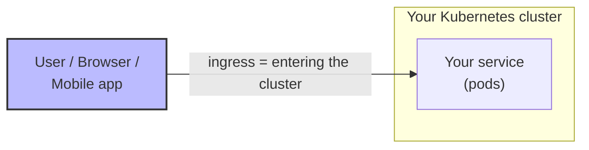
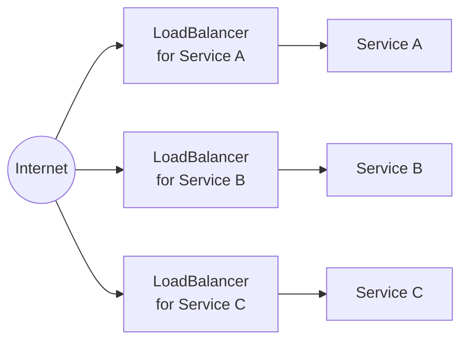
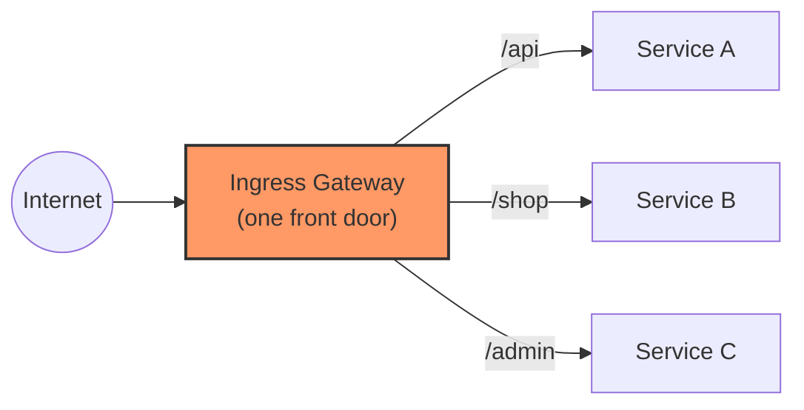
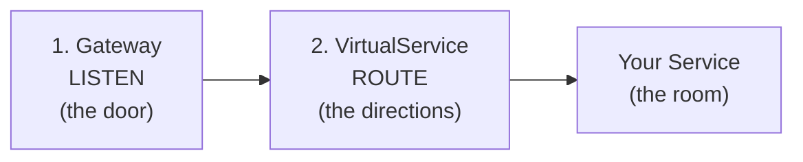
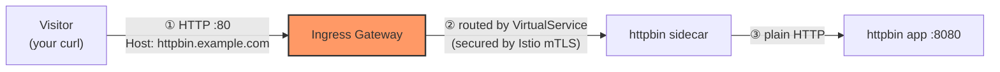
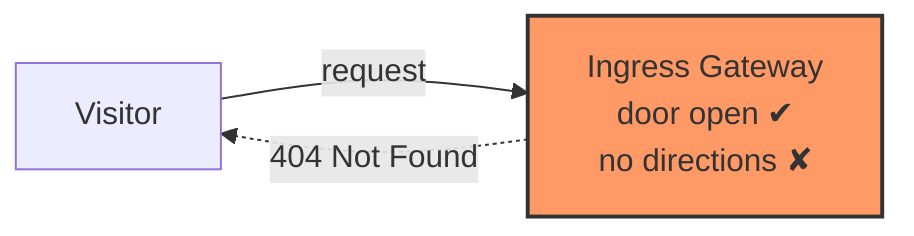
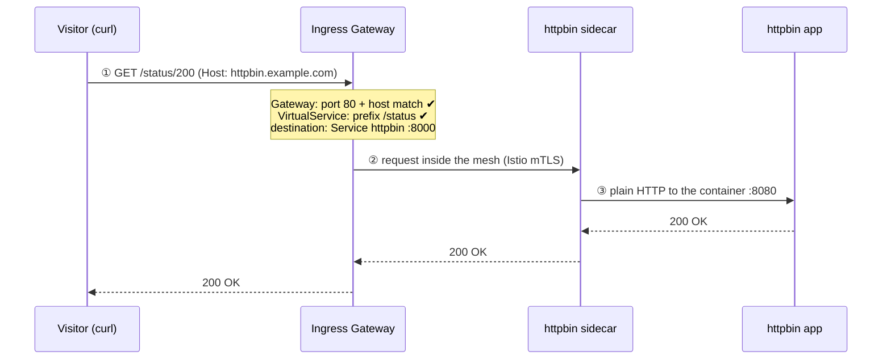
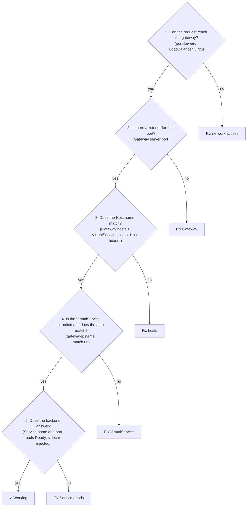
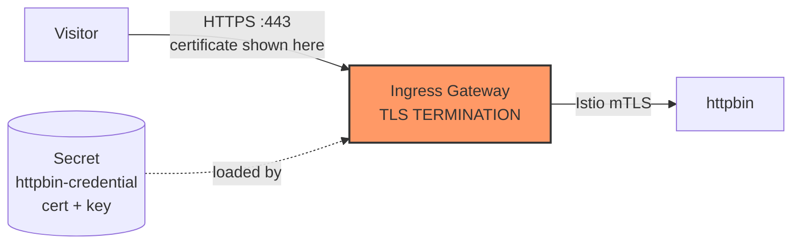
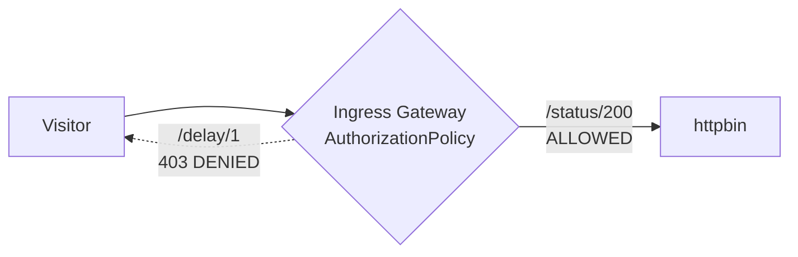

# Istio Ingress Gateway — A Beginner-to-Expert Guide

> **For:** freshers who know basic Kubernetes (pods, services, `kubectl`) but nothing about ingress gateways
> **Istio version:** 1.30.x (sidecar mode, `demo` profile already installed — no installation steps here)
> **Example used throughout:** a web service called `httpbin` runs inside the cluster, and Istio lets the outside world reach it safely

---

## What you will learn

By the end you will be able to:

1. Explain **what an ingress gateway is** and **why companies use one**
2. Build one yourself and **prove** that traffic really flows through it
3. Explain **TLS termination** in one sentence
4. **Debug** it when it breaks (especially the famous `404`)
5. **Secure it**: HTTPS for visitors, and rules about what may come in

## The learning path

| Level | Title | Time | What you do |
|---|---|---|---|
| 1 | Understand the idea | 15 min | Read only, no commands |
| 2 | Prepare the lab | 10 min | Create a test namespace and a sample app |
| 3 | Build it, step by step | 40 min | Create 2 Istio objects, test after each |
| 4 | Read logs and debug | 20 min | Find out where a request really went |
| 5 | Make it secure (expert) | 40 min | HTTPS, blocking paths, client certificates |
| ✔ | Practice + cheat sheet | 20 min | Quiz yourself |

> **Tip:** Don't skip Level 1. Almost every mistake in the lab (especially `404` errors) comes from not understanding the pictures in Level 1.

> **Already did the Egress tutorial?** Ingress is its mirror image. Egress = traffic **leaving** the mesh; Ingress = traffic **entering** it. The building blocks (`Gateway`, `VirtualService`) are the same, so this will feel familiar.

---

# Level 1 — Understand the idea

## 1.1 What is "ingress"?

- **Ingress** = traffic coming **into** your cluster from outside: visitors to your website, a mobile app calling your API, a partner sending data.
- **Egress** = traffic going **out** (the other tutorial).



## 1.2 The problem: how do outsiders reach a pod?

Pods live on private cluster addresses. Nobody outside can reach them. The basic Kubernetes options are awkward when you have many services:



Problems:

- 💸 **One cloud load balancer per service** — costly and hard to manage
- 🔐 **HTTPS certificates everywhere** — every team handles TLS differently
- 🚫 **No central control** — who is allowed in? Which paths are public?
- 🔍 **No single place to see** who is calling what

## 1.3 The solution: one front door

An **ingress gateway** is a dedicated proxy at the edge of your mesh. **All** incoming traffic enters through it, and it decides where each request goes.



**Real-life analogy — the hotel reception desk.** Guests don't wander into rooms directly. They arrive at reception (one entrance), say who they are and where they want to go, and reception sends them to the right room — or turns them away. The ingress gateway is the reception desk, and the *routing rules* are the room list.

**What you gain:**

| Benefit | Meaning |
|---|---|
| 🚪 One entrance | One public address for many services |
| 🔒 Central HTTPS | The gateway handles certificates; your apps stay simple |
| 🛂 Smart routing | Route by hostname and URL path; split traffic for canary releases |
| 🛡 Access control | Block paths, allow only certain callers |
| 👁 Visibility | One place for access logs and metrics of all incoming traffic |

## 1.4 What is the ingress gateway, technically?

- It is a normal **Envoy proxy** running in a pod: `istio-ingressgateway` in `istio-system` (the demo profile already installed it).
- In front of it sits a Kubernetes **Service** of type `LoadBalancer`, which gives it the public address.
- Your apps have a small Envoy **sidecar** next to them. The gateway is the same technology, but standalone and at the edge.
- **Important:** just like the egress gateway, it does *nothing* until you configure it. That configuration is what this tutorial teaches.

## 1.5 What is "TLS termination"?

Visitors use **HTTPS** (encrypted). Your app may want plain **HTTP**. Who decrypts?

```text
Without gateway:   every app must handle certificates and HTTPS itself   ✗ repeated work

With TLS termination:
   Visitor ──HTTPS (encrypted)──▶ Ingress Gateway ──HTTP or Istio mTLS──▶ App
                                        ▲
                             "terminates" (ends) the visitor's TLS here
```

> **TLS termination = the proxy ends the visitor's encrypted connection, so the app behind it doesn't have to deal with certificates.**

Compare it with its cousins (the egress tutorial covered origination):

| Term | Picture | Where you see it |
|---|---|---|
| **Termination** | `Client ─HTTPS─▶ Proxy ─HTTP─▶ Backend` (proxy *removes* TLS) | **Ingress gateway (this tutorial)** |
| **Origination** | `Client ─HTTP─▶ Proxy ─HTTPS─▶ Backend` (proxy *adds* TLS) | Egress gateway |
| **Passthrough** | `Client ─HTTPS─▶ Proxy ─HTTPS─▶ Backend` (proxy doesn't touch TLS) | Special cases |

## 1.6 The Istio objects you will create

Ingress needs fewer objects than egress. Two are enough for a working setup:

| # | Object | Nickname | Question it answers |
|---|---|---|---|
| 1 | `Gateway` | **LISTEN** | "Which ports and hostnames does the front door accept?" |
| 2 | `VirtualService` | **ROUTE** | "Where should each request go once it is inside?" |
| 3 | `Secret` *(Level 5)* | **CERTIFICATE** | "Which certificate proves our identity for HTTPS?" |
| 4 | `DestinationRule` *(optional)* | **CONNECT** | "How should the gateway talk to the app (versions, load balancing)?" |

Memory trick: **G-V** → *LISTEN, then ROUTE*. (Add a Secret when you want HTTPS.)



## 1.7 The single most important idea

> **A `Gateway` only opens the door. A `VirtualService` gives the directions. You need both.**

| You have… | Result for a visitor |
|---|---|
| Nothing | Connection fails — nobody is listening |
| Only a `Gateway` | Door is open but reception has no directions → **`404 Not Found`** |
| `Gateway` + `VirtualService` | Visitor reaches the app ✔ |


| | Half 1 | Half 2 |
|---|---|---|
| From → To | visitor → ingress gateway | ingress gateway → your app |
| Configured by | `Gateway` (port, host, TLS) | `VirtualService` (paths, destination) |
| Typical security | HTTPS with your certificate | Istio mTLS, automatic |

## 1.8 Istio Gateway vs Kubernetes Ingress vs Gateway API

You will hear three names. Here is the difference:

| Name | What it is | Use in this tutorial? |
|---|---|---|
| **Istio `Gateway` + `VirtualService`** | Istio's own APIs. Very flexible, easy to see the two halves | ✅ Yes |
| **Kubernetes `Ingress`** | The old, basic Kubernetes API. Works with Istio but is limited | No |
| **Kubernetes Gateway API** | The newer Kubernetes standard (`Gateway` + `HTTPRoute`). Istio supports it and plans to make it the default in future | Mentioned in Level 5 |

✅ **Level 1 check:** can you explain, without looking, (a) why one front door is better than one load balancer per service, and (b) why a `Gateway` alone gives `404`? If yes, move on.

---

# Level 2 — Prepare the lab

You already have Kubernetes and Istio 1.30.x (demo profile). We only prepare a small test area.

## 2.1 Check that the ingress gateway exists

```bash
kubectl get pods -n istio-system
kubectl get svc istio-ingressgateway -n istio-system
```

You should see a running `istio-ingressgateway-...` pod and its Service:

```text
istio-ingressgateway-xxxxxxxxxx-xxxxx   1/1   Running
istiod-xxxxxxxxxx-xxxxx                 1/1   Running

NAME                   TYPE           CLUSTER-IP     EXTERNAL-IP   PORT(S)
istio-ingressgateway   LoadBalancer   10.96.x.x      <pending>     15021:...,80:3xxxx/TCP,443:3xxxx/TCP
```

> 💡 **`EXTERNAL-IP` says `<pending>`?** That is normal on local clusters (kind, minikube, Docker Desktop) that have no cloud load balancer. We will **not** need it: the lab uses `kubectl port-forward`, which works everywhere.

Also check that Envoy **access logs** are on (we use them as proof later):

```bash
kubectl get configmap istio -n istio-system -o jsonpath='{.data.mesh}' | grep accessLogFile
```

Expected: `accessLogFile: /dev/stdout`. (If empty, ask your instructor to enable it — the demo profile normally has it on.)

## 2.2 Create the lab namespace and the sample app

We create a namespace with automatic sidecar injection and deploy `httpbin`, a small test web service that offers handy URLs such as `/status/200`, `/headers` and `/delay/1`.

```bash
kubectl create namespace ingress-lab
kubectl label namespace ingress-lab istio-injection=enabled

kubectl apply -n ingress-lab -f - <<'EOF'
apiVersion: v1
kind: ServiceAccount
metadata:
  name: httpbin
---
apiVersion: v1
kind: Service
metadata:
  name: httpbin
  labels:
    app: httpbin
spec:
  ports:
  - name: http
    port: 8000
    targetPort: 8080
  selector:
    app: httpbin
---
apiVersion: apps/v1
kind: Deployment
metadata:
  name: httpbin
spec:
  replicas: 1
  selector:
    matchLabels:
      app: httpbin
  template:
    metadata:
      labels:
        app: httpbin
    spec:
      serviceAccountName: httpbin
      containers:
      - name: httpbin
        image: mccutchen/go-httpbin:v2.15.0
        ports:
        - containerPort: 8080
EOF

kubectl rollout status deploy/httpbin -n ingress-lab
kubectl get pods -n ingress-lab
```

Expected — **`2/2`** containers (your app + the Istio sidecar):

```text
NAME                       READY   STATUS    RESTARTS   AGE
httpbin-xxxxxxxxxx-xxxxx   2/2     Running   0          20s
```

> ⚠️ If you see `1/1`, the sidecar was not injected. Check the namespace label, then run `kubectl rollout restart deploy/httpbin -n ingress-lab`.
> The Service listens on port **8000** and forwards to the container's port **8080**. Remember `8000` — the VirtualService will use it.

## 2.3 Open a tunnel to the gateway (second terminal)

Open a **second terminal window** and leave this command running the whole time. It makes the gateway reachable from your machine: local port `8080` → gateway port 80 (HTTP) and local port `8443` → gateway port 443 (HTTPS).

```bash
kubectl port-forward -n istio-system svc/istio-ingressgateway 8080:80 8443:443
```

Back in your **first terminal**, create a small helper:

```bash
# icurl = "ingress curl": call the gateway with the Host name our routes will use, show only the response headers
icurl() { curl -sS -o /dev/null -D - -H "Host: httpbin.example.com" "$@"; }
```

> 🤔 **Why the `Host` header?** `httpbin.example.com` is a made-up name. Real visitors would type it in a browser and DNS would send them to the gateway's public IP. Here we skip DNS and simply *tell* the gateway which website we want with the `Host` header. Gateways route by hostname, so this matters!

## 2.4 Baseline test — nothing is exposed yet

The app is only reachable *inside* the cluster (its Service is `ClusterIP`). Try from outside:

```bash
curl -sS --max-time 5 http://127.0.0.1:8080/status/200
```

Expected: an error such as `Empty reply from server` or `Connection reset by peer`. (You may also see `connection refused` messages in the port-forward terminal.)

Why? The gateway pod exists, but **no `Gateway` object tells it to listen on port 80**. Nobody answers.

✅ **Checkpoint:** you get an empty reply / connection error. This is our "before" picture. Now let's open the door.

---

# Level 3 — Build it, step by step

**Goal:** a visitor calls `http://httpbin.example.com/...`, the request enters through the ingress gateway, and reaches the `httpbin` app.



We create the objects one at a time and test as we go. All commands use `-n ingress-lab`.

## Step 1 — Gateway (LISTEN)

Open the front door: tell the ingress gateway to accept HTTP on port 80 for the host `httpbin.example.com`.

```bash
kubectl apply -n ingress-lab -f - <<'EOF'
apiVersion: networking.istio.io/v1
kind: Gateway
metadata:
  name: httpbin-gateway
spec:
  selector:
    istio: ingressgateway
  servers:
  - port:
      number: 80
      name: http
      protocol: HTTP
    hosts:
    - "httpbin.example.com"
EOF
```

| Line | Plain meaning |
|---|---|
| `selector: istio: ingressgateway` | "Apply this to the pod labelled `istio=ingressgateway`" (the demo profile's ingress gateway) |
| `port.number: 80` | Accept traffic on port 80 |
| `protocol: HTTP` | Plain HTTP (we add HTTPS in Level 5) |
| `hosts: httpbin.example.com` | Only accept requests for this website name |

**Test:**

```bash
icurl http://127.0.0.1:8080/status/200
```

Expected — a **`404`**, not a success:

```text
HTTP/1.1 404 Not Found
server: istio-envoy
```

🎓 **This 404 is good news!** It proves the door is open (something answered), but reception has **no directions yet**. Compare with the empty reply from Level 2. Remember this: **`404` + `server: istio-envoy` = gateway is listening, but no route matches.**



## Step 2 — VirtualService (ROUTE)

Give the directions: which requests go to which service.

```bash
cat > virtual-service.yaml <<'EOF'
apiVersion: networking.istio.io/v1
kind: VirtualService
metadata:
  name: httpbin
spec:
  hosts:
  - "httpbin.example.com"
  gateways:
  - httpbin-gateway
  http:
  - match:
    - uri:
        prefix: /status
    - uri:
        prefix: /headers
    - uri:
        prefix: /delay
    route:
    - destination:
        host: httpbin
        port:
          number: 8000
EOF

kubectl apply -n ingress-lab -f virtual-service.yaml
```

| Line | Plain meaning |
|---|---|
| `hosts: httpbin.example.com` | This rule is for requests asking for this website name |
| `gateways: [httpbin-gateway]` | "Use this rule for traffic that arrives through **that Gateway**" (the name from Step 1) |
| `match.uri.prefix` | Only these URL paths are allowed in: `/status…`, `/headers…`, `/delay…` |
| `destination.host: httpbin` | Send matching requests to the Kubernetes Service named `httpbin` |
| `destination.port: 8000` | …on the **Service** port 8000 |

Three things to remember:

- The **name in `gateways:` must exactly match** the `Gateway` object's name. A typo means the VirtualService never attaches — and you get `404`.
- The `hosts:` in the `VirtualService` must fit a host accepted by the `Gateway`.
- Paths not listed (like `/get`) are **not exposed** — a simple, safe default: *only publish what you intend to publish*.

**Test all four cases:**

```bash
icurl http://127.0.0.1:8080/status/200              # allowed path
icurl http://127.0.0.1:8080/headers                 # allowed path
icurl http://127.0.0.1:8080/get                     # path NOT in the list
curl -sS -o /dev/null -D - http://127.0.0.1:8080/status/200   # no Host header -> wrong website name
```

Expected:

| Request | Result | Why |
|---|---|---|
| `/status/200` with correct Host | `HTTP/1.1 200 OK` ✔ | Gateway + VirtualService match |
| `/headers` with correct Host | `200 OK` ✔ | Path is in the list |
| `/get` with correct Host | `404` | Path not in the list — not exposed |
| No `Host: httpbin.example.com` | `404` | Wrong hostname — the gateway only serves the hosts you listed |

## Step 3 — Verify (three proofs)

A working response is good, but let's collect evidence that the request really passed through the gateway.

### Proof 1 — the gateway logged it

```bash
kubectl logs -l istio=ingressgateway -c istio-proxy -n istio-system --tail=10
```

You should see lines like:

```text
"GET /status/200 HTTP/1.1" 200 - via_upstream ... "httpbin.example.com" "10.x.x.x:8080" outbound|8000||httpbin.ingress-lab.svc.cluster.local ...
"GET /get HTTP/1.1" 404 NR route_not_found ...
```

Two learnings in two lines:

- `outbound|8000||httpbin.ingress-lab.svc.cluster.local` = "the gateway sent the request to the httpbin Service, port 8000."
- `404 NR route_not_found` = "No Route" — the reason behind every `404` at the gateway.

### Proof 2 — the gateway knows the route

```bash
istioctl proxy-config routes deploy/istio-ingressgateway -n istio-system
```

Look for a row for `httpbin.example.com` pointing to the VirtualService `httpbin.ingress-lab`:

```text
NAME        VHOST NAME                    DOMAINS               MATCH           VIRTUAL SERVICE
http.8080   httpbin.example.com:80        httpbin.example.com   /status*        httpbin.ingress-lab
```

(The gateway pod really listens on **8080**, even though your Gateway says port 80 — the Kubernetes Service maps 80 → 8080.)

### Proof 3 — the app saw the gateway's identity

```bash
curl -s -H "Host: httpbin.example.com" http://127.0.0.1:8080/headers | grep -i "client-cert"
```

You will see a header `X-Forwarded-Client-Cert` mentioning `istio-ingressgateway-service-account`. It is added because the gateway called the app over **Istio mTLS** (the app's sidecar verified who was calling). Hop ② was secure without you doing anything.

### 🎉 What happened, hop by hop



| Hop | From → To | On the wire | Controlled by |
|---|---|---|---|
| ① | visitor → gateway | HTTP (HTTPS in Level 5) | `Gateway` |
| ② | gateway → app's sidecar | HTTP inside Istio mTLS | `VirtualService` (+ automatic mTLS) |
| ③ | sidecar → app container | plain HTTP | (automatic) |

## Step 4 — Break it on purpose (5 minutes, very educational)

See what a missing or wrong piece looks like.

**Experiment A — delete the VirtualService:**

```bash
kubectl delete virtualservice httpbin -n ingress-lab
icurl http://127.0.0.1:8080/status/200        # -> 404 again
```

The door is open, but there are no directions. Restore it:

```bash
kubectl apply -n ingress-lab -f virtual-service.yaml
icurl http://127.0.0.1:8080/status/200        # -> 200 again
```

**Experiment B — typo in the Gateway name.** Apply a copy of the VirtualService with a wrong name:

```bash
sed 's/httpbin-gateway/httpbin-gatewy/' virtual-service.yaml | kubectl apply -n ingress-lab -f -
icurl http://127.0.0.1:8080/status/200        # -> 404
istioctl analyze -n ingress-lab               # shows the problem
```

`istioctl analyze` reports that the referenced gateway was not found. Fix it by re-applying the original file:

```bash
kubectl apply -n ingress-lab -f virtual-service.yaml
```

> **Lesson:** at an ingress gateway almost everything that goes wrong looks like a `404`. The next level teaches you to tell the causes apart.

✅ **Level 3 complete.** You built a working ingress gateway with host and path routing.

---

# Level 4 — Read logs and debug

## 4.1 What each symptom tells you

At an ingress gateway, the *kind* of failure points to the cause:

| What the visitor sees | What it usually means |
|---|---|
| Empty reply / connection refused or reset | **Nobody is listening** — no `Gateway` server for that port (or the tunnel/LoadBalancer isn't reachable) |
| `404` + `server: istio-envoy` | Gateway is listening, but **no route matches** (wrong host, wrong path, or VirtualService not attached) |
| `503` | A route matched, but the **backend failed** (no healthy pods, wrong port, connection problem) |
| `403 RBAC: access denied` | An `AuthorizationPolicy` blocked the request (Level 5) |
| `200` | ✅ |

Also look at the **response flag** in the gateway's log line:

| Flag | Meaning | Typical ingress cause |
|---|---|---|
| `NR` | No route (`route_not_found`) | Host/path/gateway-name mismatch → your `404` |
| `UH` | No healthy upstream | Service has no ready pods, or selector/labels wrong |
| `UF` | Upstream connection failed | Wrong Service port, or pod not accepting connections |
| `UC` | Upstream connection terminated | App closed the connection (protocol mismatch) |

## 4.2 Five commands to memorize

```bash
# 1. Lint your configuration for mistakes
istioctl analyze -n ingress-lab

# 2. Is the gateway in sync with the control plane? (look for SYNCED)
istioctl proxy-status

# 3. Which ports is the gateway listening on?
istioctl proxy-config listeners deploy/istio-ingressgateway -n istio-system

# 4. Which routes does the gateway know?
istioctl proxy-config routes deploy/istio-ingressgateway -n istio-system

# 5. Does the gateway know the backend, and are its endpoints healthy?
istioctl proxy-config endpoints deploy/istio-ingressgateway -n istio-system \
  --cluster "outbound|8000||httpbin.ingress-lab.svc.cluster.local"
```

Expected for commands 3–5 in a healthy setup: a listener on port **8080** (and **8443** once you add HTTPS), a route for `httpbin.example.com`, and an endpoint `10.x.x.x:8080` with status `HEALTHY`.

## 4.3 Debug by following the hops

Ask these questions **in order** and stop at the first "no":



## 4.4 Common problems and fixes

| Symptom | Most likely cause | What to check |
|---|---|---|
| Empty reply / reset | No `Gateway` server for that port, or `selector` doesn't match | `kubectl get gateway -n ingress-lab`; `kubectl get pods -n istio-system --show-labels \| grep ingress` |
| `404`, log shows `NR` | `Host` header doesn't match the Gateway/VirtualService `hosts` | `icurl` sets the right Host; browsers use the URL's name |
| `404` only for some URLs | Path not in `match.uri` (prefix vs exact) | `kubectl get vs -n ingress-lab -o yaml` |
| `404` for everything after creating a VirtualService | `gateways:` name typo, or Gateway is in another namespace | `istioctl analyze`; cross-namespace use `namespace/name` |
| `503`, flag `UH` | Backend has no ready pods, or Service selector doesn't match pod labels | `kubectl get endpoints httpbin -n ingress-lab` |
| `503`, flag `UF` | Wrong destination port in the VirtualService | The **Service** port (8000), not the container port (8080) |
| HTTPS listener missing / handshake fails | TLS Secret missing, misnamed, or in the wrong namespace | `istioctl proxy-config secret deploy/istio-ingressgateway -n istio-system` |
| `EXTERNAL-IP` stays `<pending>` | No cloud load balancer (local cluster) | Use `kubectl port-forward`, `minikube tunnel`, or MetalLB |
| `403 RBAC: access denied` | An `AuthorizationPolicy` matched the request | `kubectl get authorizationpolicy -A` |

> 💡 Good habit: name Service ports with a protocol prefix (`http`, `grpc`, `tcp`…). Istio uses the name to decide how to treat the traffic. We used `name: http` in the lab.

---

# Level 5 — Make it secure (expert)

Our lab works, but visitors use plain HTTP and everything listed is public. Let's fix both, then look at client certificates and production readiness.

## 5.1 Serve HTTPS with TLS termination

**Idea.** Visitors connect with HTTPS to the gateway. The gateway holds the certificate and private key, ends the TLS there (**termination**), and forwards the request into the mesh (automatically protected by Istio mTLS).



**a) Create a certificate.** For the lab we use a self-signed one (production uses a real CA — see 5.4):

```bash
openssl req -x509 -newkey rsa:2048 -sha256 -nodes -days 365 \
  -keyout httpbin.key -out httpbin.crt \
  -subj "/CN=httpbin.example.com/O=demo" \
  -addext "subjectAltName=DNS:httpbin.example.com"
```

**b) Store it as a Kubernetes Secret — in `istio-system`**, the namespace where the *gateway pod* runs:

```bash
kubectl create -n istio-system secret tls httpbin-credential --key=httpbin.key --cert=httpbin.crt
```

> ⚠️ The Secret must live in the same namespace as the gateway pod, not in your app's namespace. This is the #1 cause of "HTTPS doesn't work".

**c) Add an HTTPS server to the Gateway** (re-apply the Gateway; the HTTP server stays):

```bash
kubectl apply -n ingress-lab -f - <<'EOF'
apiVersion: networking.istio.io/v1
kind: Gateway
metadata:
  name: httpbin-gateway
spec:
  selector:
    istio: ingressgateway
  servers:
  - port:
      number: 80
      name: http
      protocol: HTTP
    hosts:
    - "httpbin.example.com"
  - port:
      number: 443
      name: https
      protocol: HTTPS
    tls:
      mode: SIMPLE
      credentialName: httpbin-credential
    hosts:
    - "httpbin.example.com"
EOF
```

| New line | Plain meaning |
|---|---|
| `port 443`, `protocol: HTTPS` | A second door for encrypted visitors |
| `tls.mode: SIMPLE` | Normal one-way HTTPS (visitor checks the server, like a browser) |
| `credentialName: httpbin-credential` | The Secret holding the certificate + key |

You do **not** need to change the `VirtualService`: it is attached to the whole Gateway, so the same routes now work on HTTPS too.

**d) Test.** `--resolve` maps the name to our local tunnel, and `--cacert` makes curl trust our self-signed certificate:

```bash
curl -sS -o /dev/null -D - \
  --cacert httpbin.crt \
  --resolve httpbin.example.com:8443:127.0.0.1 \
  https://httpbin.example.com:8443/status/200
```

Expected: `HTTP/2 200`. Check that the gateway loaded the certificate:

```bash
istioctl proxy-config secret deploy/istio-ingressgateway -n istio-system | grep httpbin-credential
```

You should see `kubernetes://httpbin-credential` with status `ACTIVE`.

**e) (Optional) Redirect HTTP to HTTPS.** Add this to the **port 80** server so browsers are moved to HTTPS automatically:

```yaml
  - port:
      number: 80
      name: http
      protocol: HTTP
    hosts:
    - "httpbin.example.com"
    tls:
      httpsRedirect: true      # answer 301 -> https://...
```

**Bonus:** to renew a certificate, just update the Secret. The gateway picks up the change **without a restart**.

## 5.2 Control what may come in (AuthorizationPolicy)

Right now `/delay/*` is public. Imagine it is an expensive or sensitive endpoint that should never be reachable from outside. We block it **at the front door**:

```bash
kubectl apply -n istio-system -f - <<'EOF'
apiVersion: security.istio.io/v1
kind: AuthorizationPolicy
metadata:
  name: deny-delay-at-edge
spec:
  selector:
    matchLabels:
      istio: ingressgateway
  action: DENY
  rules:
  - to:
    - operation:
        paths: ["/delay*"]
EOF
```

**Verify:**

```bash
icurl http://127.0.0.1:8080/delay/1        # -> 403 (blocked at the gateway)
icurl http://127.0.0.1:8080/status/200     # -> 200 (still allowed)
```

Expected: the first prints `HTTP/1.1 403 Forbidden` (body: `RBAC: access denied`); the second still returns `200`.



Other useful rules at the edge:

| Goal | What to use |
|---|---|
| Block certain paths | `DENY` + `operation.paths` (as above) |
| Allow only some client IPs | `ALLOW`/`DENY` + `source.remoteIpBlocks` (needs the real client IP to reach the gateway — see 5.4) |
| Only allow certain methods (e.g., `GET`) | `operation.methods` |
| Require a login token | `RequestAuthentication` + `AuthorizationPolicy` (JWT) — a next-level topic |

> Order of evaluation: `CUSTOM` → `DENY` → `ALLOW`. A matching `DENY` always wins.

## 5.3 When clients must present a certificate (mutual TLS)

Some APIs (partners, internal tools) should accept only clients that show a valid **client certificate**. The change is small:

**1. Add the CA certificate to the Secret** (the CA that signed your clients' certificates) under the key `ca.crt`, along with `tls.crt` and `tls.key`.

**2. Use `MUTUAL` on the Gateway server:**

```yaml
  - port:
      number: 443
      name: https
      protocol: HTTPS
    tls:
      mode: MUTUAL                        # was SIMPLE
      credentialName: httpbin-credential  # must also contain ca.crt
    hosts:
    - "httpbin.example.com"
```

Visitors without a valid client certificate are rejected during the TLS handshake — before any request is routed. Istio's official task *Secure Gateways* walks through a complete example with generated client certificates.

**TLS modes at a glance (ingress):**

| `tls.mode` on the Gateway | Meaning |
|---|---|
| `SIMPLE` | Normal HTTPS: gateway shows its certificate |
| `MUTUAL` | Both sides show certificates (client certificate required) |
| `PASSTHROUGH` | Gateway doesn't decrypt; routes by the hostname (SNI) in the handshake — the app handles TLS |
| `ISTIO_MUTUAL` | Istio's own mTLS certificates (used between gateways/sidecars, rarely for public visitors) |

## 5.4 Production checklist

- [ ] Real DNS name pointing to the gateway's `LoadBalancer` address
- [ ] Certificates from a real CA (for example automated with **cert-manager** / Let's Encrypt), not self-signed
- [ ] HTTP → HTTPS redirect enabled; only publish hosts and paths you intend (avoid `hosts: "*"`)
- [ ] `AuthorizationPolicy` on the gateway; consider a default-deny stance
- [ ] Run **2 or more** gateway replicas with autoscaling (the demo profile runs one) and monitor 4xx/5xx and latency
- [ ] Do not use the `demo` profile in production; install gateways separately so you can scale and upgrade them on their own
- [ ] If you need the visitor's real IP (logging, IP allow-lists), make sure your load balancer preserves it (for example `externalTrafficPolicy: Local` or PROXY protocol), and configure trusted proxy hops
- [ ] Put a WAF / rate limiting in front of, or on, the gateway for public internet traffic
- [ ] Never expose dashboards (Kiali, Grafana, Prometheus) publicly without authentication
- [ ] Keep all `Gateway`/`VirtualService` YAML in version control; run `istioctl analyze` in CI

## 5.5 Where to go next

| Topic | Where |
|---|---|
| Splitting traffic (90 % / 10 % canary), retries, timeouts | `VirtualService` `route.weight`, `retries`, `timeout` — Istio docs *Traffic Shifting* |
| Kubernetes **Gateway API** (`Gateway` + `HTTPRoute`) instead of Istio APIs | Istio docs *Kubernetes Gateway API*. It is the direction Istio is moving toward, and with it you don't need the pre-installed `istio-ingressgateway` |
| Passing HTTPS through untouched (app terminates TLS) | Istio docs *Ingress Gateway without TLS Termination* |
| Several hosts / wildcard certificates on one gateway | Add more `servers`/`hosts` to the `Gateway`; see *Secure Gateways* |
| Exposing an existing Kubernetes `Ingress` through Istio | Istio docs *Kubernetes Ingress* |

---

# Practice — check your understanding

Try each question before opening the answer.

**Q1.** You created only a `Gateway` and the visitor gets `404`. Why is that a good sign?
<details><summary>Answer</summary>A <code>404</code> from <code>server: istio-envoy</code> proves the gateway is listening. It just has no route yet — create the <code>VirtualService</code>.</details>

**Q2.** What is the difference between what a `Gateway` and a `VirtualService` do at ingress?
<details><summary>Answer</summary><code>Gateway</code> = opens the door (ports, hostnames, TLS). <code>VirtualService</code> = gives directions (paths, destination service). You need both.</details>

**Q3.** What does <code>gateways: [httpbin-gateway]</code> in a VirtualService do?
<details><summary>Answer</summary>It attaches the routing rules to traffic arriving through that Gateway. The name must match exactly (use <code>namespace/name</code> if the Gateway is in another namespace). Without it, the rules apply only to traffic inside the mesh.</details>

**Q4.** The gateway log shows <code>404 NR route_not_found</code>. Name three possible causes.
<details><summary>Answer</summary>(1) The <code>Host</code> header doesn't match the Gateway/VirtualService <code>hosts</code>. (2) The URL path isn't in <code>match.uri</code>. (3) The VirtualService isn't attached (name typo or wrong namespace in <code>gateways:</code>).</details>

**Q5.** The VirtualService uses <code>port.number: 8080</code> (the container port) and you get <code>503</code>. What is wrong?
<details><summary>Answer</summary>The destination port must be the <b>Service</b> port (8000 in the lab), not the container's <code>targetPort</code>.</details>

**Q6.** Where must the TLS Secret for the gateway be created, and why?
<details><summary>Answer</summary>In the namespace where the ingress gateway <b>pod</b> runs (<code>istio-system</code>), because the gateway loads the certificate from there.</details>

**Q7.** Explain TLS termination in one sentence.
<details><summary>Answer</summary>The gateway ends the visitor's HTTPS connection (holds the certificate), so the app behind it doesn't have to handle TLS.</details>

**Q8.** What is the difference between <code>tls.mode: SIMPLE</code> and <code>MUTUAL</code> on a Gateway server?
<details><summary>Answer</summary><code>SIMPLE</code>: only the gateway shows a certificate. <code>MUTUAL</code>: the client must also present a certificate signed by the CA in the Secret's <code>ca.crt</code>.</details>

**Q9.** How can you block <code>/admin</code> from the internet without touching the application?
<details><summary>Answer</summary>Apply an <code>AuthorizationPolicy</code> with <code>selector: istio: ingressgateway</code> in <code>istio-system</code>, <code>action: DENY</code>, and <code>operation.paths: ["/admin*"]</code>. Or simply don't list <code>/admin</code> in the VirtualService.</details>

**Q10.** Why does the port in the `Gateway` say 80 while <code>istioctl</code> shows the gateway listening on 8080?
<details><summary>Answer</summary>The Gateway refers to the Kubernetes <b>Service</b> port (80). The Service forwards to the pod's unprivileged container port 8080, which is where Envoy actually listens (443 → 8443 likewise).</details>

---

# Cheat sheet

```text
GOAL      Visitor → Ingress Gateway → (Istio mTLS) → App sidecar → App

OBJECT           NICKNAME     KEY POINTS
---------------  -----------  ------------------------------------------------------------
Gateway          LISTEN       selector istio: ingressgateway; port 80/443; hosts; tls mode
VirtualService   ROUTE        hosts; gateways: [gateway-name]; http.match.uri; destination host + SERVICE port
Secret (TLS)     CERTIFICATE  type tls in istio-system; used via tls.credentialName
AuthorizationPolicy  GUARD    selector istio: ingressgateway; ALLOW / DENY rules
```

**Rules to remember**

1. A `Gateway` alone → `404`. You need `Gateway` **+** `VirtualService`.
2. `gateways:` in the VirtualService must name the Gateway exactly.
3. Hostname must match in three places: request `Host`, Gateway `hosts`, VirtualService `hosts`.
4. Route to the **Service** port, not the container port.
5. TLS Secret lives in the **gateway pod's namespace** (`istio-system`).
6. `404 NR` = no route · `503 UH/UF` = backend problem · reset = nobody listening · `403 RBAC` = policy.
7. Publish only the hosts and paths you intend to expose.
8. A matching `DENY` policy always wins.

**Handy commands**

```bash
kubectl logs -l istio=ingressgateway -c istio-proxy -n istio-system --tail=20
istioctl analyze -n ingress-lab
istioctl proxy-status
istioctl proxy-config listeners deploy/istio-ingressgateway -n istio-system
istioctl proxy-config routes    deploy/istio-ingressgateway -n istio-system
istioctl proxy-config secret    deploy/istio-ingressgateway -n istio-system
```

---

# Cleanup

Stop the port-forward (press `Ctrl+C` in the second terminal), then:

```bash
kubectl delete authorizationpolicy deny-delay-at-edge -n istio-system --ignore-not-found
kubectl delete secret httpbin-credential -n istio-system --ignore-not-found
kubectl delete namespace ingress-lab
rm -f virtual-service.yaml httpbin.key httpbin.crt
```

Deleting the namespace removes the Gateway, VirtualService and the sample app.

---

# References

- Istio docs — *Ingress Gateways*: https://istio.io/latest/docs/tasks/traffic-management/ingress/ingress-control/
- Istio docs — *Secure Gateways* (HTTPS and mutual TLS): https://istio.io/latest/docs/tasks/traffic-management/ingress/secure-ingress/
- Istio docs — *Ingress Gateway without TLS Termination*: https://istio.io/latest/docs/tasks/traffic-management/ingress/ingress-sni-passthrough/
- Istio docs — *Kubernetes Gateway API*: https://istio.io/latest/docs/tasks/traffic-management/ingress/gateway-api/
- Istio docs — *Authorization for HTTP traffic*: https://istio.io/latest/docs/tasks/security/authorization/authz-http/

*The Gateway and VirtualService shapes in Level 3 follow the official Istio "Ingress Gateways" task (Istio APIs variant). Gateway logs and `istioctl` output are your reliable proof at every step.*
