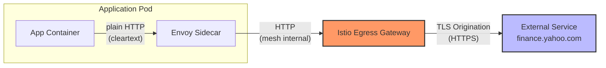
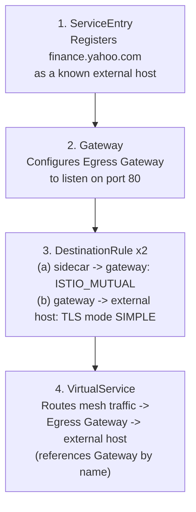
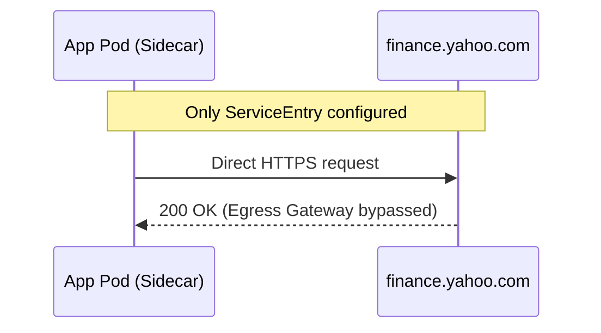
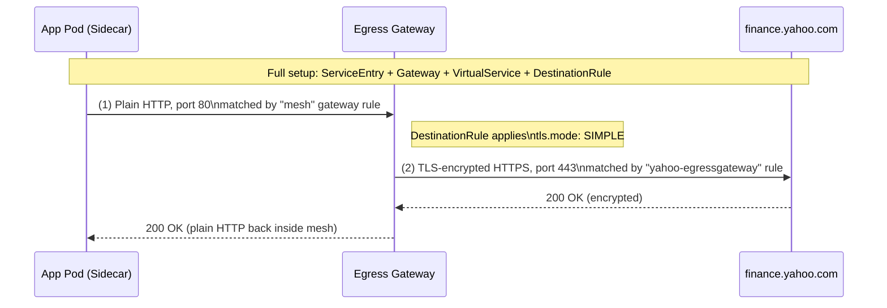
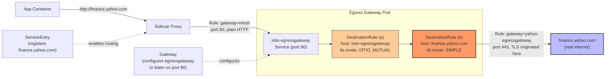

# TLS Origination on Egress Gateway — Istio Learning Guide

*A step-by-step guide for students preparing for Istio certification*

---

## 1. Why This Topic Matters

When a workload inside an Istio mesh needs to talk to an **external HTTPS service** (like `finance.yahoo.com`), there are two ways to handle the TLS handshake:

| Approach | Where TLS is originated | Problem |
|---|---|---|
| **Sidecar TLS origination** | Every single pod's sidecar | You must configure TLS settings **per pod / per workload**. Not centralized. Hard to audit, hard to rotate certs, hard to apply consistent policy. |
| **Egress Gateway TLS origination** | One centralized Egress Gateway | Pods just send **plain HTTP**. The Egress Gateway is the *only* place that speaks HTTPS to the outside world. One place to configure, monitor, and secure. |

**The core idea:** push the responsibility of "speaking HTTPS to the internet" out of every individual pod and into a single, dedicated gateway component.

---

## 2. The Big Picture (Architecture)



**Read this diagram like a story:**
1. Your application code just calls `http://finance.yahoo.com` — it doesn't know or care about TLS.
2. The pod's sidecar forwards that plain HTTP request inside the mesh.
3. Traffic is routed to the **Egress Gateway** (a dedicated Envoy proxy sitting at the edge of the mesh).
4. The Egress Gateway — and only the Egress Gateway — upgrades the connection to HTTPS (this is **TLS origination**) before sending it out to the real internet.

This is exactly the same pattern as a **corporate proxy server**: internal machines send plain requests to the proxy, and the proxy is the only device that "goes out" onto the secured/external network.

---

## 3. The Four Building Blocks

Istio needs **4 resources working together** to make this happen:

| # | Resource | Purpose |
|---|---|---|
| 1 | `ServiceEntry` | Tells Istio that an external host (`finance.yahoo.com`) exists and is allowed to be called from inside the mesh. Without this, Istio has no idea the destination exists. |
| 2 | `Gateway` | Configures the **Egress Gateway pod** itself — which ports/protocols it should listen on for outbound traffic. |
| 3 | `DestinationRule` **(x2)** | **Two separate rules, for two separate legs of the journey:** (a) sidecar → egress gateway (secures the internal mesh leg, typically `ISTIO_MUTUAL`), and (b) egress gateway → external host (originates real TLS, `mode: SIMPLE`). See Section 4, Step 2 for both. |
| 4 | `VirtualService` | The "traffic cop" — routes requests for `finance.yahoo.com` **through** the Egress Gateway instead of straight out from the sidecar. Created **last**, since it references the `Gateway` by name. |



**Why this order matters:** each resource after `ServiceEntry` depends on something created before it. The `Gateway` must exist before its `DestinationRule`s are meaningful, and the `VirtualService` is created **last** because it explicitly references the `Gateway`'s name (`yahoo-egressgateway`) in its `gateways:` field — that reference is meaningless until the `Gateway` object exists.

---

## 4. Step-by-Step Implementation

### Step 1 — Start with a `ServiceEntry`

A `ServiceEntry` registers the external service in Istio's internal service registry, so sidecars are even *allowed* to route to it.

**Before adding a ServiceEntry:**
```
502 Bad Gateway
```
Istio blocks the call because it doesn't recognize `finance.yahoo.com` as a known destination (Istio defaults to `REGISTRY_ONLY` for external traffic in many setups).

**After adding a ServiceEntry:**
```
HTTP/1.1 301 Moved Permanently
location: https://finance.yahoo.com/markets/crypto/all/
HTTP/2 200
```
Now the sidecar can reach the external host directly.

> ⚠️ **Important checkpoint:** At this point, traffic flows **straight from the sidecar to the internet**. The Egress Gateway is *not yet involved*. This is a common exam trap — having a working `ServiceEntry` does **not** mean traffic is going through the egress gateway.



---

### Step 2 — Create the `Gateway` and **two** `DestinationRule`s

Now we introduce the Egress Gateway into the path, and configure TLS for **both legs** of the journey: pod→gateway, and gateway→external host.

**`gateway.yaml`**
```yaml
apiVersion: networking.istio.io/v1
kind: Gateway
metadata:
  name: yahoo-egressgateway
spec:
  selector:
    istio: egressgateway
  servers:
  - port:
      number: 80
      name: http
      protocol: HTTP
    hosts:
    - finance.yahoo.com
```

**What this does:** Configures the `istio-egressgateway` pod (selected via `selector: istio: egressgateway`) to accept **plain HTTP on port 80** for the host `finance.yahoo.com`. Remember — pods send *unencrypted HTTP* to the gateway; the gateway does the encrypting.

Now the two `DestinationRule`s — this is the "x2" referenced back in Section 3. They configure TLS for **two completely different legs** of the request path, and it's easy to conflate them, so keep them mentally separate.

#### DestinationRule (a) — securing the *internal* leg: sidecar → egress gateway

**`destination-rule-egressgateway.yaml`**
```yaml
apiVersion: networking.istio.io/v1alpha3
kind: DestinationRule
metadata:
  name: egressgateway-for-yahoo-com
spec:
  host: istio-egressgateway.istio-system.svc.cluster.local
  trafficPolicy:
    tls:
      mode: ISTIO_MUTUAL # secures traffic between sidecars and the egress gateway pod
```

**What this does:** This rule applies to the `istio-egressgateway` Service itself. `mode: ISTIO_MUTUAL` tells sidecars to use Istio's built-in mesh mTLS certificates when talking **to the egress gateway pod**. This is about securing traffic *inside* the mesh boundary — it has nothing to do with `finance.yahoo.com` yet. (If your mesh already enforces mTLS everywhere via a `PeerAuthentication` policy, this may already be handled automatically — but it's still commonly shown explicitly for clarity on the exam.)

#### DestinationRule (b) — originating TLS on the *external* leg: egress gateway → finance.yahoo.com

**`destination-rule.yaml`**
```yaml
apiVersion: networking.istio.io/v1alpha3
kind: DestinationRule
metadata:
  name: originate-tls-for-yahoo-com
spec:
  host: finance.yahoo.com
  trafficPolicy:
    portLevelSettings:
      - port:
          number: 443
        tls:
          mode: SIMPLE # initiates HTTPS for connections to finance.yahoo.com
```

**What this does:** This is the piece that actually performs **TLS origination** toward the real internet. `tls.mode: SIMPLE` tells the Egress Gateway: *"When you send traffic onward to `finance.yahoo.com` on port 443, wrap it in a standard TLS handshake."* This is the Envoy-level equivalent of a client initiating an HTTPS connection.

> 💡 **Key concept — `tls.mode: SIMPLE`:** This is standard one-way TLS, where the gateway verifies the external server's certificate (like your browser does), but does **not** present its own client certificate. This is the most common mode for calling public HTTPS APIs.

| | DestinationRule (a) | DestinationRule (b) |
|---|---|---|
| `host` | `istio-egressgateway...svc.cluster.local` | `finance.yahoo.com` |
| Leg secured | Pod sidecar → Egress Gateway | Egress Gateway → real external host |
| `tls.mode` | `ISTIO_MUTUAL` | `SIMPLE` |
| Purpose | Internal mesh security | Actual TLS origination to the internet |

---

### Step 3 — Create the `VirtualService` to force traffic through the Egress Gateway

Right now we have a `ServiceEntry` (traffic *can* reach the destination) and a configured `Gateway` + both `DestinationRule`s (the internal leg and external leg both know how to handle TLS) — but nothing is telling the mesh to actually **send** traffic to the gateway instead of going direct. That's the `VirtualService`'s job, and it's created last because it references the `Gateway`'s name directly.

**`virtual-service.yaml`**
```yaml
apiVersion: networking.istio.io/v1alpha3
kind: VirtualService
metadata:
  name: direct-yahoo-through-egress-gateway
spec:
  hosts:
  - finance.yahoo.com
  gateways:
  - yahoo-egressgateway
  - mesh
  http:
  - match:
    - gateways:
      - mesh
      port: 80
    route:
    - destination:
        host: istio-egressgateway.istio-system.svc.cluster.local
        port:
          number: 80
  - match:
    - gateways:
      - yahoo-egressgateway
      port: 80
    route:
    - destination:
        host: finance.yahoo.com
        port:
          number: 443
```

This `VirtualService` has **two route rules** — this is the part students most often find confusing, so let's break it into two "legs" of the journey.

#### Leg A — From the app's sidecar to the Egress Gateway
```yaml
  - match:
    - gateways:
      - mesh                     # <-- matches traffic originating INSIDE the mesh
      port: 80
    route:
    - destination:
        host: istio-egressgateway.istio-system.svc.cluster.local
        port:
          number: 80
```
- `gateways: [mesh]` is a special keyword meaning **"traffic coming from sidecars inside the mesh"** (not from an ingress/egress gateway).
- This rule says: *"Any pod inside the mesh trying to reach `finance.yahoo.com` on port 80 (plain HTTP) — send it to the `istio-egressgateway` Kubernetes Service instead."*

#### Leg B — From the Egress Gateway to the real external host
```yaml
  - match:
    - gateways:
      - yahoo-egressgateway      # <-- matches traffic that already arrived AT the gateway
      port: 80
    route:
    - destination:
        host: finance.yahoo.com
        port:
          number: 443
```
- `gateways: [yahoo-egressgateway]` matches traffic that has **already arrived at** the egress gateway defined in Step 2.
- This rule says: *"Once traffic is at the egress gateway, send it onward to the real `finance.yahoo.com`, this time on port 443."*
- Port **443** here is what triggers the `DestinationRule` from Step 2 to kick in and originate TLS.



---

## 5. Putting It All Together — Final Architecture



---

## 6. Quick Reference Table

| Resource | Where it lives | What it controls | Key field to remember |
|---|---|---|---|
| `ServiceEntry` | mesh-wide | Registers the external host so Istio allows routing to it | `hosts`, `location`, `resolution` |
| `Gateway` | egress gateway pod | What ports/protocols the egress gateway listens on | `selector: istio: egressgateway` |
| `DestinationRule` (a) | applies to `istio-egressgateway` host | Secures sidecar → gateway leg | `tls.mode: ISTIO_MUTUAL` |
| `DestinationRule` (b) | applies to `finance.yahoo.com` host | Originates TLS on gateway → external host leg | `tls.mode: SIMPLE` |
| `VirtualService` | mesh-wide | Routes traffic in two legs: sidecar→gateway, then gateway→destination | `gateways: [mesh]` vs `gateways: [<gw-name>]` |

---

## 7. Common Exam / Interview Pitfalls

1. **"I added a ServiceEntry, so traffic goes through the egress gateway."** ❌ False. A `ServiceEntry` alone just *unblocks* direct sidecar-to-internet traffic. You need the `VirtualService` + `Gateway` to actually force traffic through the egress gateway.
2. **Confusing the two `gateways` matches in the `VirtualService`.** Remember: `mesh` = "coming from inside," and the named gateway (`yahoo-egressgateway`) = "already arrived at the gateway."
3. **Forgetting the port change.** Pods talk to the gateway on **port 80** (plain HTTP or mTLS-wrapped, per DestinationRule (a)); the gateway talks to the real destination on **port 443** (TLS). DestinationRule (b)'s `portLevelSettings` for port 443 is what triggers TLS origination.
4. **Mixing up the two `DestinationRule`s.** DestinationRule (a) (`ISTIO_MUTUAL`, host = the egress gateway) secures the *internal* mesh leg. DestinationRule (b) (`SIMPLE`, host = `finance.yahoo.com`) originates *real* TLS to the internet. They apply to different `host` values and solve different problems — don't treat them as duplicates.
5. **Creating the `VirtualService` before the `Gateway`.** Since the `VirtualService` references the `Gateway`'s name in its `gateways:` field, create the `Gateway` first, or the reference resolves to nothing.

---

## 8. Self-Check Questions

Try answering these before moving on:

1. What HTTP status code do you see *before* creating a `ServiceEntry` for an unregistered external host, and why?
2. Which `VirtualService` match block handles traffic that has **already reached** the egress gateway?
3. Why does the app pod send plain HTTP instead of HTTPS in this setup?
4. What does `tls.mode: SIMPLE` actually configure — one-way or mutual TLS?
5. Why are **two** `DestinationRule`s needed, and what `host` does each one target?

*(Answers: 1 — 502 Bad Gateway, because Istio doesn't know the external host exists yet; 2 — the block matching `gateways: [yahoo-egressgateway]`; 3 — because TLS is centralized at the egress gateway, not the sidecar; 4 — one-way/simple TLS, gateway verifies server cert only; 5 — DestinationRule (a) targets `istio-egressgateway...svc.cluster.local` and secures the sidecar→gateway leg with `ISTIO_MUTUAL`; DestinationRule (b) targets `finance.yahoo.com` and originates real TLS on the gateway→external-host leg with `mode: SIMPLE`.)*

---

## 9. Summary

- **Problem:** Per-pod TLS origination is decentralized and hard to manage.
- **Solution:** Centralize TLS origination at the **Egress Gateway** — pods speak plain HTTP internally.
- **Resources involved, in dependency order:** `ServiceEntry` (register host) → `Gateway` (configure egress listener) → two `DestinationRule`s (secure sidecar→gateway with `ISTIO_MUTUAL`, and originate TLS gateway→external host with `SIMPLE`) → `VirtualService` (routes traffic through both legs, created last since it references the `Gateway` by name).
- **Mental model:** It's a corporate proxy pattern — one gateway is trusted to "go outside," everyone else stays internal and unencrypted (but still inside the secure mesh boundary).
