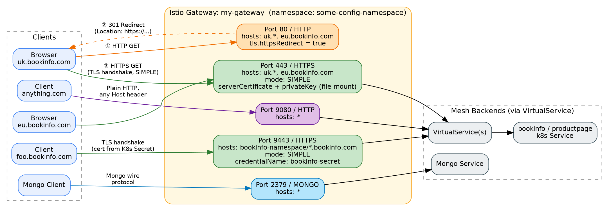
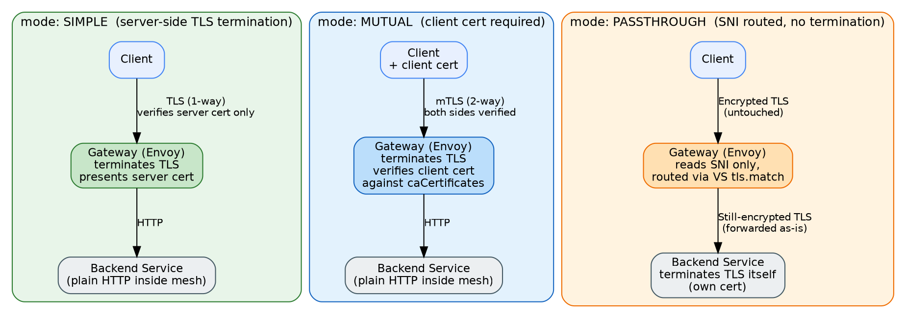
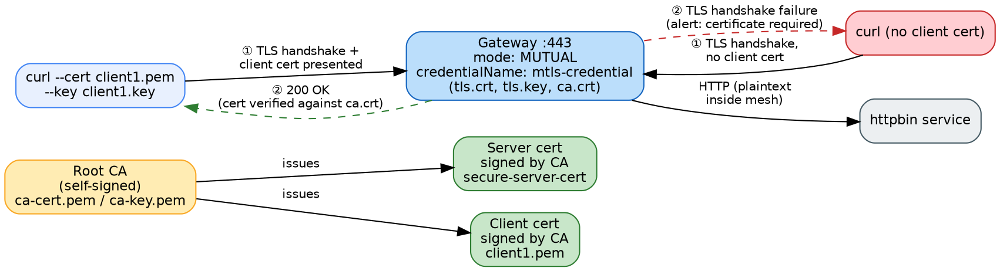
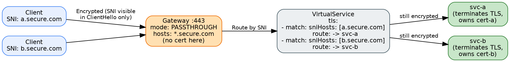

# Istio Gateway TLS Deep Dive: `httpsRedirect`, `SIMPLE`, `MUTUAL` & `PASSTHROUGH` — A Complete Hands-On Guide

*From YAML confusion to exam-ready mastery: understand every `tls:` field on an Istio `Gateway`, then prove it with three progressively harder labs.*

---

## Who this is for

If you've ever stared at an Istio `Gateway` manifest with a `tls:` block and wondered *"what actually happens on the wire when `httpsRedirect: true` is set?"* — this guide is for you. It's written for:

- Engineers preparing for **Istio / CKA-adjacent / service-mesh certification** style questions
- Anyone debugging a Gateway that isn't redirecting, isn't terminating TLS, or isn't routing by SNI correctly
- Students who want conceptual clarity **and** copy-pasteable labs they can run on `minikube`, `kind`, or any cluster with Istio installed

By the end, you'll be able to explain — and reproduce — the difference between `SIMPLE`, `MUTUAL`, and `PASSTHROUGH` TLS modes, and exactly what `httpsRedirect` does (and doesn't) do.

---

## 1. The Gateway resource, in one sentence

An Istio `Gateway` is a **layer-4/6 load balancer configuration** that describes which **ports, protocols, and hosts** the mesh's edge proxy (usually `istio-ingressgateway`, an Envoy instance) should listen on. It does **not** define routing rules by itself — that's the job of a `VirtualService` bound to the Gateway via `spec.gateways`.

Think of the Gateway as **"what the front door looks like"** and the VirtualService as **"where visitors get sent once they're inside."**

---

## 2. The manifest we're dissecting

```yaml
apiVersion: networking.istio.io/v1
kind: Gateway
metadata:
  name: my-gateway
  namespace: some-config-namespace
spec:
  selector:
    app: my-gateway-controller
  servers:
  - port:
      number: 80
      name: http
      protocol: HTTP
    hosts:
    - uk.bookinfo.com
    - eu.bookinfo.com
    tls:
      httpsRedirect: true # sends 301 redirect for http requests
  - port:
      number: 443
      name: https-443
      protocol: HTTPS
    hosts:
    - uk.bookinfo.com
    - eu.bookinfo.com
    tls:
      mode: SIMPLE # enables HTTPS on this port
      serverCertificate: /etc/certs/servercert.pem
      privateKey: /etc/certs/privatekey.pem
  - port:
      number: 9443
      name: https-9443
      protocol: HTTPS
    hosts:
    - "bookinfo-namespace/*.bookinfo.com"
    tls:
      mode: SIMPLE # enables HTTPS on this port
      credentialName: bookinfo-secret # fetches certs from Kubernetes secret
  - port:
      number: 9080
      name: http-wildcard
      protocol: HTTP
    hosts:
    - "*"
  - port:
      number: 2379 # to expose internal service via external port 2379
      name: mongo
      protocol: MONGO
    hosts:
    - "*"
```

This single Gateway opens **five listeners**. Here's what each one is doing:



| Port | Protocol | Hosts | TLS behaviour |
|---|---|---|---|
| 80 | HTTP | `uk.bookinfo.com`, `eu.bookinfo.com` | **Redirect-only** — no content served, just 301 → HTTPS |
| 443 | HTTPS | `uk.bookinfo.com`, `eu.bookinfo.com` | `SIMPLE` TLS, cert loaded from **files mounted on the gateway pod** |
| 9443 | HTTPS | `*.bookinfo.com` (scoped to `bookinfo-namespace`) | `SIMPLE` TLS, cert loaded from a **Kubernetes Secret** via `credentialName` |
| 9080 | HTTP | `*` (wildcard) | Plain HTTP, no TLS, no redirect — accepts any `Host` header |
| 2379 | MONGO | `*` | Raw TCP-level proxying for the Mongo wire protocol (not HTTP at all) |

---

## 3. `httpsRedirect` — the core concept

```yaml
tls:
  httpsRedirect: true
```

This lives inside a server block whose `protocol` is `HTTP`. It is a **boolean instruction to Envoy**: *"For any request landing on this listener, matching one of these `hosts`, don't route it anywhere — just respond with an HTTP `301 Moved Permanently`, rewriting the scheme to `https`, and send the client away."*

### What actually happens on the wire

```
GET / HTTP/1.1
Host: uk.bookinfo.com
```

Envoy replies with something like:

```
HTTP/1.1 301 Moved Permanently
location: https://uk.bookinfo.com/
```

The browser then automatically re-requests the same path over HTTPS — which lands on the **port 443** server block, where actual TLS termination happens.

### Key facts you must know cold (these are exam favourites)

1. **`httpsRedirect` and `mode` are mutually exclusive** within the same `tls:` block. You cannot set `httpsRedirect: true` *and* `mode: SIMPLE` on the same server — the whole point of the redirect listener is that it does **no** TLS work itself.
2. **Scope is per-`hosts` list, not global.** In our manifest, only `uk.bookinfo.com` and `eu.bookinfo.com` get redirected. The `9080` wildcard HTTP listener (`hosts: ["*"]`) is a **completely separate server block** and continues serving plain HTTP with zero redirection.
3. **It only fires on a `Host` header match.** If a request hits port 80 with a `Host` header that isn't `uk.bookinfo.com` or `eu.bookinfo.com`, this server block won't match it at all (Envoy falls through / rejects, depending on other config).
4. **The redirect is a 301**, meaning browsers and HTTP clients will cache it as permanent — useful to know when debugging "why is my curl following an old redirect."
5. It requires a **`VirtualService` is not needed** for the redirect itself — redirection happens entirely inside the Gateway's Envoy config, before any `VirtualService` routing logic is consulted.

---

## 4. TLS `mode` — the other half of the picture

The `tls.mode` field (used on the 443 and 9443 listeners above) controls **how** the gateway handles the TLS session itself. There are four values you should know, but three matter for 90% of real-world and exam scenarios:



| Mode | Who terminates TLS? | Client auth? | Typical use case |
|---|---|---|---|
| `SIMPLE` | Gateway (Envoy) | No — server-only cert | Standard public HTTPS website |
| `MUTUAL` | Gateway (Envoy) | **Yes** — client must present a cert | Service-to-service, B2B APIs, zero-trust edges |
| `PASSTHROUGH` | **Backend service**, not the gateway | Whatever the backend enforces | Backend needs to see/terminate its own TLS (e.g. compliance, existing cert pipeline) |
| `AUTO_PASSTHROUGH` | Backend, routed by SNI **to another mesh/cluster** without a matching VirtualService | Whatever the backend enforces | Multi-cluster / multi-network mesh federation |

### Where the certificate material comes from

Our manifest shows **both** ways to supply certs:

```yaml
# Port 443 — file-mounted certs (older / static pattern)
tls:
  mode: SIMPLE
  serverCertificate: /etc/certs/servercert.pem
  privateKey: /etc/certs/privatekey.pem
```
This requires the cert/key files to actually exist **inside the ingress gateway pod's filesystem** (mounted via a `Secret` volume or `ConfigMap` in the pod spec, or baked into the image). If they aren't mounted, the listener silently fails to become healthy.

```yaml
# Port 9443 — Kubernetes Secret reference (modern, recommended pattern)
tls:
  mode: SIMPLE
  credentialName: bookinfo-secret
```
This is the **preferred approach** in current Istio: Envoy's SDS (Secret Discovery Service) fetches the cert dynamically from a Kubernetes `Secret` named `bookinfo-secret`. Two important rules:

- By default, that `Secret` **must live in the same namespace as the gateway workload** (typically `istio-system` for the default ingress gateway) — *not* necessarily the namespace of the `Gateway` resource itself.
- The secret must be of type `kubernetes.io/tls` (or `generic` with `tls.crt`/`tls.key` keys) and Istio's ingress gateway service account needs read RBAC on it (handled automatically by the Istio installation in most cases).

---

## 5. The `hosts` field's special syntax: `namespace/host`

Notice port 9443 uses:

```yaml
hosts:
- "bookinfo-namespace/*.bookinfo.com"
```

This `namespace/dnsName` format restricts **which namespace's `VirtualService`(s)** are allowed to bind to this host on this Gateway. It's a security boundary: only `VirtualService` resources created in `bookinfo-namespace` (or ones using `.` for "same namespace as itself" if applicable) may claim routing for `*.bookinfo.com` through this listener. This prevents a rogue team in another namespace from hijacking your hostname.

---

## 6. Why the MONGO listener matters conceptually

```yaml
- port:
    number: 2379
    name: mongo
    protocol: MONGO
  hosts:
  - "*"
```

This isn't HTTP at all — it demonstrates that Istio Gateways aren't limited to HTTP/HTTPS. For non-HTTP TCP protocols, `hosts` is largely cosmetic/required-but-unused for matching (since Mongo's wire protocol has no `Host` header), and routing to a backend is done purely via `VirtualService` TCP/Mongo routes matching on port. **This block has nothing to do with TLS or redirects** — it's included in the original manifest purely to show that a single Gateway resource can multiplex very different protocols across different ports.

---

## 7. Quick self-check (answer before scrolling)

1. Why can't you set `httpsRedirect: true` together with `mode: SIMPLE` in the same server block?
2. If a client requests `http://random.bookinfo.com` on port 80, does it get redirected? Why or why not?
3. What's the practical difference between `serverCertificate`/`privateKey` and `credentialName`?
4. In `PASSTHROUGH` mode, does the Istio ingress gateway ever see the decrypted HTTP request?

<details>
<summary>Click to reveal answers</summary>

1. Because a redirect-only listener does no TLS handshake at all — there's nothing to apply `mode` to. They serve mutually exclusive purposes: bounce traffic away vs. actually terminate TLS.
2. No — the `hosts` list on that server block only contains `uk.bookinfo.com` and `eu.bookinfo.com`. A `Host` header of `random.bookinfo.com` doesn't match, so this server block is not selected.
3. `serverCertificate`/`privateKey` point to **files already present on the gateway pod's disk** (static, requires pod restart or volume remount to rotate). `credentialName` points to a **Kubernetes Secret fetched dynamically via SDS**, supporting hot cert rotation without restarting the gateway pod.
4. No. In `PASSTHROUGH` mode the gateway only reads the **SNI (Server Name Indication)** from the unencrypted part of the TLS ClientHello to decide routing — the actual encrypted payload is forwarded byte-for-byte to the backend, which performs its own TLS termination.

</details>

---

# Hands-On Labs

The three labs below escalate in difficulty and cover the three TLS modes end-to-end: **SIMPLE + redirect**, **MUTUAL**, and **PASSTHROUGH with SNI routing**. Each lab is self-contained with prerequisites, manifests, commands, expected output, and a "what you should have learned" recap — exactly the kind of scenario you'll see in a practical exam.

### Common prerequisites for all labs

```bash
# 1. A cluster with Istio installed (kind/minikube/EKS/GKE — any works)
istioctl install --set profile=demo -y

# 2. Enable sidecar injection on the working namespace
kubectl create namespace bookinfo-namespace
kubectl label namespace bookinfo-namespace istio-injection=enabled

# 3. Confirm the ingress gateway is up
kubectl get pods -n istio-system -l istio=ingressgateway
kubectl get svc istio-ingressgateway -n istio-system
```

> 💡 If you're on `kind`/`minikube` without a real LoadBalancer, use `kubectl port-forward` or `minikube tunnel` to reach the gateway's `EXTERNAL-IP`. Throughout the labs, `$GATEWAY_IP` and `$GATEWAY_PORT` refer to whatever your environment resolves to (see `istioctl` docs' "Determining the ingress IP and ports" section if unsure).

---

## Lab 1 (Beginner → Intermediate): `httpsRedirect` End-to-End with `SIMPLE` TLS

### 🎯 Use case / scenario

> Your team owns `bookinfo-namespace`. Product wants **all traffic to `shop.example.com` to be forced onto HTTPS** — anyone hitting the plain HTTP URL should be transparently bounced to HTTPS, and HTTPS itself must be terminated at the gateway using a certificate stored as a Kubernetes Secret (not file-mounted). Deploy this, and prove — with `curl`, not guesswork — that both behaviours work.

### Step 1 — Generate a self-signed certificate

```bash
mkdir -p ~/lab1-certs && cd ~/lab1-certs

openssl req -x509 -nodes -days 365 -newkey rsa:2048 \
  -subj "/CN=shop.example.com/O=shop" \
  -keyout shop.key -out shop.crt
```

### Step 2 — Store it as a Kubernetes Secret in the gateway's namespace

```bash
kubectl create -n istio-system secret tls shop-credential \
  --key=shop.key \
  --cert=shop.crt
```

> ⚠️ **Exam trap:** the secret must be created in the **same namespace the ingress gateway *pod* runs in** (`istio-system` for the default profile) — *not* `bookinfo-namespace` — unless you've configured a custom gateway deployment there.

### Step 3 — Deploy a sample backend

```bash
kubectl apply -n bookinfo-namespace -f https://raw.githubusercontent.com/istio/istio/release-1.22/samples/httpbin/httpbin.yaml
```

### Step 4 — The Gateway manifest

```yaml
# lab1-gateway.yaml
apiVersion: networking.istio.io/v1
kind: Gateway
metadata:
  name: shop-gateway
  namespace: bookinfo-namespace
spec:
  selector:
    istio: ingressgateway
  servers:
  - port:
      number: 80
      name: http
      protocol: HTTP
    hosts:
    - "shop.example.com"
    tls:
      httpsRedirect: true
  - port:
      number: 443
      name: https
      protocol: HTTPS
    hosts:
    - "shop.example.com"
    tls:
      mode: SIMPLE
      credentialName: shop-credential
```

### Step 5 — The VirtualService

```yaml
# lab1-vs.yaml
apiVersion: networking.istio.io/v1
kind: VirtualService
metadata:
  name: shop-vs
  namespace: bookinfo-namespace
spec:
  hosts:
  - "shop.example.com"
  gateways:
  - shop-gateway
  http:
  - route:
    - destination:
        host: httpbin
        port:
          number: 8000
```

```bash
kubectl apply -f lab1-gateway.yaml
kubectl apply -f lab1-vs.yaml
```

### Step 6 — Prove the redirect

```bash
export GATEWAY_IP=$(kubectl -n istio-system get svc istio-ingressgateway -o jsonpath='{.status.loadBalancer.ingress[0].ip}')

curl -sv -o /dev/null "http://$GATEWAY_IP" -H "Host: shop.example.com" 2>&1 | grep -E "< HTTP|< location"
```

**Expected output:**
```
< HTTP/1.1 301 Moved Permanently
< location: https://shop.example.com/
```

### Step 7 — Prove HTTPS termination works

```bash
curl -sv -k --resolve shop.example.com:443:$GATEWAY_IP https://shop.example.com/get 2>&1 | grep -E "subject:|< HTTP"
```

**Expected output** (abbreviated):
```
* subject: CN=shop.example.com; O=shop
< HTTP/1.1 200 OK
```

### ✅ What you should have learned

- How to wire `httpsRedirect` and `SIMPLE` TLS into two cooperating server blocks on one Gateway
- The **namespace rule** for `credentialName` secrets
- How to verify redirect behaviour and TLS termination independently, using `curl -v` flags (`-k` to skip CA validation since it's self-signed, `--resolve` to fake DNS)

---

## Lab 2 (Intermediate → Advanced): Mutual TLS (`MUTUAL`) — Client Certificate Enforcement

### 🎯 Use case / scenario

> A partner integration team needs to call your internal `httpbin` API over HTTPS, but **anonymous HTTPS access must be rejected** — only requests presenting a client certificate signed by your internal CA should succeed. This is a classic **zero-trust edge / B2B API gateway** requirement.



### Step 1 — Build a mini CA, a server cert, and a client cert

```bash
mkdir -p ~/lab2-certs && cd ~/lab2-certs

# Root CA
openssl req -x509 -sha256 -nodes -days 3650 -newkey rsa:2048 \
  -subj "/O=my-org/CN=my-org-root-ca" \
  -keyout ca.key -out ca.crt

# Server cert (signed by our CA)
openssl req -out server.csr -newkey rsa:2048 -nodes -keyout server.key \
  -subj "/CN=secure.example.com/O=my-org"
openssl x509 -req -sha256 -days 365 -CA ca.crt -CAkey ca.key -set_serial 1 \
  -in server.csr -out server.crt

# Client cert (signed by our CA — this is what "authorized" partners will use)
openssl req -out client.csr -newkey rsa:2048 -nodes -keyout client.key \
  -subj "/CN=partner-team-1/O=my-org"
openssl x509 -req -sha256 -days 365 -CA ca.crt -CAkey ca.key -set_serial 2 \
  -in client.csr -out client.crt
```

### Step 2 — Create the Secret (must include `ca.crt` for `MUTUAL` mode)

```bash
kubectl create -n istio-system secret generic mtls-credential \
  --from-file=tls.key=server.key \
  --from-file=tls.crt=server.crt \
  --from-file=ca.crt=ca.crt
```

> 📌 **This is the #1 thing students get wrong:** for `mode: SIMPLE` you only need `tls.crt`/`tls.key`. For `mode: MUTUAL`, the secret **must also contain `ca.crt`** — that's the trust anchor Envoy uses to validate incoming client certs.

### Step 3 — The Gateway manifest

```yaml
# lab2-gateway.yaml
apiVersion: networking.istio.io/v1
kind: Gateway
metadata:
  name: secure-gateway
  namespace: bookinfo-namespace
spec:
  selector:
    istio: ingressgateway
  servers:
  - port:
      number: 443
      name: https-mtls
      protocol: HTTPS
    hosts:
    - "secure.example.com"
    tls:
      mode: MUTUAL
      credentialName: mtls-credential
```

### Step 4 — VirtualService (same pattern as Lab 1)

```yaml
# lab2-vs.yaml
apiVersion: networking.istio.io/v1
kind: VirtualService
metadata:
  name: secure-vs
  namespace: bookinfo-namespace
spec:
  hosts:
  - "secure.example.com"
  gateways:
  - secure-gateway
  http:
  - route:
    - destination:
        host: httpbin
        port:
          number: 8000
```

```bash
kubectl apply -f lab2-gateway.yaml
kubectl apply -f lab2-vs.yaml
```

### Step 5 — Negative test: no client cert (must fail)

```bash
curl -sv -k --resolve secure.example.com:443:$GATEWAY_IP \
  https://secure.example.com/get 2>&1 | tail -15
```

**Expected:** a TLS handshake failure — something like `alert certificate required` or `curl: (35) OpenSSL SSL_connect: SSL_ERROR_SYSCALL`. This is the whole point: no cert, no entry.

### Step 6 — Positive test: with client cert (must succeed)

```bash
curl -sv -k --resolve secure.example.com:443:$GATEWAY_IP \
  --cert client.crt --key client.key \
  https://secure.example.com/get 2>&1 | grep "< HTTP"
```

**Expected output:**
```
< HTTP/1.1 200 OK
```

### ✅ What you should have learned

- `MUTUAL` mode requires a `ca.crt` in the credential secret, on top of the server cert/key
- How to generate a working mini-PKI (CA → server cert, CA → client cert) with pure `openssl`
- How to test both the **rejection** path and the **acceptance** path — exam questions frequently ask you to justify *both* halves of an mTLS setup

---

## Lab 3 (Advanced): `PASSTHROUGH` Mode with SNI-Based Routing to Two Backends

### 🎯 Use case / scenario

> Two independent backend teams (`svc-a` and `svc-b`) each manage and terminate **their own TLS certificates** for compliance reasons — the platform team is not allowed to see their private keys. Both services must be reachable on the **same external port 443** of a shared gateway, routed purely by the hostname the client asked for (SNI), with the gateway never decrypting anything.



### Step 1 — Each backend generates and owns its own cert

```bash
mkdir -p ~/lab3-certs && cd ~/lab3-certs

# svc-a's own self-managed cert
openssl req -x509 -nodes -days 365 -newkey rsa:2048 \
  -subj "/CN=a.secure.com" -keyout a.key -out a.crt

# svc-b's own self-managed cert
openssl req -x509 -nodes -days 365 -newkey rsa:2048 \
  -subj "/CN=b.secure.com" -keyout b.key -out b.crt
```

### Step 2 — Deploy two backends that terminate TLS themselves

We'll use a minimal `nginx` deployment per service, each mounting its own cert and doing TLS termination in-container (simulating "backend owns its TLS").

```yaml
# lab3-backends.yaml
apiVersion: v1
kind: ConfigMap
metadata:
  name: nginx-tls-conf
  namespace: bookinfo-namespace
data:
  default.conf: |
    server {
      listen 8443 ssl;
      ssl_certificate     /etc/nginx/certs/tls.crt;
      ssl_certificate_key /etc/nginx/certs/tls.key;
      location / { return 200 "hello from $hostname\n"; }
    }
---
apiVersion: apps/v1
kind: Deployment
metadata:
  name: svc-a
  namespace: bookinfo-namespace
  labels: { app: svc-a }
spec:
  replicas: 1
  selector: { matchLabels: { app: svc-a } }
  template:
    metadata:
      labels: { app: svc-a }
    spec:
      containers:
      - name: nginx
        image: nginx:1.25
        volumeMounts:
        - name: certs
          mountPath: /etc/nginx/certs
        - name: conf
          mountPath: /etc/nginx/conf.d
      volumes:
      - name: certs
        secret: { secretName: svc-a-cert }
      - name: conf
        configMap: { name: nginx-tls-conf }
---
apiVersion: v1
kind: Service
metadata:
  name: svc-a
  namespace: bookinfo-namespace
spec:
  selector: { app: svc-a }
  ports:
  - port: 8443
    targetPort: 8443
    name: tls
---
apiVersion: apps/v1
kind: Deployment
metadata:
  name: svc-b
  namespace: bookinfo-namespace
  labels: { app: svc-b }
spec:
  replicas: 1
  selector: { matchLabels: { app: svc-b } }
  template:
    metadata:
      labels: { app: svc-b }
    spec:
      containers:
      - name: nginx
        image: nginx:1.25
        volumeMounts:
        - name: certs
          mountPath: /etc/nginx/certs
        - name: conf
          mountPath: /etc/nginx/conf.d
      volumes:
      - name: certs
        secret: { secretName: svc-b-cert }
      - name: conf
        configMap: { name: nginx-tls-conf }
---
apiVersion: v1
kind: Service
metadata:
  name: svc-b
  namespace: bookinfo-namespace
spec:
  selector: { app: svc-b }
  ports:
  - port: 8443
    targetPort: 8443
    name: tls
```

```bash
kubectl create -n bookinfo-namespace secret tls svc-a-cert --cert=a.crt --key=a.key
kubectl create -n bookinfo-namespace secret tls svc-b-cert --cert=b.crt --key=b.key
kubectl apply -f lab3-backends.yaml
```

> Note: because these backends terminate TLS themselves rather than the mesh mTLS, the port name `tls` (not `https`) signals Istio not to attempt mTLS origination on this port — the gateway must forward raw bytes.

### Step 3 — The Gateway (`PASSTHROUGH`, single port, wildcard host)

```yaml
# lab3-gateway.yaml
apiVersion: networking.istio.io/v1
kind: Gateway
metadata:
  name: passthrough-gateway
  namespace: bookinfo-namespace
spec:
  selector:
    istio: ingressgateway
  servers:
  - port:
      number: 443
      name: tls-passthrough
      protocol: TLS
    hosts:
    - "*.secure.com"
    tls:
      mode: PASSTHROUGH
```

> ⚠️ **Exam trap:** in `PASSTHROUGH` mode the listener `protocol` is `TLS` (or `HTTPS`), and there is **no `serverCertificate`, `privateKey`, or `credentialName`** — the gateway has no certificate material at all. Providing one is a config error, because the gateway is never meant to decrypt anything.

### Step 4 — The VirtualService: this is where SNI routing actually happens

```yaml
# lab3-vs.yaml
apiVersion: networking.istio.io/v1
kind: VirtualService
metadata:
  name: passthrough-vs
  namespace: bookinfo-namespace
spec:
  hosts:
  - "*.secure.com"
  gateways:
  - passthrough-gateway
  tls:
  - match:
    - port: 443
      sniHosts:
      - "a.secure.com"
    route:
    - destination:
        host: svc-a
        port:
          number: 8443
  - match:
    - port: 443
      sniHosts:
      - "b.secure.com"
    route:
    - destination:
        host: svc-b
        port:
          number: 8443
```

```bash
kubectl apply -f lab3-gateway.yaml
kubectl apply -f lab3-vs.yaml
```

### Step 5 — Test both SNI routes

```bash
# Should hit svc-a and get svc-a's cert back
curl -sv -k --resolve a.secure.com:443:$GATEWAY_IP https://a.secure.com/ 2>&1 | grep -E "subject:|hello"

# Should hit svc-b and get svc-b's cert back
curl -sv -k --resolve b.secure.com:443:$GATEWAY_IP https://b.secure.com/ 2>&1 | grep -E "subject:|hello"
```

**Expected output for `a.secure.com`:**
```
* subject: CN=a.secure.com
hello from svc-a-xxxxx
```

**Expected output for `b.secure.com`:**
```
* subject: CN=b.secure.com
hello from svc-b-xxxxx
```

The fact that **the certificate returned matches each backend's own cert, not a shared gateway cert**, is the proof that the gateway never terminated TLS — it purely routed by SNI and forwarded encrypted bytes untouched.

### ✅ What you should have learned

- `PASSTHROUGH` moves TLS termination responsibility entirely to the backend
- SNI routing rules live in the `VirtualService`'s `tls:` block (`sniHosts`), not the Gateway
- How to prove passthrough behaviour empirically: **the returned certificate identity is the tell**

---

## 8. Cheat-sheet: exam-ready comparison table

| Feature | `httpsRedirect: true` | `mode: SIMPLE` | `mode: MUTUAL` | `mode: PASSTHROUGH` |
|---|---|---|---|---|
| Protocol on listener | `HTTP` | `HTTPS` | `HTTPS` | `TLS` / `HTTPS` |
| Gateway terminates TLS? | N/A (no TLS here) | Yes | Yes | **No** |
| Needs `credentialName` / cert files? | No | Yes | Yes (+ `ca.crt`) | **No** |
| Client cert required? | No | No | **Yes** | Backend's choice |
| Routing config location | Gateway itself (redirect) | Gateway + `VirtualService.http` | Gateway + `VirtualService.http` | Gateway + `VirtualService.tls` (SNI match) |
| Common failure symptom | 404 instead of 301 (host mismatch) | Envoy listener not ready (missing mounted cert) | Handshake failure for legit clients (missing `ca.crt`) | Wrong backend hit (SNI match ordering / typo) |

---

## 9. Final recap

- `httpsRedirect` is a **pure redirect instruction** scoped to specific hosts on an `HTTP` listener — it never coexists with `mode` in the same block.
- TLS **`mode`** decides *where* encryption ends: at the gateway (`SIMPLE`/`MUTUAL`) or at the backend (`PASSTHROUGH`).
- Certificate material can come from **mounted files** (`serverCertificate`/`privateKey`) or, preferably, a **Kubernetes Secret** (`credentialName`) fetched dynamically via SDS — the latter lives in the **gateway workload's namespace**.
- `MUTUAL` mode additionally requires a **`ca.crt`** in the secret to validate client certificates.
- `PASSTHROUGH` shifts routing logic to the `VirtualService`'s `tls.match.sniHosts`, and the gateway never sees plaintext.

If you can rebuild these three labs from memory, you're in solid shape for any Istio Gateway TLS question an exam — or an incident at 2 a.m. — throws at you.

---

*Found this useful? Clap, follow, and try breaking one of the labs on purpose (e.g., omit `ca.crt` in Lab 2) to see the exact failure mode — that's the fastest way to internalize this.*
