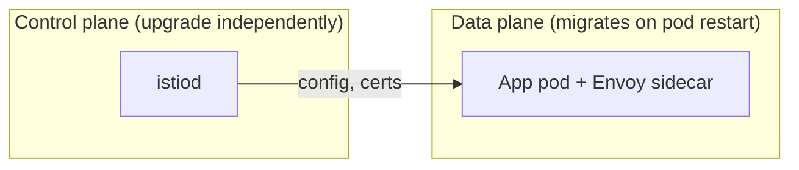
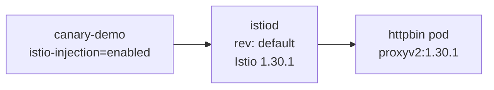
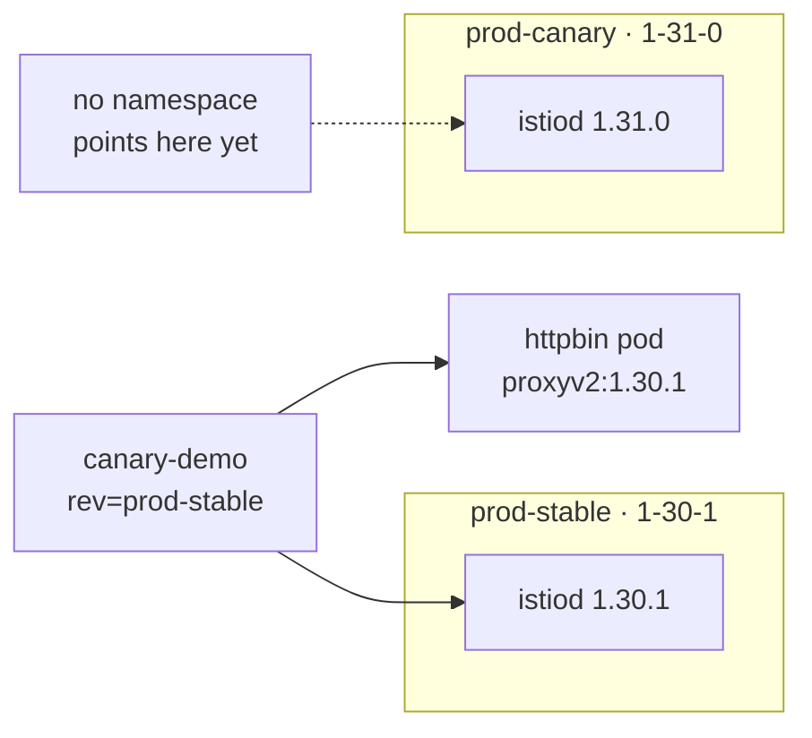
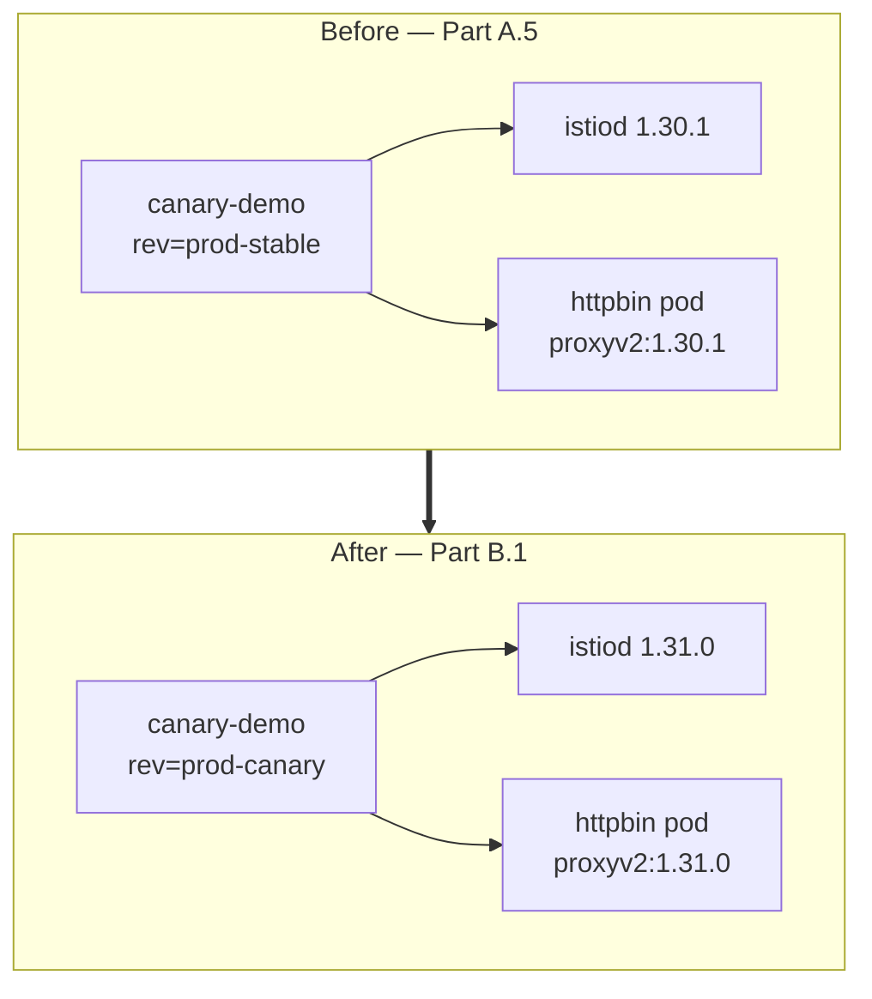
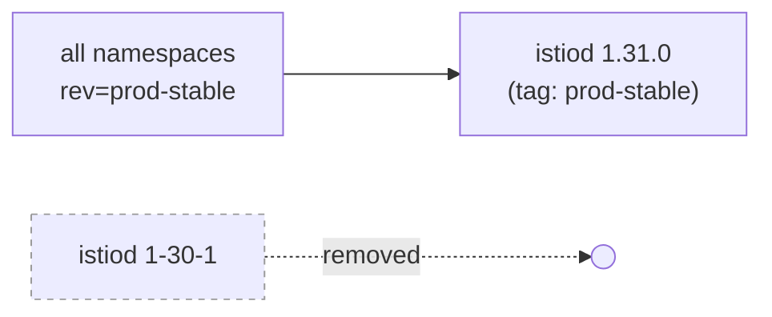

# Istio Canary Upgrade — 1.30.1 to 1.31.0

A complete, self-contained walkthrough of upgrading Istio using the canary
revision model — with the **control plane upgrade** and the **data plane
migration** treated as two separate, independently-understood stages. One
sample app is deployed at the very start and followed through every phase,
so you watch a single pod actually move from 1.30.1 to 1.31.0.

---

## Table of Contents

1. [Core Concepts](#1-core-concepts)
2. [Starting State](#2-starting-state)
3. [Deploy the Sample App](#3-deploy-the-sample-app)
4. [Part A — Control Plane Canary Upgrade](#4-part-a--control-plane-canary-upgrade)
5. [Part B — Data Plane Canary Migration](#5-part-b--data-plane-canary-migration)
6. [Part C — Full Rollout & Promotion](#6-part-c--full-rollout--promotion)
7. [Part D — Decommission the Old Control Plane](#7-part-d--decommission-the-old-control-plane)
8. [Validation Cheat Sheet](#8-validation-cheat-sheet)
9. [Full Command Reference](#9-full-command-reference)
10. [Rollback Notes](#10-rollback-notes)

---

## 1. Core Concepts

Two ideas make canary upgrades work, and it's worth separating them clearly
before touching a single command.

| Term | What it actually is |
|---|---|
| **Revision** | The literal name given to a control plane binary at install time (`--set revision=X`). Two revisions can run in the same cluster at once, fully isolated from each other. |
| **Tag** | A friendly alias (`prod-stable`, `prod-canary`) that points at one revision. Tags are what you actually put in namespace labels — not raw revision names — so the underlying revision can change without touching every namespace. |
| **Control plane** | `istiod` itself — the component that issues certs, pushes config, and validates resources. Upgrading it does **not** touch any running workload. |
| **Data plane** | The Envoy sidecars injected into your application pods. A pod only moves to a new Istio version when it is **restarted** under a namespace pointing at the new revision. |



This is the whole reason the process below is split in two parts: **Part A
upgrades the control plane with zero workload impact**, and **Part B is the
separate, deliberate act of moving traffic onto it.**

---

## 2. Starting State

This guide begins from the simplest possible baseline — a demo-profile
install with **no explicit revision name**, which is what you get out of the
box.

```
$ istioctl version
client version: 1.30.1
control plane version: 1.30.1
data plane version: 1.30.1 (2 proxies)

$ istioctl tag list
TAG      REVISION  NAMESPACES
default  default
```

Because the revision is literally named `default`, there is no name to pin a
tag to, and nowhere for a second version to install alongside it without
first giving this one a proper identity. Before we fix that, let's put a
real workload in the cluster so there's something concrete to migrate.

---

## 3. Deploy the Sample App

This is the one pod you'll track through every phase of this guide. It goes
into the cluster **now**, while only the legacy, unnamed `default` revision
exists — using the classic `istio-injection=enabled` label, which is how
injection works before any revision naming is introduced.

Save as `httpbin-canary-demo.yaml`:

```yaml
apiVersion: v1
kind: Namespace
metadata:
  name: canary-demo
  labels:
    istio-injection: enabled
---
apiVersion: v1
kind: ServiceAccount
metadata:
  name: httpbin
  namespace: canary-demo
---
apiVersion: v1
kind: Service
metadata:
  name: httpbin
  namespace: canary-demo
  labels:
    app: httpbin
    service: httpbin
spec:
  ports:
    - name: http
      port: 8000
      targetPort: 80
  selector:
    app: httpbin
---
apiVersion: apps/v1
kind: Deployment
metadata:
  name: httpbin
  namespace: canary-demo
spec:
  replicas: 1
  selector:
    matchLabels:
      app: httpbin
      version: v1
  template:
    metadata:
      labels:
        app: httpbin
        version: v1
    spec:
      serviceAccountName: httpbin
      containers:
        - name: httpbin
          image: docker.io/kong/httpbin
          imagePullPolicy: IfNotPresent
          ports:
            - containerPort: 80
```

```bash
kubectl apply -f httpbin-canary-demo.yaml
kubectl get pods -n canary-demo
```

Confirm the baseline — the pod should show `2/2` containers (app + sidecar),
running the 1.30.1 proxy:

```bash
kubectl get pod -n canary-demo -l app=httpbin \
  -o jsonpath='{.items[0].spec.containers[?(@.name=="istio-proxy")].image}{"\n"}'
```

```
docker.io/istio/proxyv2:1.30.1
```

> **Why not check the `istio.io/rev` label here too?** Because there isn't
> one yet. The legacy `istio-injection=enabled` label triggers injection
> through the original mutating webhook, which does not stamp pods with an
> `istio.io/rev` label — that label only appears once injection happens
> through a **named revision or tag**. Running the label-check command at
> this stage would return an empty result. It becomes meaningful starting
> at A.2, once `canary-demo` is moved onto the named `1-30-1` revision —
> that's the first point where the label exists and the command returns a
> real value.



This is now the pod we'll follow through Parts A through D.

---

## 4. Part A — Control Plane Canary Upgrade

**Goal of this part:** end up with two named, tagged control planes —
`prod-stable` (1.30.1) and `prod-canary` (1.31.0) — running side by side.
**`canary-demo` keeps running the whole time; nothing in it is touched yet.**

### A.1 — Give the current control plane a real name

```bash
istioctl install --set profile=demo --set revision=1-30-1 -y
```

This installs a **second** istiod next to `default`, this time named
`1-30-1`. Both exist momentarily — `canary-demo` is still being served by
the old unnamed `default` revision.

### A.2 — Move the sample namespace onto the named revision

This is where `<your-ns>` becomes concrete: it's `canary-demo`, the app you
deployed in Section 3.

```bash
kubectl label namespace canary-demo istio.io/rev=1-30-1 --overwrite
kubectl label namespace canary-demo istio-injection-
kubectl rollout restart deployment httpbin -n canary-demo
```

Verify — same Istio version, but now tied to a named revision instead of the
legacy `default` one:

```bash
kubectl get pod -n canary-demo -l app=httpbin \
  -o jsonpath='{.items[0].metadata.labels.istio\.io/rev}{"\n"}'
```

```
1-30-1
```

> This step is a same-version move (1.30.1 → 1.30.1, just renamed), not an
> upgrade. It only exists to get every workload off the unnamed `default`
> revision so it can be safely retired.

### A.3 — Tag it, retire `default`

```bash
istioctl tag set prod-stable --revision 1-30-1
istioctl uninstall --revision default -y
```

`canary-demo` is unaffected by this — it was already moved off `default` in
A.2, so removing it is safe.

### A.4 — Install 1.31.0 as the canary control plane

```bash
curl -L https://istio.io/downloadIstio | ISTIO_VERSION=1.31.0 sh -
cd istio-1.31.0 && export PATH=$PWD/bin:$PATH

istioctl install --set profile=demo --set revision=1-31-0 -y
istioctl tag set prod-canary --revision 1-31-0
```

### A.5 — Verify: two control planes, zero further workload impact

```bash
istioctl tag list
kubectl get pods -n istio-system -l app=istiod --show-labels
```

```
TAG          REVISION  NAMESPACES
prod-stable  1-30-1    canary-demo
prod-canary  1-31-0
```



At this point, **Part A is complete**. The 1.31.0 control plane is live,
validated, and idle — `canary-demo` is still safely on `prod-stable`, and
nothing has touched its running pod since A.2.

---

## 5. Part B — Data Plane Canary Migration

**Goal of this part:** move the actual running workload onto the new control
plane, and prove it happened by inspecting the pod directly.

### B.1 — Migrate `canary-demo` to `prod-canary`

```bash
kubectl label namespace canary-demo istio.io/rev=prod-canary --overwrite
kubectl rollout restart deployment httpbin -n canary-demo
kubectl rollout status deployment httpbin -n canary-demo
```

### B.2 — Validate the migration actually happened

```bash
kubectl get pod -n canary-demo -l app=httpbin \
  -o jsonpath='{.items[0].metadata.labels.istio\.io/rev}{"\n"}'

kubectl get pod -n canary-demo -l app=httpbin \
  -o jsonpath='{.items[0].spec.containers[?(@.name=="istio-proxy")].image}{"\n"}'

istioctl proxy-status | grep httpbin
```

```
prod-canary
docker.io/istio/proxyv2:1.31.0
```

If the label reads `prod-canary` and the sidecar image reports `1.31.0`, the
migration is confirmed — this one pod is now fully served by the new
control plane, while every other namespace in the cluster (in a real
cluster, not this demo) would remain untouched on `prod-stable`.

### B.3 — Functional check

```bash
kubectl exec -n canary-demo deploy/httpbin -c istio-proxy -- \
  curl -s localhost:15000/server_info | grep -i "ISTIO_VERSION"

kubectl port-forward -n canary-demo svc/httpbin 8000:8000 &
curl -s localhost:8000/get
```



Soak this namespace under real traffic before going further. Watch error
rate, p99 latency, and mTLS handshake failures.

---

## 6. Part C — Full Rollout & Promotion

Once `canary-demo` (and any other pilot namespaces, in a real cluster) have
soaked long enough to build confidence, migrate the rest of the fleet the
same way, one namespace at a time.

```bash
kubectl label namespace <ns> istio.io/rev=prod-canary --overwrite
kubectl rollout restart deployment -n <ns>
# validate, then repeat per namespace
```

Once **every** namespace is confirmed on 1.31.0, re-point the `prod-stable`
name itself so nothing has to change its label again:

```bash
istioctl tag set prod-stable --revision 1-31-0 --overwrite
```

`prod-stable` now means 1.31.0. Namespaces still labeled `prod-stable` pick
up the new version on their next restart with no further action.

---

## 7. Part D — Decommission the Old Control Plane

Only once nothing references `1-30-1` anymore:

```bash
istioctl tag remove prod-canary
istioctl uninstall --revision 1-30-1 -y
istioctl tag list
```



```
TAG          REVISION  NAMESPACES
prod-stable  1-31-0    canary-demo, ...
```

---

## 8. Validation Cheat Sheet

Use these anytime to answer "which revision is actually serving this pod?"

| Question | Command |
|---|---|
| Which tag/revision is this pod on? | `kubectl get pod <pod> -n <ns> -o jsonpath='{.metadata.labels.istio\.io/rev}'` |
| What sidecar image version is running? | `kubectl get pod <pod> -n <ns> -o jsonpath='{.spec.containers[?(@.name=="istio-proxy")].image}'` |
| Is the proxy synced with its control plane? | `istioctl proxy-status` |
| Which revision will inject a given namespace? | `kubectl get ns <ns> --show-labels` |
| Full sidecar injection status annotation | `kubectl get pod <pod> -n <ns> -o jsonpath='{.metadata.annotations.sidecar\.istio\.io/status}'` |

---

## 9. Full Command Reference

| Part | Step | Command |
|---|---|---|
| 3 | Deploy the sample app | `kubectl apply -f httpbin-canary-demo.yaml` |
| A | Name current revision | `istioctl install --set revision=1-30-1` |
| A | Move sample namespace onto it | `kubectl label namespace canary-demo istio.io/rev=1-30-1 --overwrite` |
| A | Tag as stable | `istioctl tag set prod-stable --revision 1-30-1` |
| A | Remove unnamed default | `istioctl uninstall --revision default -y` |
| A | Install canary control plane | `istioctl install --set revision=1-31-0` |
| A | Tag as canary | `istioctl tag set prod-canary --revision 1-31-0` |
| B | Migrate sample namespace to canary | `kubectl label namespace canary-demo istio.io/rev=prod-canary --overwrite` |
| B | Restart to pick up new sidecar | `kubectl rollout restart deployment httpbin -n canary-demo` |
| B | Validate sidecar version | `kubectl get pod ... -o jsonpath='{...istio-proxy.image}'` |
| C | Migrate remaining namespaces | `kubectl label namespace <ns> istio.io/rev=prod-canary --overwrite` |
| C | Promote canary to stable | `istioctl tag set prod-stable --revision 1-31-0 --overwrite` |
| D | Remove old control plane | `istioctl uninstall --revision 1-30-1 -y` |

---

## 10. Rollback Notes

Rollback is the same action at every stage of Part A.2 through Part C — it
is never destructive until Part D:

```bash
kubectl label namespace canary-demo istio.io/rev=prod-stable --overwrite
kubectl rollout restart deployment httpbin -n canary-demo
```

As long as the old control plane revision hasn't been uninstalled (Part D),
any namespace can move back to it in exactly the same way it moved forward.
