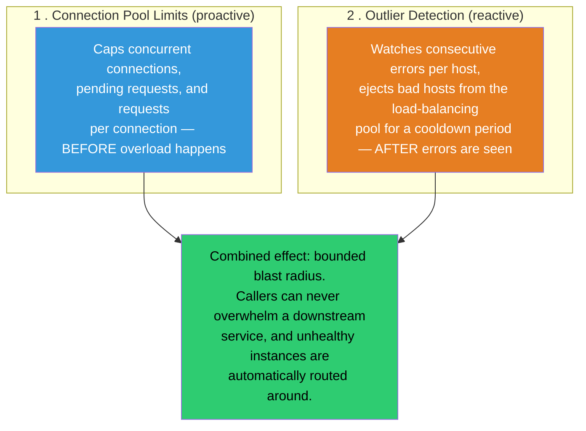
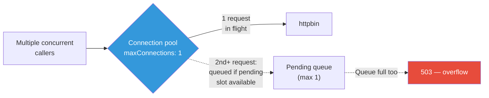
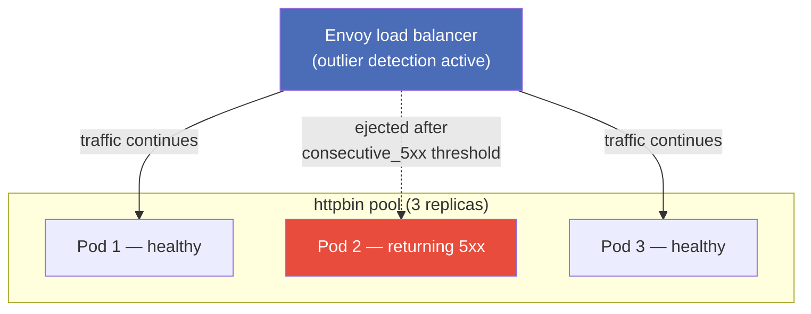
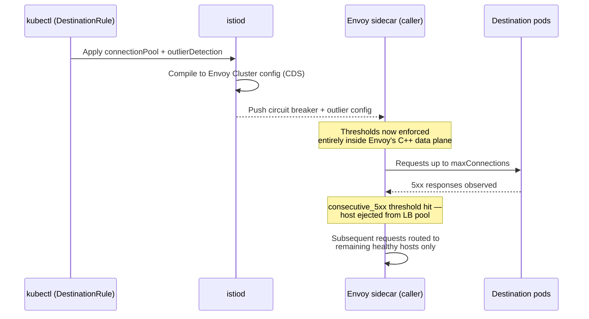
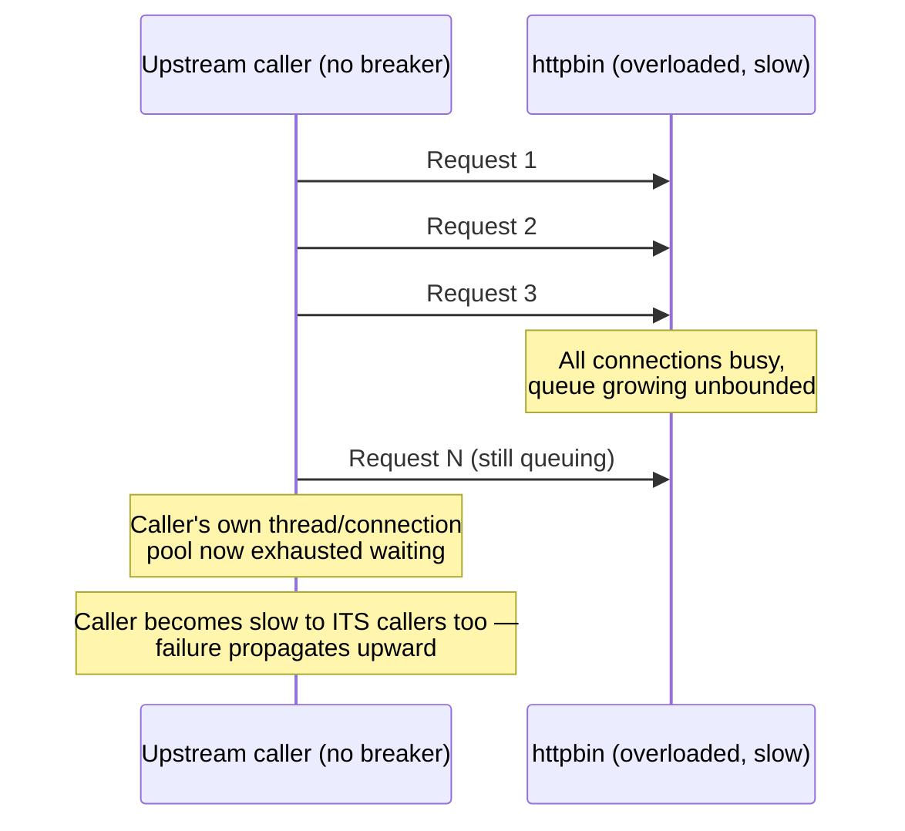
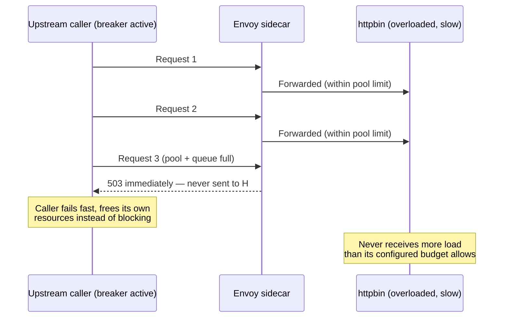

# Istio Circuit Breaking: Stopping Cascading Failures Before They Start

### A hands-on guide to connection pool limits, outlier detection, and proving it all with `fortio` load testing

---

Cascading failure has a very predictable shape: one downstream service gets slow or overloaded, callers pile up requests waiting on it, those callers exhaust their own thread pools or connection limits, *their* callers start timing out too, and within minutes an isolated slowdown has taken down half your system. The service that was actually unhealthy is often a small part of the blast radius by the time anyone notices.

Circuit breaking exists to stop this propagation at the source: cap how much load any single caller sends to any single destination, and stop sending to hosts that are visibly struggling. Istio implements this entirely in the Envoy sidecar, via `DestinationRule` configuration — no client library, no resilience4j, no Hystrix, no code.

This tutorial covers:

1. Configuring **connection pool limits** to cap concurrent requests and pending connections
2. Enabling **outlier detection** to automatically eject unhealthy hosts
3. How Istio's circuit breaker is implemented **at the Envoy sidecar**, not in your app
4. Using **`fortio`** to generate load and watch the circuit breaker trip in real time
5. How overflow triggers `503`s and what the **`overflow`** stat actually tracks
6. How this **prevents cascading failure** when a downstream service becomes overloaded

---

## 1. The Core Idea: Two Independent Protective Mechanisms

Istio's "circuit breaking" isn't one setting — it's two complementary mechanisms in `DestinationRule`, and it's worth keeping them mentally separate:



Connection pool limits are a **hard ceiling** — Envoy simply won't send more concurrent traffic to a host than you've allowed, full stop. Outlier detection is **adaptive** — it watches actual response behavior and temporarily removes misbehaving hosts from rotation. You typically want both.

---

## 2. Prerequisites

- Kubernetes cluster with Istio installed (`istioctl install --set profile=demo -y`)
- Namespace labeled for injection: `kubectl label namespace default istio-injection=enabled`
- The Istio Bookinfo sample deployed:

```bash
kubectl apply -f https://raw.githubusercontent.com/istio/istio/release-1.22/samples/bookinfo/platform/kube/bookinfo.yaml
```

- `fortio` available in-mesh. The easiest approach is deploying Istio's own fortio sample client, which ships with a sidecar so its traffic flows through Envoy like any other in-mesh caller:

```bash
kubectl apply -f https://raw.githubusercontent.com/istio/istio/release-1.22/samples/httpbin/httpbin.yaml
kubectl apply -f https://raw.githubusercontent.com/istio/istio/release-1.22/samples/fortio/fortio-deploy.yaml
```

We'll circuit-break calls to `httpbin`, since it gives us clean, controllable response codes for load testing.

---

## 3. Step One: Configure Connection Pool Limits

Connection pool settings live under `trafficPolicy.connectionPool` in a `DestinationRule`, split into TCP-level and HTTP-level settings:

```yaml
# destinationrule-httpbin-circuitbreaker.yaml
apiVersion: networking.istio.io/v1
kind: DestinationRule
metadata:
  name: httpbin
spec:
  host: httpbin.default.svc.cluster.local
  trafficPolicy:
    connectionPool:
      tcp:
        maxConnections: 1
      http:
        http1MaxPendingRequests: 1
        maxRequestsPerConnection: 1
    outlierDetection:
      consecutive5xxErrors: 1
      interval: 1s
      baseEjectionTime: 30s
      maxEjectionPercent: 100
```

```bash
kubectl apply -f destinationrule-httpbin-circuitbreaker.yaml
```

Here's what each field actually caps:

| Field | Controls |
|---|---|
| `tcp.maxConnections` | Max simultaneous TCP connections this sidecar will open to the destination's whole pool |
| `http.http1MaxPendingRequests` | Max requests queued waiting for a free connection, once `maxConnections` is saturated |
| `http.maxRequestsPerConnection` | Forces connection cycling after N requests (1 disables HTTP keep-alive reuse, useful for testing) |
| `http.maxRetries` | Caps concurrent retries across all pending requests to this host (not set above — defaults are permissive) |

We've deliberately set these very low (`1`, `1`, `1`) so the breaker trips almost immediately under modest concurrent load — perfect for observing the behavior clearly. In production, you'd size these based on real measured capacity (e.g., `maxConnections: 100`, `http1MaxPendingRequests: 50`), not artificially tiny values.



---

## 4. Step Two: Enable Outlier Detection

The `outlierDetection` block in the same `DestinationRule` above is the reactive half of circuit breaking:

```yaml
    outlierDetection:
      consecutive5xxErrors: 1
      interval: 1s
      baseEjectionTime: 30s
      maxEjectionPercent: 100
```

| Field | Meaning |
|---|---|
| `consecutive5xxErrors` | How many consecutive 5xx responses from a specific host trigger ejection |
| `interval` | How often Envoy scans hosts for ejection eligibility |
| `baseEjectionTime` | Minimum time a host stays ejected; doubles with each subsequent ejection for that host (exponential backoff) |
| `maxEjectionPercent` | Ceiling on what fraction of the pool can be ejected simultaneously, preventing a bad metric from ejecting 100% of a healthy pool by accident (we set it to 100 here deliberately, for a clear demo) |

Outlier detection operates **per pod**, independently, at the load-balancing layer — so with multiple `httpbin` replicas, one consistently-failing pod gets pulled from rotation while healthy siblings keep serving, without any global service-level impact.



---

## 5. Where This Actually Lives: The Envoy Sidecar, Zero App Changes

Same principle as every other Istio traffic feature: `istiod` compiles `DestinationRule.trafficPolicy` into Envoy's native `Cluster` configuration (pushed via CDS), specifically:

- `connectionPool` → Envoy's [circuit breaker thresholds](https://www.envoyproxy.io/docs/envoy/latest/api-v3/config/cluster/v3/circuit_breaker.proto) on the cluster
- `outlierDetection` → Envoy's [outlier detection](https://www.envoyproxy.io/docs/envoy/latest/intro/arch_overview/upstream/outlier) extension on the same cluster



The calling application (`fortio`, or your real service) makes ordinary outbound HTTP calls exactly as it always has. It has no idea a circuit breaker exists — it just experiences either a normal response, a `503` when the pool is exhausted, or requests silently being routed only to healthy pods. This is precisely why circuit breaking can be added to *any* service in the mesh, in any language, with a single YAML change and no library dependency.

---

## 6. Step Three: Generate Load With `fortio` and Watch It Trip

`fortio` is purpose-built for exactly this kind of test — it reports connection-level errors distinctly from HTTP-level errors, which is essential for seeing circuit breaking behavior clearly (a tripped connection-pool limit surfaces differently than a downstream 5xx).

Exec into the fortio client pod:

```bash
export FORTIO_POD=$(kubectl get pod -l app=fortio -o jsonpath='{.items[0].metadata.name}')
kubectl exec "$FORTIO_POD" -c fortio -- /usr/bin/fortio load \
  -c 1 -qps 0 -n 20 -loglevel Warning \
  http://httpbin:8000/get
```

With `-c 1` (one concurrent connection) and our `maxConnections: 1` setting, this single-connection run should complete cleanly — no breaker tripped yet, because we're within the configured limit.

**Now increase concurrency past the configured pool size:**

```bash
kubectl exec "$FORTIO_POD" -c fortio -- /usr/bin/fortio load \
  -c 3 -qps 0 -n 60 -loglevel Warning \
  http://httpbin:8000/get
```

With 3 concurrent connections against a pool sized for 1 (plus a pending queue of 1), you'll now see output like:

```
Code 200 : 34 (56.7 %)
Code 503 : 26 (43.3 %)
```

That jump in `503` responses is Envoy's circuit breaker actively rejecting requests it cannot safely forward — **before** they ever reach `httpbin`. This is the entire point: the destination is protected from overload by refusing excess requests at the edge, rather than letting them queue up and degrade everything downstream.

Push concurrency even higher to see the effect scale:

```bash
kubectl exec "$FORTIO_POD" -c fortio -- /usr/bin/fortio load \
  -c 10 -qps 0 -n 200 -loglevel Warning \
  http://httpbin:8000/get
```

You should see the `503` percentage climb sharply as concurrency further exceeds the configured pool limits.

---

## 7. Confirming the Overflow Stat Directly in Envoy

`curl`-and-eyeball is convincing, but the definitive proof is Envoy's own stats endpoint, which tracks circuit breaker overflow explicitly per cluster:

```bash
kubectl exec "$FORTIO_POD" -c istio-proxy -- \
  pilot-agent request GET stats | grep httpbin | grep -E "overflow|pending|cx_open"
```

Look for lines like:

```
cluster.outbound|8000||httpbin.default.svc.cluster.local.upstream_rq_pending_overflow: 26
cluster.outbound|8000||httpbin.default.svc.cluster.local.upstream_cx_overflow: 4
cluster.outbound|8000||httpbin.default.svc.cluster.local.upstream_rq_retry_overflow: 0
```

| Stat | What it means |
|---|---|
| `upstream_cx_overflow` | Requests rejected because `tcp.maxConnections` was already saturated |
| `upstream_rq_pending_overflow` | Requests rejected because the pending queue (`http1MaxPendingRequests`) was also full |
| `upstream_rq_retry_overflow` | Retries rejected because `maxRetries` concurrent retry budget was exhausted |

These counters increment in real time as the breaker trips, and they're exactly what you'd wire into a Grafana dashboard or alert rule in production — `overflow > 0` sustained over a window is a direct, unambiguous signal that a downstream dependency is being protected from more load than it (or your configured budget for it) can handle, which is a very different and more actionable signal than a generic error-rate spike.

---

## 8. How This Prevents Cascading Failure

Walk through what happens **without** circuit breaking when `httpbin` slows down under load:



And with circuit breaking configured:



The difference is the entire point of the pattern: without a breaker, an overloaded downstream service pulls every caller down with it through resource exhaustion — connections, threads, memory all tied up waiting. With a breaker, excess requests fail **fast and locally**, at the Envoy sidecar, before consuming any resources on either side of the call. Callers that fail fast can retry with backoff, serve degraded/cached responses, or fail visibly and immediately — all far better outcomes than the entire call chain silently grinding to a halt together.

This is also precisely why circuit breaker limits should reflect **real, measured capacity** of the downstream service, not arbitrary numbers. Set them too low and you'll reject legitimate traffic; set them too high and they won't protect anything before the real failure mode kicks in. Load testing with `fortio` against realistic traffic shapes — as done above — is exactly how you calibrate these thresholds correctly before relying on them in production.

---

## 9. Summary

| Concept | Takeaway |
|---|---|
| `connectionPool.tcp` / `.http` | Hard caps on concurrent connections and pending requests to a destination — proactive protection |
| `outlierDetection` | Ejects individual hosts returning consecutive 5xx errors, with exponential backoff on re-ejection |
| Implementation location | Entirely in the Envoy sidecar's compiled Cluster config — zero application code or library changes |
| `fortio` load testing | Concurrency beyond configured pool limits reliably produces `503` responses, cleanly demonstrating the breaker tripping |
| `overflow` stats | `upstream_cx_overflow`, `upstream_rq_pending_overflow`, `upstream_rq_retry_overflow` — precise, dashboardable signals of a tripped breaker |
| Cascading failure prevention | Fast, local `503`s at the caller's own sidecar stop resource exhaustion from propagating upstream through the call chain |

Circuit breaking is the one resilience pattern in this series that isn't really optional at scale — any service with more than a couple of downstream dependencies will eventually have one of them degrade, and the only real question is whether that degradation stays contained or cascades. Configuring it via `DestinationRule`, testing it with `fortio`, and watching the `overflow` stats is how you find out which one you've built — before production does.

---

*If you found this useful, consider following for more deep dives into Istio, Envoy, and resilient distributed systems design.*
