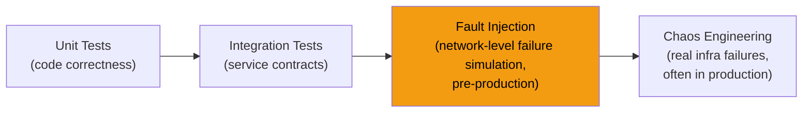
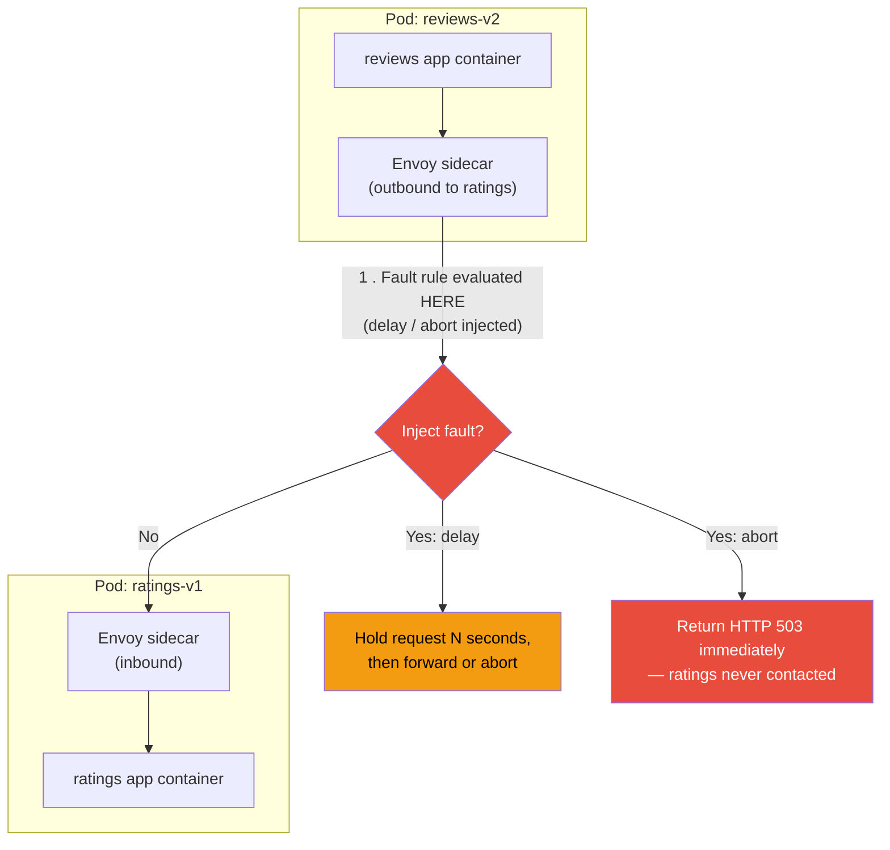
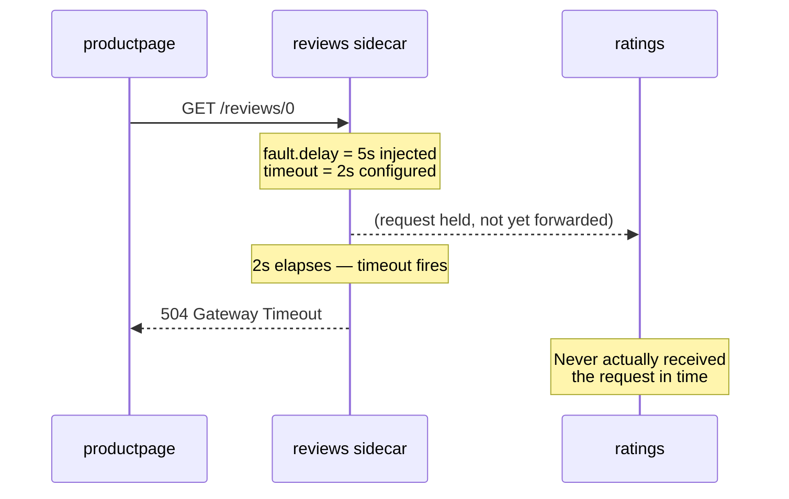
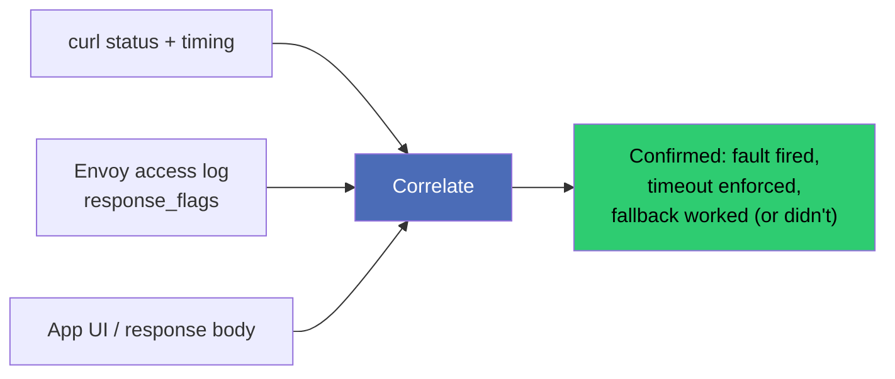

# Istio Fault Injection: Testing Resilience Without Breaking Production

### A hands-on guide to injecting HTTP delays and aborts, understanding timeout interactions, and verifying it all with `curl` — no application code changes required

---

Most teams find out their service isn't resilient the hard way: a downstream dependency slows down or starts failing, and the whole call chain unravels — timeouts cascade, retries pile up, connection pools exhaust, and the on-call engineer gets paged at 2 a.m.

The uncomfortable truth is that most of this is *discoverable in advance*. You don't need a production incident to learn that your service has no timeout configured, or that a slow dependency isn't handled gracefully. Istio lets you **inject synthetic delays and errors directly into the network path** — no code changes, no custom middleware, no "let's add a sleep() and redeploy" hacks. You flip on a rule, run some `curl` commands, watch what breaks, then flip it off.

This tutorial covers:

1. Injecting **HTTP delays** to simulate slow dependencies
2. Injecting **HTTP abort faults** (e.g., `503`) to simulate hard failures
3. How **upstream timeouts** interact with injected delays to expose real resilience gaps
4. Observing fault effects through **application responses and `curl`**
5. Why fault injection is a **safer alternative to chaos testing** in production

---

## 1. Where Fault Injection Fits in the Testing Pyramid

Fault injection in Istio isn't a load-testing tool and it isn't chaos engineering in the "kill -9 a random production node" sense. It sits in between:



Fault injection answers a narrower, more precise question: *"If dependency X responds slowly or with an error, does my service degrade gracefully?"* It does this by manipulating traffic **at the Envoy proxy**, entirely outside your application — the same data-plane mechanism used for the routing rules in `VirtualService`.

---

## 2. Prerequisites

- A Kubernetes cluster with Istio installed (`istioctl install --set profile=demo -y`)
- The namespace labeled for sidecar injection: `kubectl label namespace default istio-injection=enabled`
- The Istio Bookinfo sample app deployed:

```bash
kubectl apply -f https://raw.githubusercontent.com/istio/istio/release-1.22/samples/bookinfo/platform/kube/bookinfo.yaml
```

We'll use the `reviews → ratings` call path: the `productpage` service calls `reviews`, which (for `v2`/`v3`) calls `ratings`. This gives us a real service-to-service hop to inject faults into.

Confirm baseline health:

```bash
kubectl exec deploy/productpage-v1 -- curl -s productpage:9080/productpage | grep -i "error\|rating"
```

---

## 3. Architecture: Where the Fault Actually Lives

This is the critical mental model. A fault rule is attached to a `VirtualService` for a **destination host** — meaning it's enforced by the Envoy sidecar of the **caller**, before the request is even sent over the wire to the destination.



Key takeaway: **neither `reviews` nor `ratings` application code is touched.** The `reviews` sidecar either holds the request open (delay) or fabricates a response and never even opens a connection to `ratings` (abort). This is what makes fault injection so safe to toggle — it's purely a proxy-layer decision, reversible by re-applying a config file.

---

## 4. Step One: Inject an HTTP Delay

Let's simulate `ratings` responding slowly — say, a 5-second network delay on every call from `reviews`.

```yaml
# virtualservice-ratings-delay.yaml
apiVersion: networking.istio.io/v1
kind: VirtualService
metadata:
  name: ratings
spec:
  hosts:
    - ratings.default.svc.cluster.local
  http:
    - fault:
        delay:
          percentage:
            value: 100
          fixedDelay: 5s
      route:
        - destination:
            host: ratings.default.svc.cluster.local
            subset: v1
```

Apply it:

```bash
kubectl apply -f virtualservice-ratings-delay.yaml
```

> Note: this assumes a `DestinationRule` for `ratings` with a `v1` subset already exists (`labels: {version: v1}`), following the same subset pattern covered in Istio's routing fundamentals.

**Test it:**

```bash
time curl -s productpage:9080/productpage -o /dev/null
```

You should see the request now take just over 5 seconds — the injected delay compounding with normal processing time. If `productpage` has no defensive timeout, the whole page load will simply hang for that duration, which is often the first (uncomfortable) discovery teams make.

The `percentage.value: 100` field means *every* request gets delayed. Dial it down (e.g., `value: 10`) to simulate intermittent slowness instead of total degradation — a much more realistic production scenario than "everything is slow all the time."

---

## 5. Step Two: Inject an HTTP Abort Fault

Now let's simulate `ratings` being completely down, returning `503 Service Unavailable` for every request.

```yaml
# virtualservice-ratings-abort.yaml
apiVersion: networking.istio.io/v1
kind: VirtualService
metadata:
  name: ratings
spec:
  hosts:
    - ratings.default.svc.cluster.local
  http:
    - fault:
        abort:
          percentage:
            value: 100
          httpStatus: 503
      route:
        - destination:
            host: ratings.default.svc.cluster.local
            subset: v1
```

```bash
kubectl apply -f virtualservice-ratings-abort.yaml
```

**Test it:**

```bash
curl -s productpage:9080/productpage | grep -i "rating\|error"
```

With Bookinfo's default behavior, `reviews-v2`/`v3` will surface a "Ratings service is currently unavailable" message on the page — this is the app's *intended* fallback behavior, and abort injection is precisely how you'd verify that fallback actually works before ever seeing it happen for real.

You can also combine delay and abort in the same rule to simulate a dependency that's slow *and* partially failing:

```yaml
  http:
    - fault:
        delay:
          percentage:
            value: 100
          fixedDelay: 3s
        abort:
          percentage:
            value: 50
          httpStatus: 503
      route:
        - destination:
            host: ratings.default.svc.cluster.local
            subset: v1
```

This means: every request waits 3 seconds, and 50% of them then receive a `503` instead of a real response — a strong approximation of a struggling, half-healthy backend.

---

## 6. Step Three: How Timeouts Interact With Injected Delays (This Is Where Gaps Surface)

Delay injection is most useful **paired with** an explicit upstream timeout — because it's the *interaction* between the two that reveals whether your resilience configuration is real or theoretical.

Set an explicit timeout on the `reviews → ratings` call that's shorter than the injected delay:

```yaml
# virtualservice-ratings-timeout.yaml
apiVersion: networking.istio.io/v1
kind: VirtualService
metadata:
  name: ratings
spec:
  hosts:
    - ratings.default.svc.cluster.local
  http:
    - route:
        - destination:
            host: ratings.default.svc.cluster.local
            subset: v1
      timeout: 2s
      fault:
        delay:
          percentage:
            value: 100
          fixedDelay: 5s
```

Here, the injected delay (5s) is **longer** than the configured timeout (2s). This is intentional — it's the exact scenario you want to test.



**Test it:**

```bash
time curl -s -o /dev/null -w "%{http_code}\n" productpage:9080/productpage
```

You should see the request fail with a `504` (or the app's fallback UI) at roughly the **2-second mark**, not the 5-second mark — proving the timeout is actually being enforced by Envoy rather than being a value someone set once and never validated.

This is the single most valuable exercise in this tutorial. Teams frequently discover one of these gaps:

- **No timeout configured at all** → the delay propagates all the way up, and a single slow dependency stalls the entire request chain (and often exhausts thread/connection pools upstream).
- **Timeout configured but retries multiply the damage** → if `reviews` retries on timeout 3 times before giving up, a 2-second timeout becomes 6+ seconds of end-user-visible latency, and the "protection" actually made things worse.
- **Timeout shorter than a legitimately slow (not faulty) call** → false-positive failures under normal load spikes, meaning the timeout is too aggressive.

You can test the retry-amplification scenario directly by adding a retry policy alongside the timeout and re-running the same `curl`:

```yaml
      retries:
        attempts: 3
        perTryTimeout: 2s
        retryOn: gateway-error,connect-failure
```

Time the request again — if total latency jumps to ~6 seconds, you've just proven, safely and repeatably, that your retry configuration turns a single slow dependency into a much slower one.

---

## 7. Observing Fault Effects: What to Actually Look At

Don't just eyeball the `curl` output — correlate three signals:

**1. HTTP status code and timing from `curl`:**

```bash
curl -s -o /dev/null -w "status=%{http_code} time=%{time_total}s\n" productpage:9080/productpage
```

**2. Envoy access logs on the calling sidecar** — look for the `response_flags` field, which tells you *why* a request ended the way it did:

```bash
kubectl logs deploy/reviews-v2 -c istio-proxy | tail -20
```

Common flags you'll see:

| Flag | Meaning |
|---|---|
| `UF` | Upstream connection failure |
| `UT` | Upstream request timeout |
| `FI` | **Fault injected** (this confirms your fault rule fired) |
| `DC` | Downstream connection termination |

**3. Application-level fallback UI** — in Bookinfo, this is literally the visible "ratings unavailable" message; in your own services, this is whatever graceful-degradation path (cached data, default value, partial page) you've built. If there's no fallback, fault injection is exactly how you find that out before a customer does.



---

## 8. Cleaning Up

Fault injection rules are meant to be temporary. Remove them the moment you're done testing:

```bash
kubectl delete virtualservice ratings
```

Or, more safely, keep a "clean" baseline `VirtualService` file checked into version control and re-apply it:

```bash
kubectl apply -f virtualservice-ratings-baseline.yaml
```

Never leave a `percentage.value: 100` abort or delay rule active outside a deliberate test window — it's indistinguishable from a real outage to anything consuming that service.

---

## 9. Why Fault Injection Is Safer Than Chaos Testing in Production

Chaos engineering (killing pods, cutting network links, exhausting CPU on real nodes) is a legitimate and valuable practice — but it carries real blast-radius risk, especially in production. Istio's fault injection is a meaningfully different tool, and it's worth being precise about why:

| Property | Istio Fault Injection | Infrastructure-Level Chaos Testing |
|---|---|---|
| **Blast radius** | Scoped to a single `host` + optional `match` (specific route, header, subset) | Often affects an entire node, AZ, or process, impacting unrelated workloads |
| **Reversibility** | Instant — delete/re-apply one YAML object | Recovery depends on infra healing, restarts, or manual intervention |
| **What's actually broken** | Nothing — the target service is fully healthy; only the *simulated observation of it* is faulty | Something is genuinely broken (killed process, dropped packets) |
| **Precision** | Percentage-based, header/path-scoped, exact status codes and delay durations | Difficult to make surgically precise |
| **Safe to run pre-prod** | Yes, trivially — same YAML works in dev, staging, prod | Usually restricted to dedicated chaos environments or careful game days |
| **What it proves** | Whether your timeout/retry/circuit-breaker *configuration* is correct | Whether your *infrastructure* survives real failure — a different, later-stage question |

In short: fault injection tests your **application and mesh configuration's reaction to failure**, using a completely healthy backend as the control group. Chaos testing tests **your infrastructure's actual failure behavior**, with all the operational risk that implies. Most teams get far more signal, far more cheaply and safely, from getting fault injection right first — and chaos testing becomes a much lower-risk exercise once the basic resilience gaps (missing timeouts, retry storms, absent fallbacks) have already been found and fixed this way.

---

## 10. Summary

| Concept | Takeaway |
|---|---|
| `fault.delay` | Injects artificial latency on a percentage of requests, at the caller's Envoy sidecar |
| `fault.abort` | Returns a synthetic HTTP status (e.g., 503) without ever contacting the real backend |
| Timeout interaction | Delays longer than your configured `timeout` reveal whether timeouts — and retries — are actually working, or silently absent |
| Observation | Correlate `curl` status/timing, Envoy `response_flags` (look for `FI`), and application fallback behavior |
| Safety | Fault injection is scoped, reversible, and tests configuration against a healthy backend — a lower-risk, earlier-stage complement to infrastructure chaos testing |

Once you've run this exercise against every critical service-to-service call in your mesh, you'll have empirical answers — not assumptions — about how your system behaves when a dependency isn't perfectly healthy. That's a much better place to be than finding out during an actual incident.

---

*If you found this useful, consider following for more deep dives into Istio, Envoy, and resilient distributed systems design.*
