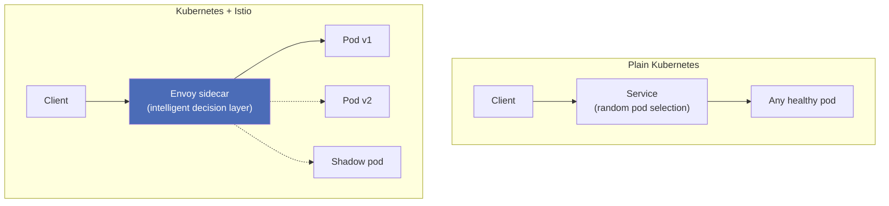
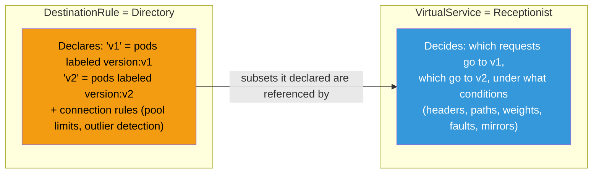
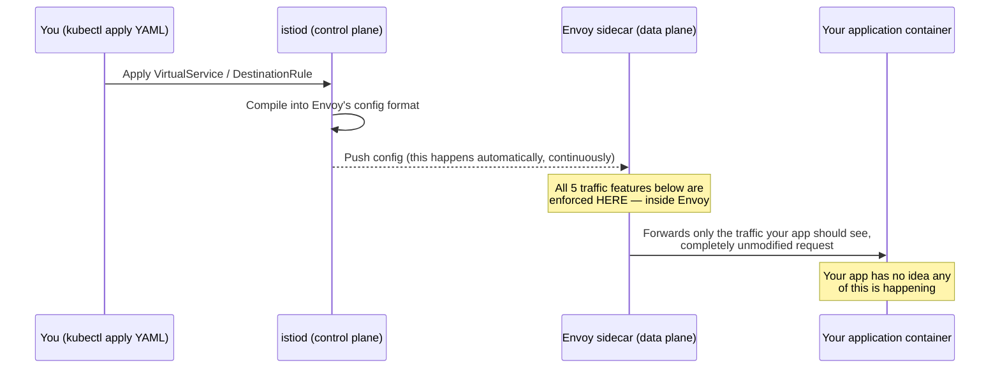
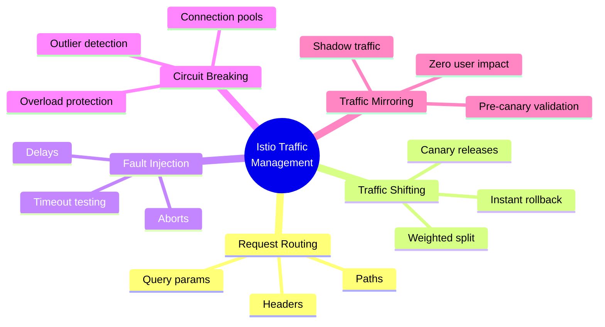
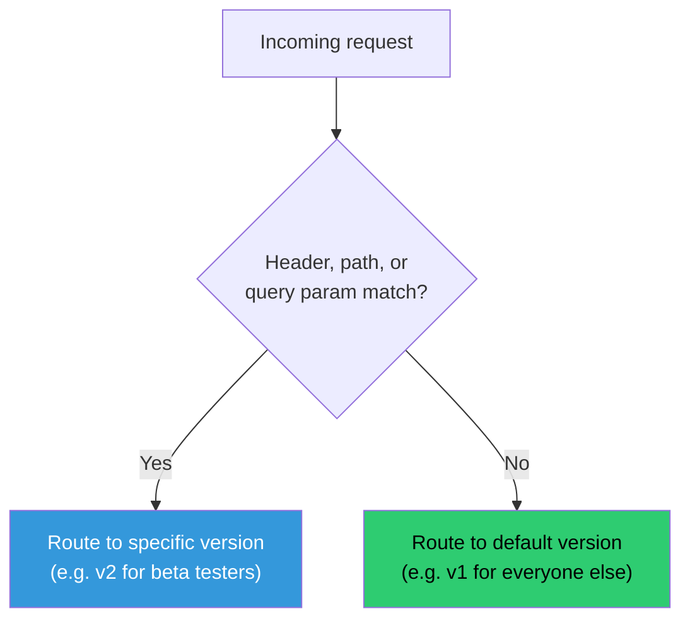
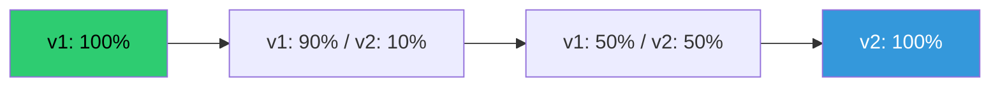
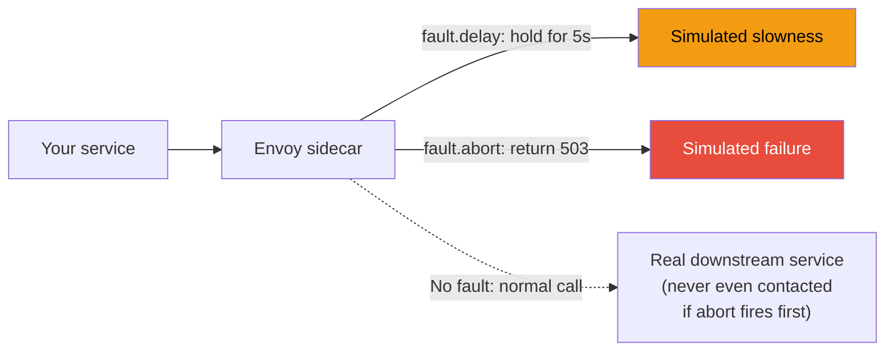
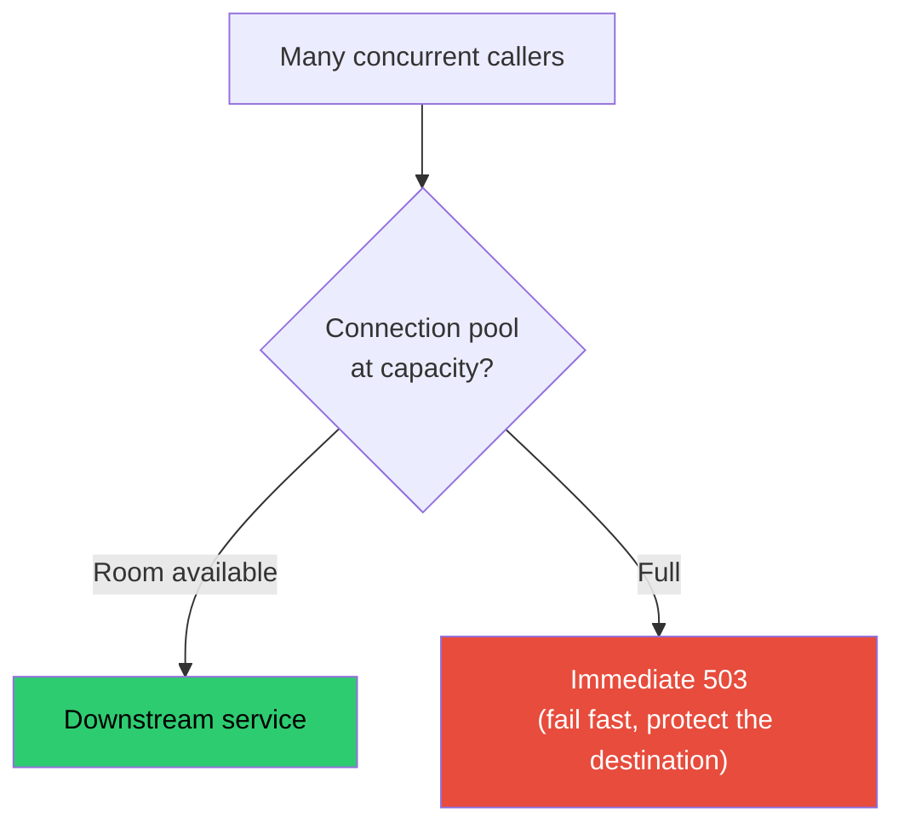
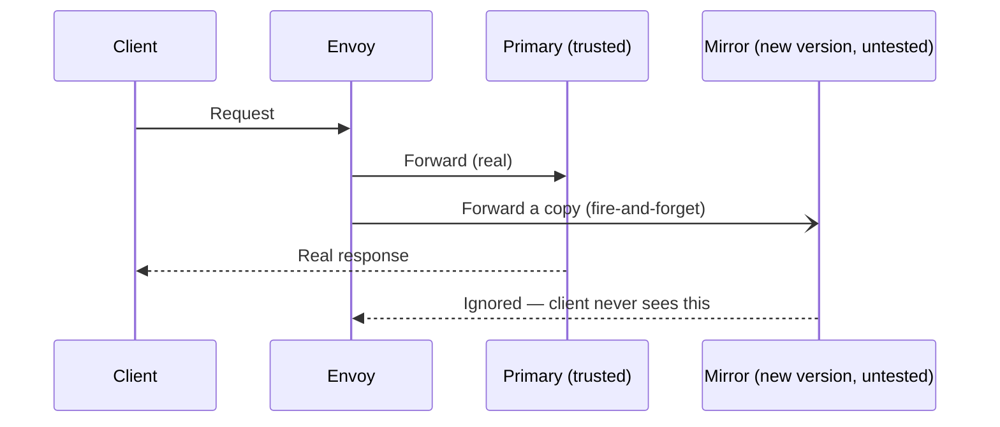
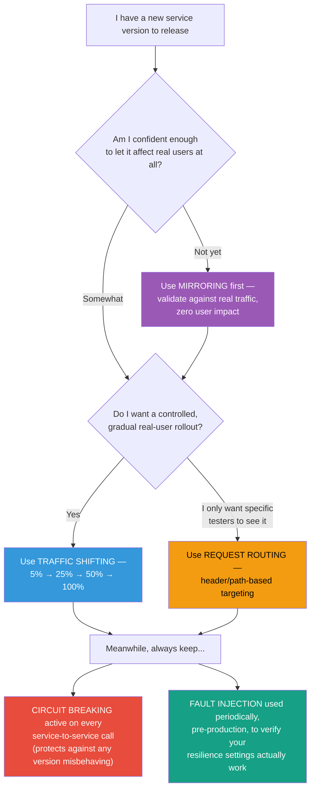

# Istio Traffic Management for Beginners: The Complete Map

### One landing page to understand routing, fault injection, traffic shifting, circuit breaking, and mirroring — before diving into the deep-dive tutorial for each

---

If you're new to Istio, traffic management can feel like five unrelated topics thrown at you at once: `VirtualService`, `DestinationRule`, canary releases, circuit breakers, mirroring — a wall of YAML with no obvious map connecting it all together.

It's actually one coherent story. Every feature in Istio traffic management answers a version of the same underlying question: **"Once a request leaves a client and before it reaches a pod, who decides where it goes, and what happens to it along the way?"** In plain Kubernetes, the answer is "kube-proxy picks a random healthy pod." Istio replaces that one-line answer with a small, composable toolkit — and once you see how the pieces relate, each individual feature becomes much easier to reason about.

This article is the map. It explains the two foundational building blocks everything else is built on, walks through all five traffic management capabilities in plain language with a diagram for each, and tells you what order to learn them in — with links out to a full, hands-on, step-by-step tutorial for every topic.

---

## 1. Why This Exists: The Problem With "Just Use a Kubernetes Service"

A Kubernetes Service does exactly one job well: it load-balances requests across every ready pod matching a label selector. That's it. It cannot:

- Send 5% of traffic to a new version and 95% to the old one
- Route a specific tester's requests to a beta version based on a header
- Simulate a downstream failure to test if your app handles it gracefully
- Stop a caller from overwhelming a struggling downstream service
- Copy live traffic to a new version for testing, without affecting real users

Istio doesn't replace the Kubernetes Service — it sits **in front of** every pod, as a lightweight proxy (Envoy) that intercepts all network traffic and makes intelligent, configurable decisions about it. All five capabilities in this article are different jobs that same proxy can do, once you tell it how via two Kubernetes custom resources.



---

## 2. The Two Building Blocks Everything Else Is Made Of

Before any of the five capabilities make sense, you need these two objects straight in your head. Almost every mistake beginners make with Istio traffic rules comes from mixing these two up.

| Object | In plain words | Answers the question |
|---|---|---|
| **`DestinationRule`** | "Here are the different versions of this service, and here's how carefully to talk to them." | *What exists, and how do I connect to it?* |
| **`VirtualService`** | "Here's exactly which requests should go to which version, under what conditions." | *Given a request, where should it go?* |

Think of it like a company directory and a receptionist:



A `VirtualService` can only route to a subset name that a `DestinationRule` has already declared. This dependency is the backbone of everything that follows — you'll see `subset: v1` / `subset: v2` show up in nearly every example across all five topics.

**Minimal example of both, side by side:**

```yaml
# DestinationRule — declares the versions
apiVersion: networking.istio.io/v1
kind: DestinationRule
metadata:
  name: reviews
spec:
  host: reviews.default.svc.cluster.local
  subsets:
    - name: v1
      labels: {version: v1}
    - name: v2
      labels: {version: v2}
---
# VirtualService — decides routing
apiVersion: networking.istio.io/v1
kind: VirtualService
metadata:
  name: reviews
spec:
  hosts:
    - reviews.default.svc.cluster.local
  http:
    - route:
        - destination: {host: reviews.default.svc.cluster.local, subset: v1}
          weight: 100
```

Once this pattern clicks, every feature below is just "add more instructions inside the `VirtualService`'s `http` block."

---

## 3. Where the Decision Actually Happens: The Envoy Sidecar

This one fact underlies everything in this article, so it's worth stating plainly before we go further: **none of these five features touch your application code.**

When Istio is enabled, every pod gets a second container injected automatically — the **Envoy sidecar**. All network traffic in and out of the pod is transparently redirected through it. Your `VirtualService` and `DestinationRule` objects are read by Istio's control plane (`istiod`), compiled into Envoy's native configuration format, and pushed down to every sidecar in the mesh.



This is why every feature below is described as "no code changes." The intelligence lives entirely in the proxy sitting next to your app, not inside it.

---

## 4. The Five Pillars of Istio Traffic Management

Here's the full picture, then each one explained simply below.



### 4.1 Request Routing — "Send this specific request to that specific version"

**In plain words:** Look at something about the incoming request — a header, the URL path, a query string — and use that to decide which version handles it. Useful for internal testers, beta opt-in users, or staged API paths.



**When to reach for it:** You want *specific, identifiable* requests to see a different version — not a random percentage of all traffic.

📘 **Deep dive:** *Mastering Istio Traffic Routing: VirtualService, DestinationRule, and Envoy Under the Hood*

---

### 4.2 Traffic Shifting — "Send X% of all traffic to the new version"

**In plain words:** Instead of conditions, you just assign percentages. 90% of *all* requests go to v1, 10% go to v2 — regardless of who's asking. Increase the new version's share gradually as confidence builds. This is how canary releases work.



**Important beginner point:** this percentage has **nothing to do with how many pods** each version has. You could run 10 pods of v1 and 1 pod of v2, and still send an exact 50/50 split — Istio's weighting is independent of Kubernetes replica counts.

**When to reach for it:** You want a *gradual, monitored rollout* where real users see the new version, in a controlled and instantly-reversible way.

📘 **Deep dive:** *Istio Traffic Shifting: Canary Releases Without Touching Replica Counts*

---

### 4.3 Fault Injection — "Deliberately break things, on purpose, to see what happens"

**In plain words:** Tell Envoy to pretend a service is slow (inject a delay) or pretend it's down (inject an error like `503`) — without actually touching the real service at all. Then watch whether your application handles it gracefully or falls over.



**When to reach for it:** *Before* a real dependency actually fails, you want to know whether your timeout settings, retries, and fallback logic actually work — safely, in a test window, on a fully healthy backend.

📘 **Deep dive:** *Istio Fault Injection: Testing Resilience Without Breaking Production*

---

### 4.4 Circuit Breaking — "Don't let one struggling service take everything else down with it"

**In plain words:** Two protections in one. First, cap how much load any caller can send to a destination at once (connection pool limits) — like a bouncer capping how many people can be in a room. Second, automatically stop sending traffic to individual pods that are clearly unhealthy (outlier detection), and give them time to recover.



**When to reach for it:** Any service with downstream dependencies, basically always — it's the difference between one slow service causing a contained, visible problem versus an invisible cascading outage across your whole system.

📘 **Deep dive:** *Istio Circuit Breaking: Stopping Cascading Failures Before They Start*

---

### 4.5 Traffic Mirroring — "Show the new version real traffic, but don't let it affect anyone"

**In plain words:** Copy live requests and send a duplicate to a new version, entirely in the background. The real user's response always comes from the original, trusted version — the copy sent to the new version is thrown away, no matter what it returns.



**When to reach for it:** You want to test a brand-new, unproven version against *real* production traffic patterns — before it's trusted enough to affect even 1% of real users.

📘 **Deep dive:** *Istio Traffic Mirroring: Testing New Versions Against Real Production Traffic, Risk-Free*

---

## 5. How They All Fit Together: A Decision Guide

A common beginner question: "Which one of these do I actually need?" Usually the honest answer is several of them, at different stages of a rollout. Here's a simple way to decide:



Notice that **circuit breaking** and **fault injection** aren't really "stages" like the others — they're standing practices. Circuit breaking should generally be configured on every important service-to-service call, all the time. Fault injection is something you run periodically (especially before trusting a new resilience setting) rather than something you turn on for a single release and then remove.

**A realistic, full lifecycle for shipping a risky new version, using everything in this article together:**

1. **Circuit breaking** is already configured on the relevant `DestinationRule`s — this is baseline hygiene, not a special step for this release.
2. Deploy the new version with **zero real traffic** routed to it.
3. Turn on **traffic mirroring** at a low percentage, watch how the new version handles real production traffic shape, ramp up mirror volume as confidence builds.
4. Run a **fault injection** test against the new version's own dependencies to confirm its own timeout/retry logic is sound before it's trusted with real users.
5. Begin a **traffic shift** — 5% real users, then 25%, 50%, 100% — monitoring at each stage, with instant rollback available the entire time.
6. Optionally use **request routing** during this window to let specific internal testers opt into the new version early, ahead of the general rollout percentage.

---

## 6. Quick Reference Cheat Sheet

| Feature | Configured in | Key field(s) | Answers |
|---|---|---|---|
| Request Routing | `VirtualService` | `match.headers`, `match.uri`, `match.queryParams` | "Which *specific* requests go where?" |
| Traffic Shifting | `VirtualService` | `route[].weight` | "What *percentage* of all traffic goes where?" |
| Fault Injection | `VirtualService` | `fault.delay`, `fault.abort` | "What happens if this dependency misbehaves?" |
| Circuit Breaking | `DestinationRule` | `connectionPool`, `outlierDetection` | "How do I stop one bad dependency from taking everything down?" |
| Traffic Mirroring | `VirtualService` | `mirror`, `mirrorPercentage` | "How do I test with real traffic, risk-free?" |

And the one rule that ties it all together: **`DestinationRule` always declares what exists; `VirtualService` always decides what happens to a request.** Every feature above is a variation on that second half.

---

## 7. Suggested Learning Path

If you're working through this series for the first time, this order builds cleanly on itself:

1. **Start here** — this landing page, for the big picture
2. **Request Routing** — get comfortable with `VirtualService` and `DestinationRule` basics
3. **Traffic Shifting** — same objects, now using weights instead of conditions
4. **Fault Injection** — same `VirtualService`, now deliberately breaking things to test resilience
5. **Circuit Breaking** — move into `DestinationRule`'s other job: protecting against real overload
6. **Traffic Mirroring** — combine everything into the safest possible way to test a new version

Each deep-dive article includes full YAML you can copy, a working example using Istio's Bookinfo sample app, diagrams of exactly where each decision happens inside Envoy, and a verification section using `curl` (and `fortio` for circuit breaking) so you can see every behavior for yourself rather than taking it on faith.

---

## 8. Summary

Istio traffic management can look like five disconnected features, but it's really one idea applied five ways: **the Envoy sidecar sitting next to your application can make sophisticated routing decisions — based on conditions, percentages, simulated failure, load limits, or duplication — entirely outside your code, driven by two Kubernetes objects you already know how to apply with `kubectl`.**

Once `VirtualService` and `DestinationRule` feel familiar, and once you've internalized that the decision always happens in the proxy, not the app, every one of these five capabilities is just a different set of fields inside objects you already understand.

---

*This article is the index for a five-part deep-dive series on Istio traffic management. Follow along for the full hands-on tutorials on Request Routing, Traffic Shifting, Fault Injection, Circuit Breaking, and Traffic Mirroring.*
