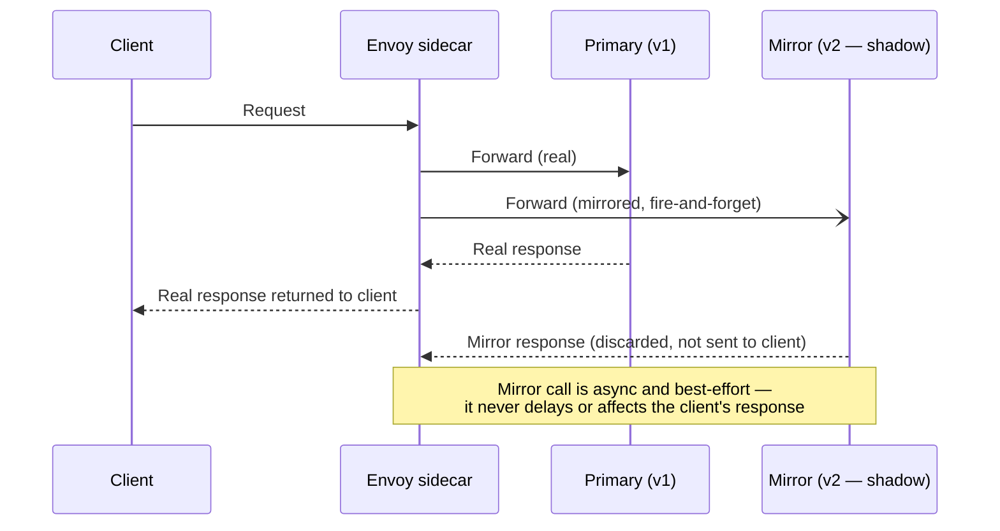
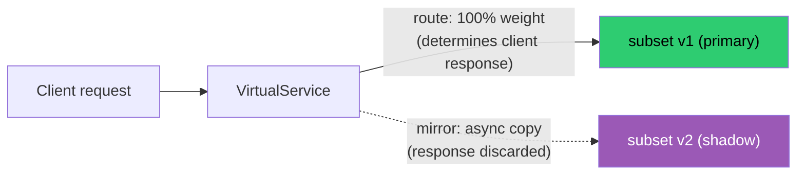
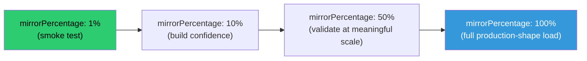
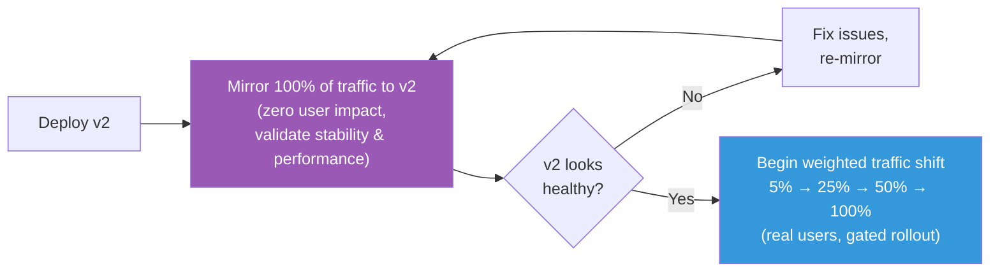

# Istio Traffic Mirroring: Testing New Versions Against Real Production Traffic, Risk-Free

### A hands-on guide to shadowing live requests with `VirtualService`, controlling mirror volume, and proving the primary path is never affected

---

Every rollout strategy discussed so far in this series — weighted shifting, canary progressions, fault injection — shares one property: they all let *real users* touch the new version, even if only a small percentage of them. Sometimes that's not acceptable. Maybe the new version writes to a database and you're not confident about a schema migration. Maybe it's a payments service and even 1% of real customers hitting an unproven code path is too much risk. Maybe you just want to see how it behaves under genuine production load *before* it's allowed to affect a single real response.

This is exactly what traffic mirroring solves. Istio can duplicate live requests and send a copy to a second service — the **mirror** (or "shadow") — while the original response returned to the client comes entirely from the **primary** service, untouched. The mirrored copy's response is discarded. The client never knows mirroring is happening at all.

This tutorial covers:

1. Configuring traffic mirroring in a `VirtualService` to shadow requests to a second service
2. Controlling mirror volume precisely with `mirrorPercentage`
3. Verifying mirrored traffic arrives at the shadow service, with zero impact on primary responses
4. How mirroring compares to traffic shifting, and when to reach for each
5. Using mirroring to validate a new version against real production workloads safely

---

## 1. The Core Idea: One Request In, Two Requests Out, One Response Back



The dashed arrow to the mirror service is deliberate: Envoy sends the mirrored request **asynchronously**, does not wait for it to complete, and drops whatever comes back. The client's actual response is determined entirely by the primary route. This asymmetry — one real path, one disposable shadow path — is the entire mechanism, and it's what makes mirroring safe to point at genuinely unfinished or unstable code.

---

## 2. Prerequisites

- Kubernetes cluster with Istio installed (`istioctl install --set profile=demo -y`)
- Namespace labeled for sidecar injection: `kubectl label namespace default istio-injection=enabled`
- Istio Bookinfo sample deployed:

```bash
kubectl apply -f https://raw.githubusercontent.com/istio/istio/release-1.22/samples/bookinfo/platform/kube/bookinfo.yaml
```

We'll mirror calls to `httpbin` — deploy two instances under different labels so we can clearly tell primary and mirror traffic apart in logs:

```bash
kubectl apply -f https://raw.githubusercontent.com/istio/istio/release-1.22/samples/httpbin/httpbin.yaml
```

For this tutorial, imagine `httpbin` `v1` is your stable primary and a second deployment, `httpbin-v2` (same image, different labels/name, simulating a new version), is the shadow target you want to validate.

```bash
kubectl label deployment httpbin version=v1 --overwrite
kubectl get pods -l app=httpbin --show-labels
```

Deploy a second copy representing the new version under test:

```bash
kubectl get deployment httpbin -o yaml | \
  sed 's/name: httpbin/name: httpbin-v2/; s/app: httpbin/app: httpbin\n        track: shadow/' \
  > httpbin-v2.yaml
kubectl apply -f httpbin-v2.yaml
kubectl label deployment httpbin-v2 version=v2 --overwrite
```

(In a real setup you'd simply deploy your actual new version normally — the point here is just having two distinguishable targets to mirror between.)

---

## 3. Step One: Map Both Versions With a `DestinationRule`

Same foundational pattern as every other traffic feature in this series — subsets need to exist before a `VirtualService` can route (or mirror) to them:

```yaml
# destinationrule-httpbin.yaml
apiVersion: networking.istio.io/v1
kind: DestinationRule
metadata:
  name: httpbin
spec:
  host: httpbin.default.svc.cluster.local
  subsets:
    - name: v1
      labels:
        version: v1
    - name: v2
      labels:
        version: v2
```

```bash
kubectl apply -f destinationrule-httpbin.yaml
```

---

## 4. Step Two: Configure Mirroring in the `VirtualService`

Mirroring is expressed with the `mirror` field alongside a normal `route` — the primary route determines what the client actually gets back, and `mirror` names the additional shadow destination:

```yaml
# virtualservice-httpbin-mirror.yaml
apiVersion: networking.istio.io/v1
kind: VirtualService
metadata:
  name: httpbin
spec:
  hosts:
    - httpbin.default.svc.cluster.local
  http:
    - route:
        - destination:
            host: httpbin.default.svc.cluster.local
            subset: v1
          weight: 100
      mirror:
        host: httpbin.default.svc.cluster.local
        subset: v2
      mirrorPercentage:
        value: 100.0
```

```bash
kubectl apply -f virtualservice-httpbin-mirror.yaml
```

Notice the primary `route` weight is **100 to v1** — this is not a traffic split. Every client-facing response still comes exclusively from `v1`. The `mirror` block is an entirely separate instruction: "also send a copy of this traffic to `v2`, but don't let it influence anything the client sees."



---

## 5. Step Three: Control Mirror Volume With `mirrorPercentage`

Mirroring 100% of production traffic to an unproven service is often more than you actually need or want — especially if the shadow service has side effects like writing to a datastore, calling third-party APIs, or you simply want to ramp up gradually. `mirrorPercentage` controls exactly what fraction of primary traffic also gets mirrored.

```yaml
      mirrorPercentage:
        value: 10.0
```

A conservative rollout of the mirroring itself often looks like:



Each stage is, as with weighted traffic shifting, just a re-`apply` of the same object with a different value:

```yaml
# Stage 1 — 1% mirror
      mirror:
        host: httpbin.default.svc.cluster.local
        subset: v2
      mirrorPercentage:
        value: 1.0
```

```bash
kubectl apply -f virtualservice-httpbin-mirror-1pct.yaml
```

One important nuance: omitting `mirrorPercentage` entirely defaults to mirroring **100%** of matched traffic (this was the only behavior in older Istio versions, before percentage control was added) — so always set it explicitly once you care about volume, rather than relying on the implicit default.

---

## 6. Step Four: Verify Mirrored Traffic Arrives — and Primary Responses Are Unaffected

This is the part worth proving empirically, not just trusting the config to do what the docs say.

**First, confirm the primary response is completely normal** — time it and check its content, with mirroring active:

```bash
kubectl exec deploy/sleep -- curl -s -o /dev/null -w "status=%{http_code} time=%{time_total}s\n" \
  http://httpbin:8000/get
```

(If you don't have a `sleep` client pod from earlier samples, deploy one: `kubectl apply -f https://raw.githubusercontent.com/istio/istio/release-1.22/samples/sleep/sleep.yaml`)

Response time and status should look exactly as they would with no mirroring configured at all — this is the property you're validating: **mirroring must be invisible from the client's perspective.**

**Now confirm the shadow service actually received a copy.** Check `httpbin-v2`'s access logs directly:

```bash
kubectl logs deploy/httpbin-v2 -c httpbin --tail=20
```

You should see the same request path/method logged there, arriving essentially simultaneously with calls to `v1`. For more definitive proof at the proxy layer, check the calling sidecar's access log and look for the mirror indicator:

```bash
kubectl logs deploy/sleep -c istio-proxy --tail=20
```

Envoy access logs record mirrored requests distinctly — look for two upstream cluster entries around the same timestamp, one for `outbound|8000|v1|httpbin...` (primary, response returned to client) and a corresponding mirrored call to `outbound|8000|v2|httpbin...`. You can also confirm via Envoy stats directly:

```bash
kubectl exec deploy/sleep -c istio-proxy -- pilot-agent request GET stats | grep httpbin | grep -i mirror
```

Run a burst of requests and compare counts between primary and shadow to confirm the configured `mirrorPercentage` is actually being honored:

```bash
for i in $(seq 1 100); do
  kubectl exec deploy/sleep -- curl -s -o /dev/null http://httpbin:8000/get
done

echo "Primary (v1) requests received:"
kubectl logs deploy/httpbin -c httpbin --tail=200 | grep -c "GET /get"

echo "Mirrored (v2) requests received:"
kubectl logs deploy/httpbin-v2 -c httpbin --tail=200 | grep -c "GET /get"
```

At `mirrorPercentage: 10.0`, you should see roughly 100 primary requests and roughly 10 mirrored ones — converging on the configured percentage as sample size grows, same probabilistic behavior as weighted routing.

---

## 7. How Mirroring Compares to Traffic Shifting

These two features are easy to conflate because both live in the same `VirtualService.http[].route` structure and both involve a "new version." They solve different problems, though, and picking the wrong one for your situation matters.

| Dimension | Traffic Shifting (weighted routing) | Traffic Mirroring |
|---|---|---|
| **Who sees the new version's response** | Real users, for the weighted percentage of requests | Nobody — the response is discarded, client always gets the primary's response |
| **Risk if new version misbehaves** | Some real users get bad responses, proportional to weight | Zero user-facing impact — failures in the shadow are invisible to clients |
| **What it validates** | End-to-end user experience, including response correctness as perceived by real clients | Whether the new version *can handle* real traffic shape/volume — not response correctness from the user's point of view |
| **Side effects (writes, third-party calls)** | Real, since it's genuinely serving the request | Still happen if the shadow service has them — mirroring copies the request, not just reads; this needs explicit handling (see below) |
| **Appropriate confidence level needed before use** | Reasonably high — you're accepting partial real-user exposure | Low — this is specifically for versions you're *not yet* confident in |
| **Typical use case** | Canary rollout once a version has already passed basic validation | Pre-canary validation: load/capacity testing, crash/error-rate observation, performance comparison, before any real user exposure |

A common, well-sequenced rollout actually uses **both**, in order:



Mirroring de-risks the *first* real exposure a new version gets to production-shaped traffic; weighted shifting then de-risks the *actual* user-facing rollout once you've already built confidence via the shadow.

---

## 8. The Important Caveat: Side Effects Are Real, Even in a Shadow

This deserves its own section because it's the most common way teams get burned by mirroring. Envoy mirrors the **entire request** — including `POST`/`PUT`/`DELETE` bodies. If your shadow service actually processes that request the same way the primary does, any writes, emails, payment calls, or third-party API hits it performs are **real**, not simulated.

Safe mirroring in practice generally requires one of these mitigations on the shadow service side:

- Point the mirror's downstream dependencies at sandboxed/staging instances (test database, sandboxed payment provider, etc.)
- Have the shadow service detect the mirrored request (Envoy adds a `-shadow` suffix to the `Host`/`:authority` header by default) and short-circuit any actual side-effecting calls while still exercising the rest of the code path
- Restrict mirroring to read-only endpoints only, using `VirtualService` path matching to scope which routes get mirrored at all

```yaml
  http:
    - match:
        - method:
            exact: GET
      route:
        - destination: {host: httpbin.default.svc.cluster.local, subset: v1}
      mirror:
        host: httpbin.default.svc.cluster.local
        subset: v2
      mirrorPercentage:
        value: 100.0
    - route:   # POST/PUT/DELETE — no mirror block, not shadowed
        - destination: {host: httpbin.default.svc.cluster.local, subset: v1}
```

This is exactly the kind of composability this series has covered throughout: mirroring rules live in the same `http.match` structure as header/path routing, so you can scope exactly which traffic gets shadowed with the same precision.

---

## 9. Using Mirroring to Validate a New Version Against Real Workloads

The reason mirroring is uniquely valuable — beyond just "safer than shifting" — is that it's the only technique in this series that exposes a new version to **actual production traffic shape**: real query patterns, real payload sizes, real concurrency bursts, real edge-case inputs your test suite never thought to generate. Synthetic load testing (even with `fortio`, as in the circuit-breaking tutorial) approximates this; mirroring *is* this, without any synthetic step.

Practical validation workflow:

1. **Deploy the new version** with no traffic routed to it directly (0% via `VirtualService` route weight).
2. **Mirror a controlled percentage** of live traffic to it, starting small (`mirrorPercentage: 1.0` or `5.0`).
3. **Compare behavior** between primary and shadow: error rates, latency percentiles, resource usage (CPU/memory), and — if feasible — response diffing (some teams build lightweight tooling that compares primary vs. mirrored response bodies for read-only endpoints, flagging divergence).
4. **Ramp `mirrorPercentage` up** as confidence builds, watching the shadow's own metrics the entire time — remember, the shadow's failures don't affect real users, so this is a genuinely low-risk place to push volume aggressively.
5. **Once satisfied**, switch to weighted traffic shifting (covered in the earlier canary tutorial in this series) to begin the actual user-facing rollout, now backed by real evidence rather than synthetic test results.

This sequencing turns "does the new version work under real production conditions?" from a question you answer *during* a risky rollout into a question you've already answered *before* a single real user is affected.

---

## 10. Summary

| Concept | Takeaway |
|---|---|
| `mirror` field | Duplicates matched requests to a second destination, asynchronously, with the response discarded |
| `mirrorPercentage` | Precisely controls what fraction of primary traffic is also mirrored — defaults to 100% if omitted |
| Verification | Client-side timing/status stays identical with mirroring on; shadow service logs and Envoy mirror stats confirm delivery independently |
| Vs. traffic shifting | Mirroring exposes zero real users to the new version; shifting exposes a controlled percentage — use mirroring *before* shifting for maximum safety |
| Side effects | Mirrored requests are real requests — writes and third-party calls in the shadow are genuine unless explicitly neutralized |
| Production validation | Mirroring is the only technique that tests a new version against actual production traffic shape, not synthetic approximations of it |

Of everything covered across this series — routing, fault injection, weighted canaries, circuit breaking — mirroring is the closest thing to a free lunch: real production signal, with a blast radius of zero. The only cost is discipline around side effects, and once that's handled, it's hard to find a reason not to mirror traffic to every new version before it ever serves a real user.

---

*If you found this useful, consider following for more deep dives into Istio, Envoy, and safe progressive delivery on Kubernetes.*
