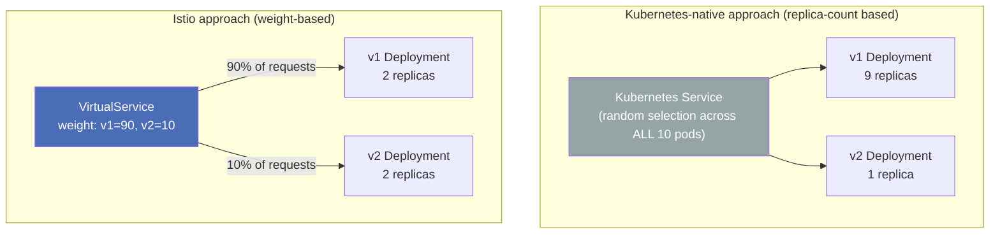
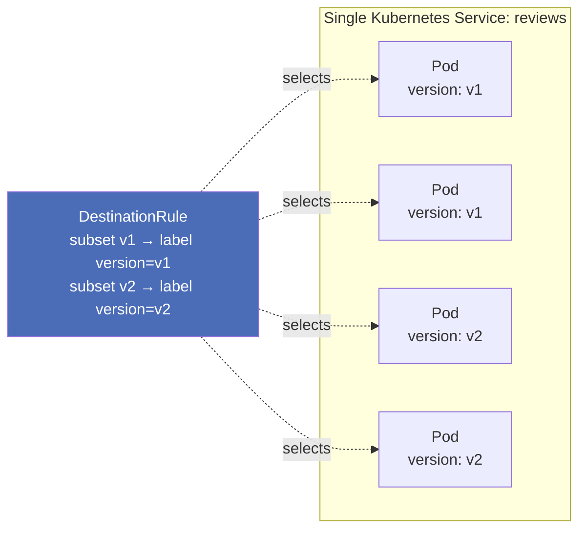
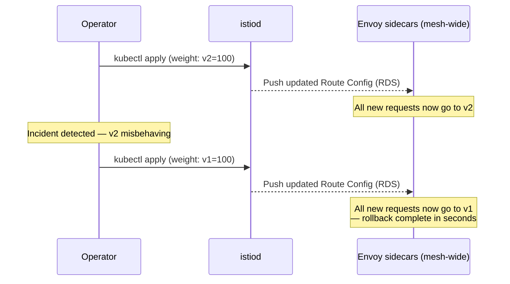

# Istio Traffic Shifting: Canary Releases Without Touching Replica Counts

### A hands-on guide to weighted routing, incremental canary rollouts, and instant rollback — all through `VirtualService` weights, not pod scaling

---

Ask most Kubernetes teams how they do a canary release, and you'll hear some version of: "we scale the new deployment to 1 replica and the old one to 9, so roughly 10% of traffic hits the new version." It works, sort of, but it's a blunt instrument — you're using **replica count** as a proxy for **traffic percentage**, and those two things are only loosely related once you factor in different pod resource requests, uneven load balancer behavior, or simply needing 3% instead of 10%.

Istio decouples these two concerns completely. **How many pods you run** and **what percentage of traffic each version receives** become entirely independent decisions, both expressed declaratively, both changeable in seconds, with zero pod restarts.

This tutorial covers:

1. Weighted traffic splitting between two versions with `VirtualService`
2. Building a real incremental canary release, v1 → v2
3. How Istio's weighted routing differs fundamentally from replica-count splitting
4. Progressing from a 50/50 split to a full 100% cutover with no redeploys
5. How `DestinationRule` subsets map to pod labels for precise targeting
6. Why this makes rollback a config change, not an incident

---

## 1. The Core Idea: Decoupling Pod Count From Traffic Percentage



Notice: in the Istio example, both versions run **the same number of replicas** (2 and 2), yet traffic is still split 90/10. That's the whole point — replica count now exists purely to serve the traffic each version is *assigned*, not to determine what fraction it receives.

---

## 2. Prerequisites

- Kubernetes cluster with Istio installed (`istioctl install --set profile=demo -y`)
- Namespace labeled for sidecar injection: `kubectl label namespace default istio-injection=enabled`
- Istio Bookinfo sample deployed (gives us `reviews-v1`, `v2`, `v3` out of the box):

```bash
kubectl apply -f https://raw.githubusercontent.com/istio/istio/release-1.22/samples/bookinfo/platform/kube/bookinfo.yaml
```

Confirm both versions are healthy:

```bash
kubectl get pods -l app=reviews
```

For this tutorial we'll treat `reviews-v1` as the stable baseline and `reviews-v2` as the canary.

---

## 3. Step One: Map Pod Labels to Subsets With `DestinationRule`

Before any weight can be applied, Istio needs named "buckets" of pods to route weighted traffic into. This is entirely the job of `DestinationRule` subsets — each subset is just a label selector against pods already running behind a single Kubernetes Service.

```yaml
# destinationrule-reviews.yaml
apiVersion: networking.istio.io/v1
kind: DestinationRule
metadata:
  name: reviews
spec:
  host: reviews.default.svc.cluster.local
  subsets:
    - name: v1
      labels:
        version: v1
    - name: v2
      labels:
        version: v2
```

```bash
kubectl apply -f destinationrule-reviews.yaml
```

Check the label Istio is matching against:

```bash
kubectl get pods -l app=reviews --show-labels
```

You'll see each pod carries a `version: v1` or `version: v2` label — the exact same label your Deployment's `spec.selector` and `spec.template.metadata.labels` already use to manage rollouts. Istio isn't inventing a new labeling scheme; it's **reusing your existing pod labels** to build routable subsets on top of a single logical Service. This is why subsets can be scaled, rescheduled, or replaced independently — Istio always resolves them live against current pod labels, not a static list.



---

## 4. Step Two: A Weighted Traffic Split (90/10)

Now define the `VirtualService` that actually splits traffic across those subsets:

```yaml
# virtualservice-reviews-90-10.yaml
apiVersion: networking.istio.io/v1
kind: VirtualService
metadata:
  name: reviews
spec:
  hosts:
    - reviews.default.svc.cluster.local
  http:
    - route:
        - destination:
            host: reviews.default.svc.cluster.local
            subset: v1
          weight: 90
        - destination:
            host: reviews.default.svc.cluster.local
            subset: v2
          weight: 10
```

```bash
kubectl apply -f virtualservice-reviews-90-10.yaml
```

Weights must sum to 100 across all destinations in a route rule — Istio validates this at admission time and will reject the object otherwise.

**Verify the split empirically:**

```bash
for i in $(seq 1 20); do
  kubectl exec deploy/productpage-v1 -- curl -s productpage:9080/productpage \
    | grep -o "color=\"[^\"]*\"" | head -1
done | sort | uniq -c
```

Bookinfo's `reviews-v1` shows no star ratings while `v2` shows black stars, so this crude grep gives you a visible proxy for which version served each request. Over 20 requests you should see roughly an 18/2 split — statistically approximate at low volumes, but converging tightly on 90/10 as request count grows, since Envoy's weighted round-robin operates probabilistically per request.

---

## 5. Step Three: How This Differs From Replica-Count Splitting

This is worth being explicit about, because the two approaches *look* similar from a distance but behave very differently under real conditions.

| Dimension | Kubernetes replica-count splitting | Istio weighted `VirtualService` |
|---|---|---|
| **Mechanism** | kube-proxy load-balances across all pod IPs behind one Service, uniformly | Envoy sidecar applies explicit percentage weights across named subsets |
| **Precision** | Approximate — 1 of 10 pods ≈ 10%, but breaks down at small pod counts (1 of 3 ≈ 33%, not adjustable to, say, 5%) | Exact, arbitrary percentages (1%, 5%, 33%, whatever you need) regardless of replica count |
| **Coupling to scaling** | Traffic % is *tied* to replica count — scaling for load also changes the split | Completely decoupled — scale each version for its own load independently of traffic %|
| **Change mechanism** | `kubectl scale` — changes actual running pod count | `kubectl apply` on a `VirtualService` — no pods touched |
| **Rollback speed** | Re-scale deployments back, wait for pods to terminate/start | Instant — reapply previous weight values |
| **Granular targeting** | Not possible — can't condition on headers/paths, only raw random distribution | Composable with header/path/query rules from the same object |
| **Blast radius during change** | Scaling events can trigger readiness probe churn, connection draining | Weight changes take effect immediately in Envoy's config, no pod lifecycle involved |

The most important row is **coupling to scaling**. If you're running a replica-count canary and traffic spikes, autoscaling naturally changes your v1:v2 pod ratio — which silently *changes your canary percentage* as a side effect of an unrelated event. With Istio, the Horizontal Pod Autoscaler can scale either version's Deployment however it needs to for load, and the 90/10 (or whatever) traffic split remains exactly what you declared, untouched.

---

## 6. Step Four: Progressing an Incremental Canary Release

A canary release is really just a sequence of weight changes over time, typically gated by watching error rates, latency, and business metrics at each stage before proceeding.


Each stage is nothing more than reapplying the same `VirtualService` with different weight values:

```yaml
# Stage 1 — 5% canary
    - route:
        - destination: {host: reviews.default.svc.cluster.local, subset: v1}
          weight: 95
        - destination: {host: reviews.default.svc.cluster.local, subset: v2}
          weight: 5
```

```yaml
# Stage 2 — 25% canary
    - route:
        - destination: {host: reviews.default.svc.cluster.local, subset: v1}
          weight: 75
        - destination: {host: reviews.default.svc.cluster.local, subset: v2}
          weight: 25
```

```yaml
# Stage 3 — 50/50 split
    - route:
        - destination: {host: reviews.default.svc.cluster.local, subset: v1}
          weight: 50
        - destination: {host: reviews.default.svc.cluster.local, subset: v2}
          weight: 50
```

Apply each stage in sequence, pausing between them to check metrics:

```bash
kubectl apply -f virtualservice-reviews-5-95.yaml
# watch dashboards / run smoke tests
kubectl apply -f virtualservice-reviews-25-75.yaml
# watch dashboards / run smoke tests
kubectl apply -f virtualservice-reviews-50-50.yaml
```

In production, this progression is commonly automated with tools like **Flagger** or **Argo Rollouts**, both of which drive exactly this pattern — incrementally patching `VirtualService` weights based on automated Prometheus metric checks (error rate, p99 latency) rather than manual `kubectl apply` calls. Understanding the manual mechanics here is what makes those tools' behavior legible when something goes wrong.

---

## 7. Step Five: The Full 100% Cutover — No Redeploy Required

Once you're confident, the final cutover is just one more weight change:

```yaml
# virtualservice-reviews-100-cutover.yaml
apiVersion: networking.istio.io/v1
kind: VirtualService
metadata:
  name: reviews
spec:
  hosts:
    - reviews.default.svc.cluster.local
  http:
    - route:
        - destination:
            host: reviews.default.svc.cluster.local
            subset: v2
          weight: 100
```

```bash
kubectl apply -f virtualservice-reviews-100-cutover.yaml
```

Notice what did **not** happen anywhere in this entire progression:

- No `kubectl rollout restart`
- No pod terminations or new pod creation triggered by the traffic change itself
- No changes to Deployment `replicas`, images, or specs
- No application code touched

`v1` pods are still running right now — they're simply receiving 0% of traffic. This is precisely what makes rollback trivial.

---

## 8. Instant Rollback: Just Change the Weights Back

Because `v1` was never scaled down or deleted as part of this process, rolling back a bad cutover is a single `kubectl apply` away:

```bash
kubectl apply -f virtualservice-reviews-90-10.yaml   # or -f virtualservice-reviews-v1-only.yaml
```



Compare this to a replica-count-based rollback, which requires scaling the old Deployment back up (waiting for readiness probes to pass) and scaling the new one down (waiting for graceful termination) — a process that takes anywhere from tens of seconds to minutes, during which your traffic split is in an undefined, shifting state. The Istio rollback is a single control-plane config push, typically propagated to all sidecars within a second or two, with no pod lifecycle events involved at all.

This is the practical payoff of decoupling traffic percentage from replica count: **rollback becomes a configuration read, not an infrastructure operation.**

---

## 9. Verifying the Cutover With `curl`

At any stage, confirm the actual live split using repeated requests and the Envoy access logs, which record precisely which subset served each call:

```bash
kubectl logs deploy/productpage-v1 -c istio-proxy --tail=50 | grep reviews
```

Look for the `upstream_cluster` field in each log line — it will read something like `outbound|9080|v1|reviews.default.svc.cluster.local` or `...|v2|...`, giving you ground truth about which subset actually handled each request, independent of what the application response happened to render.

For a higher-volume statistical check:

```bash
for i in $(seq 1 100); do
  kubectl exec deploy/productpage-v1 -- curl -s productpage:9080/productpage
done > /tmp/results.txt

grep -c "glyphicon-star " /tmp/results.txt   # rough proxy for v2/v3 responses (has star ratings)
```

At 100 requests, your observed ratio should track the configured weight closely — this is Envoy's weighted round-robin distribution converging on the configured percentages as sample size increases.

---

## 10. Summary

| Concept | Takeaway |
|---|---|
| `DestinationRule` subsets | Map named buckets (`v1`, `v2`) to existing pod labels — no new labeling scheme required |
| Weighted `VirtualService` | Splits traffic by exact percentage, independent of how many pods back each version |
| Vs. replica-count splitting | Decouples traffic % from pod count — autoscaling no longer silently changes your canary ratio |
| Incremental canary | A sequence of weight changes (5% → 25% → 50% → 100%), each gated by metrics, with no redeploys |
| 100% cutover | Just another weight value — old version's pods keep running, receiving zero traffic |
| Rollback | Reapply the previous weights — a config push propagated in seconds, not a scaling operation |

Once traffic percentage and pod count are separate dials, canary releases stop being a scaling puzzle and become what they should be: a series of small, reversible, observable configuration changes.

---

*If you found this useful, consider following for more deep dives into Istio, Envoy, and progressive delivery on Kubernetes.*
