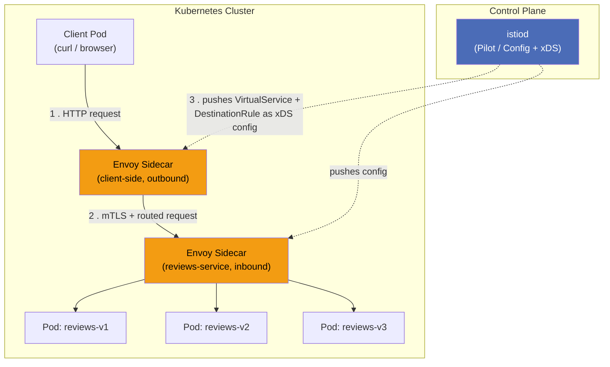
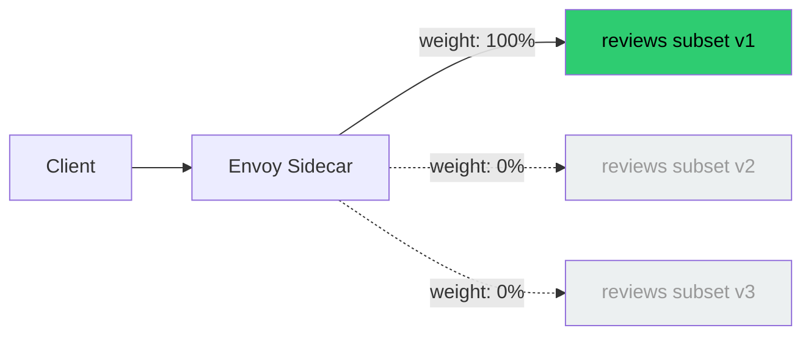
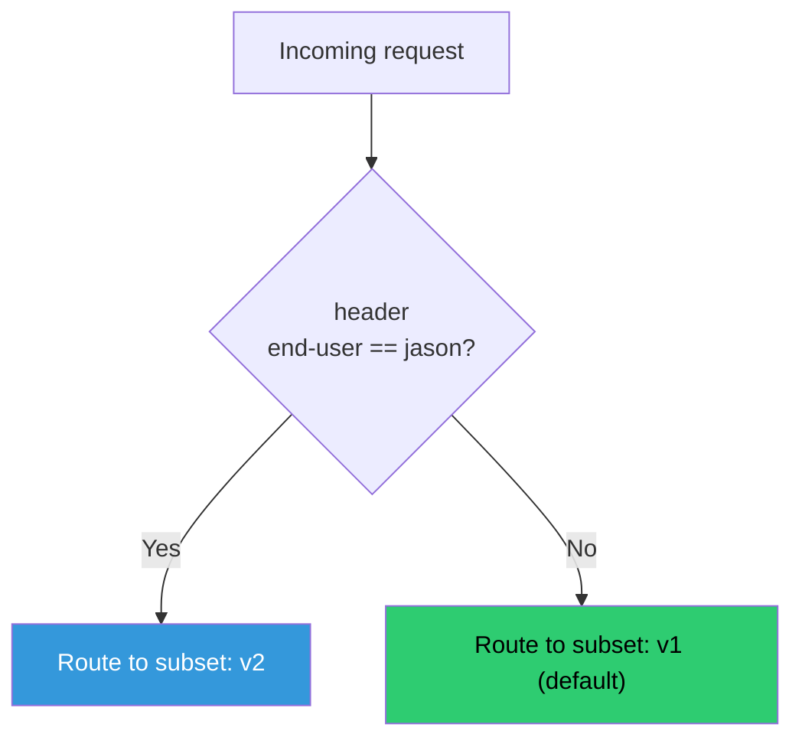
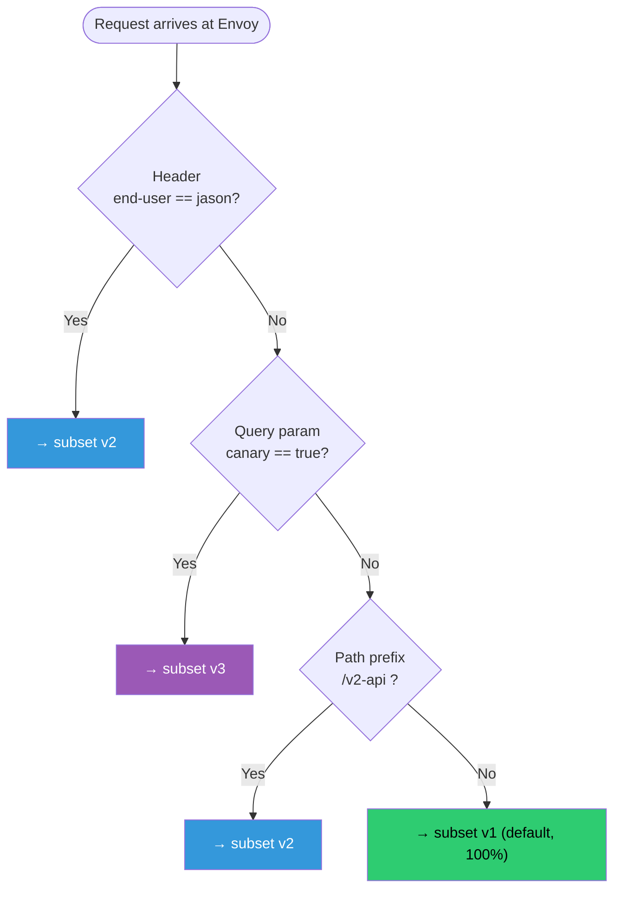
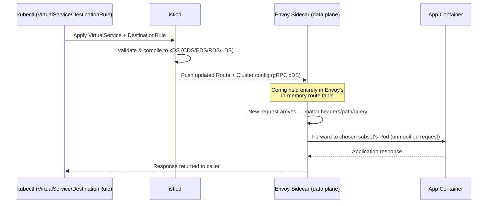

# Mastering Istio Traffic Routing: VirtualService, DestinationRule, and Envoy Under the Hood

### A hands-on, one-stop guide to routing traffic by HTTP headers, paths, and query parameters — without touching your application code

---

If you've worked with Kubernetes long enough, you've hit this wall: your Deployment and Service objects give you *load balancing*, but they give you almost no control over *which version* of a service a request actually reaches. Kubernetes Services route to any healthy Pod matching a label selector — that's it. There's no concept of "10% to v2," or "send requests with header `x-beta-user: true` to the canary."

This is exactly the gap Istio's traffic management API fills. In this tutorial, you'll build a complete mental model — and a working example — of how `VirtualService` and `DestinationRule` cooperate, how Envoy actually enforces these rules, and how to prove it all works with nothing more than `curl`.

By the end, you'll be able to:

1. Understand how `VirtualService` and `DestinationRule` divide responsibilities in Istio's traffic model
2. Shift 100% of traffic to a specific service version (a "baseline cutover")
3. Layer in routing by **HTTP header**, **request path**, and **query parameter**
4. Understand exactly where and how Envoy makes the routing decision — with zero application code changes
5. Verify every routing rule using `curl -H`

---

## 1. The Mental Model: Two Objects, Two Jobs

Istio splits traffic management into two custom resources, and the single most common source of confusion is not knowing which one does what.

| Resource | Job | Analogy |
|---|---|---|
| `DestinationRule` | Defines **what versions exist** (subsets) and **how to connect** to them (load balancing, TLS, connection pool) | The "phone book" — who exists and their address |
| `VirtualService` | Defines **which requests go where** (routing rules based on headers, paths, weights, etc.) | The "receptionist" — decides which desk to send a visitor to |

A `VirtualService` route can only point at a subset name if that subset was first declared in a `DestinationRule`. They are two halves of one decision, and Istio validates that dependency at admission time.

### High-level architecture



Key insight: **your application never sees a `VirtualService` or a `DestinationRule`.** These are Kubernetes Custom Resources consumed by `istiod`, translated into Envoy's native configuration format (via the xDS APIs — CDS, EDS, RDS, LDS), and pushed down to every Envoy sidecar in the mesh. The routing decision happens entirely in the sidecar proxy sitting next to your app container, before the request ever reaches your code.

---

## 2. Prerequisites

You'll need:

- A Kubernetes cluster (minikube, kind, GKE, EKS — anything works)
- `kubectl` configured against that cluster
- Istio installed (`istioctl install --set profile=demo -y`)
- The target namespace labeled for sidecar injection:

```bash
kubectl label namespace default istio-injection=enabled
```

- The Istio sample **Bookinfo** application, which conveniently ships with three versions of the `reviews` service — perfect for demonstrating subsets:

```bash
kubectl apply -f https://raw.githubusercontent.com/istio/istio/release-1.22/samples/bookinfo/platform/kube/bookinfo.yaml
```

Verify all three review versions are running:

```bash
kubectl get pods -l app=reviews
```

You should see `reviews-v1`, `reviews-v2`, and `reviews-v3` pods, each injected with an `istio-proxy` sidecar container (2/2 `READY`).

---

## 3. Step One: Define the DestinationRule (Declare the Subsets)

Before any `VirtualService` can route by version, Istio needs to know that versions exist. That's the sole job of `DestinationRule` subsets — they map a friendly name (`v1`, `v2`, `v3`) to a Kubernetes label selector.

```yaml
# destinationrule-reviews.yaml
apiVersion: networking.istio.io/v1
kind: DestinationRule
metadata:
  name: reviews
spec:
  host: reviews.default.svc.cluster.local
  subsets:
    - name: v1
      labels:
        version: v1
    - name: v2
      labels:
        version: v2
    - name: v3
      labels:
        version: v3
  trafficPolicy:
    loadBalancer:
      simple: ROUND_ROBIN
```

Apply it:

```bash
kubectl apply -f destinationrule-reviews.yaml
```

**What just happened under the hood:** `istiod` watches this object, resolves `version: v1/v2/v3` against live Pod labels via the Kubernetes API, and generates an Envoy **Cluster** (CDS) for each subset — essentially three separate load-balancing pools that Envoy can route to independently, even though they all sit behind one Kubernetes Service.

---

## 4. Step Two: Shift 100% of Traffic to a Single Version (Baseline Cutover)

Before layering on clever conditional rules, always establish a clean, unconditional baseline. This is a critical (and often skipped) production practice: it proves the wiring works, gives you a known-good rollback target, and avoids debugging weighted or conditional logic and connectivity issues at the same time.

```yaml
# virtualservice-reviews-v1-only.yaml
apiVersion: networking.istio.io/v1
kind: VirtualService
metadata:
  name: reviews
spec:
  hosts:
    - reviews.default.svc.cluster.local
  http:
    - route:
        - destination:
            host: reviews.default.svc.cluster.local
            subset: v1
          weight: 100
```

Apply and verify:

```bash
kubectl apply -f virtualservice-reviews-v1-only.yaml
kubectl exec deploy/ratings-v1 -c ratings -- curl -s reviews:9080/reviews/0
```

No matter how many times you call it, every response should come from `v1` (no star ratings, since `v1` doesn't call the ratings service). This confirms:

- The `VirtualService` → `DestinationRule` → subset chain resolves correctly
- Envoy's cluster manager is correctly load-balancing within the `v1` subset
- You have a safe, deterministic fallback before adding complexity



---

## 5. Step Three: Add Header-Based Routing

Now let's introduce a conditional override: internal QA testers send a custom header, `end-user: jason`, and should be routed to `v2`. Everyone else continues to hit `v1`.

Istio evaluates `http.match` rules **top to bottom**, and the **first match wins**. The final unconditional route acts as the default/fallback.

```yaml
# virtualservice-reviews-header.yaml
apiVersion: networking.istio.io/v1
kind: VirtualService
metadata:
  name: reviews
spec:
  hosts:
    - reviews.default.svc.cluster.local
  http:
    - match:
        - headers:
            end-user:
              exact: jason
      route:
        - destination:
            host: reviews.default.svc.cluster.local
            subset: v2
    - route:
        - destination:
            host: reviews.default.svc.cluster.local
            subset: v1
          weight: 100
```

```bash
kubectl apply -f virtualservice-reviews-header.yaml
```



---

## 6. Step Four: Add Request-Path-Based Routing

Suppose you're staging a new API surface only under `/v2-api`, while every other path stays on the stable version. Path matching uses `uri.prefix` (or `exact`/`regex`).

```yaml
    - match:
        - uri:
            prefix: /v2-api
      route:
        - destination:
            host: reviews.default.svc.cluster.local
            subset: v2
```

Insert this **above** the default fallback route, alongside the header rule:

```yaml
apiVersion: networking.istio.io/v1
kind: VirtualService
metadata:
  name: reviews
spec:
  hosts:
    - reviews.default.svc.cluster.local
  http:
    - match:
        - headers:
            end-user:
              exact: jason
      route:
        - destination:
            host: reviews.default.svc.cluster.local
            subset: v2
    - match:
        - uri:
            prefix: /v2-api
      route:
        - destination:
            host: reviews.default.svc.cluster.local
            subset: v2
    - route:
        - destination:
            host: reviews.default.svc.cluster.local
            subset: v1
          weight: 100
```

Order matters because Envoy's Route Configuration (RDS) is a linear list — the first `match` block whose conditions are all satisfied wins, and evaluation stops there.

---

## 7. Step Five: Add Query-Parameter-Based Routing

Now let's add one more override: any request carrying `?canary=true` in the query string should also land on `v3` (a newer, riskier build you want a handful of testers to poke at).

```yaml
    - match:
        - queryParams:
            canary:
              exact: "true"
      route:
        - destination:
            host: reviews.default.svc.cluster.local
            subset: v3
```

Full combined `VirtualService` — this is the complete, "production-shaped" version we'll test against:

```yaml
# virtualservice-reviews-full.yaml
apiVersion: networking.istio.io/v1
kind: VirtualService
metadata:
  name: reviews
spec:
  hosts:
    - reviews.default.svc.cluster.local
  http:
    - match:
        - headers:
            end-user:
              exact: jason
      route:
        - destination:
            host: reviews.default.svc.cluster.local
            subset: v2
    - match:
        - queryParams:
            canary:
              exact: "true"
      route:
        - destination:
            host: reviews.default.svc.cluster.local
            subset: v3
    - match:
        - uri:
            prefix: /v2-api
      route:
        - destination:
            host: reviews.default.svc.cluster.local
            subset: v2
    - route:
        - destination:
            host: reviews.default.svc.cluster.local
            subset: v1
          weight: 100
```

```bash
kubectl apply -f virtualservice-reviews-full.yaml
```

### The full decision tree



This is precisely the logic Envoy compiles into its **Route Configuration** — a set of ordered virtual-host match rules, each pointing at a weighted cluster.

---

## 8. How Envoy Actually Enforces This (No App Code Involved)

This is the part most tutorials skip, and it's the most important concept to internalize.

1. **Sidecar injection**: When a Pod is created in a labeled namespace, Istio's mutating webhook injects an `istio-proxy` container. `iptables` rules (or, in newer ambient-mode deployments, a node proxy) transparently redirect all inbound/outbound traffic through this Envoy process. The application container is completely unaware.

2. **Config distribution (xDS)**: `istiod` continuously watches `VirtualService`, `DestinationRule`, `Service`, and `Endpoints` objects. It compiles them into Envoy's control-plane protocols:
   - **CDS** (Cluster Discovery Service) — from `DestinationRule` subsets → Envoy clusters
   - **EDS** (Endpoint Discovery Service) — actual Pod IPs behind each cluster
   - **RDS** (Route Discovery Service) — from `VirtualService` match/route rules → Envoy route configs
   - **LDS** (Listener Discovery Service) — which port/protocol Envoy listens on

3. **Request-time evaluation**: When a request hits the client-side Envoy sidecar, Envoy's HTTP Connection Manager evaluates the **Route Configuration** in memory — checking headers, `:path`, and query parameters against the compiled match rules — and selects a cluster (subset). Load balancing to a specific Pod IP within that cluster happens next, using EDS-provided endpoints.

4. **Zero code changes**: None of this touches your Go/Java/Python/Node service. The header inspection, path matching, and query parsing happen in the Envoy sidecar's C++ data plane, entirely outside your process boundary. You could swap your app's language entirely and this routing logic wouldn't change.



---

## 9. Verifying Everything with `curl`

Now let's prove each rule works using nothing but `curl` and custom headers. Run these from inside the mesh (e.g., exec into any pod with a sidecar) so traffic actually passes through Envoy, or via the ingress gateway if you've exposed Bookinfo externally.

**Default (no header, no query param, plain path) → should hit v1:**

```bash
curl -s http://reviews:9080/reviews/0
```

**Header override → should hit v2:**

```bash
curl -s -H "end-user: jason" http://reviews:9080/reviews/0
```

**Query parameter override → should hit v3:**

```bash
curl -s "http://reviews:9080/reviews/0?canary=true"
```

**Path override → should hit v2:**

```bash
curl -s http://reviews:9080/v2-api/reviews/0
```

Since `reviews` doesn't return a version string directly, the cleanest way to *see* which subset served a request is to check response shape (v1 has no ratings, v2 has black stars, v3 has red stars) or, more reliably, tail the sidecar's access logs while you curl:

```bash
kubectl logs -f deploy/reviews-v2 -c istio-proxy | grep reviews
```

You'll see structured Envoy access log lines confirming the `upstream_cluster` matched, something like:

```
[2026-09-07T10:14:02.123Z] "GET /reviews/0 HTTP/1.1" 200 - via_upstream ... outbound|9080|v2|reviews.default.svc.cluster.local ...
```

That `outbound|9080|v2|reviews...` string is the smoking gun — it's the literal Envoy cluster name derived from your `DestinationRule` subset, proving the routing decision was made and enforced entirely at the proxy layer.

For a fast, repeatable verification loop, script it:

```bash
#!/bin/bash
echo "Default route:"; curl -s -o /dev/null -w "%{http_code}\n" http://reviews:9080/reviews/0
echo "Header route (jason):"; curl -s -o /dev/null -w "%{http_code}\n" -H "end-user: jason" http://reviews:9080/reviews/0
echo "Query param route (canary):"; curl -s -o /dev/null -w "%{http_code}\n" "http://reviews:9080/reviews/0?canary=true"
echo "Path route (/v2-api):"; curl -s -o /dev/null -w "%{http_code}\n" http://reviews:9080/v2-api/reviews/0
```

---

## 10. Common Pitfalls

- **Subset not found errors**: If a `VirtualService` references a subset name that doesn't exist in any `DestinationRule` for that host, Envoy will return a `503 UH` (no healthy upstream). Always apply `DestinationRule` before or together with the `VirtualService` that depends on it.
- **Match order matters**: Envoy stops at the first matching rule. Put your most specific matches first and your unconditional fallback last.
- **Host mismatch**: The `host` field in `VirtualService`/`DestinationRule` must match the fully qualified Kubernetes service name exactly (`reviews.default.svc.cluster.local`), or resolution silently fails.
- **Traffic not going through the mesh**: If a Pod lacks the injected sidecar (check for 2/2 containers), none of this applies — plain kube-proxy routing takes over instead.
- **Query parameter matching is exact by default**: `queryParams.canary.exact: "true"` will not match `Canary=true` or `canary=1`. Use `regex` if you need flexible matching.

---

## 11. Summary

| Concept | Takeaway |
|---|---|
| `DestinationRule` | Declares subsets (versions) and connection policy for a host |
| `VirtualService` | Declares conditional routing logic — headers, paths, query params, weights |
| Rule evaluation | Ordered, first-match-wins, at the Envoy sidecar (data plane) |
| Baseline cutover | Always establish 100%-to-one-version before adding conditional logic |
| No app changes | All matching logic lives in Envoy's compiled route config, not your code |
| Verification | `curl -H`, query strings, and sidecar access logs confirm the actual cluster used |

Once this model clicks, canary releases, A/B testing, staged rollouts, and internal dogfooding all become configuration problems, not application problems — which is exactly the point of a service mesh.

---

*If you found this useful, consider following for more deep dives into Istio, Envoy, and Kubernetes traffic engineering.*
